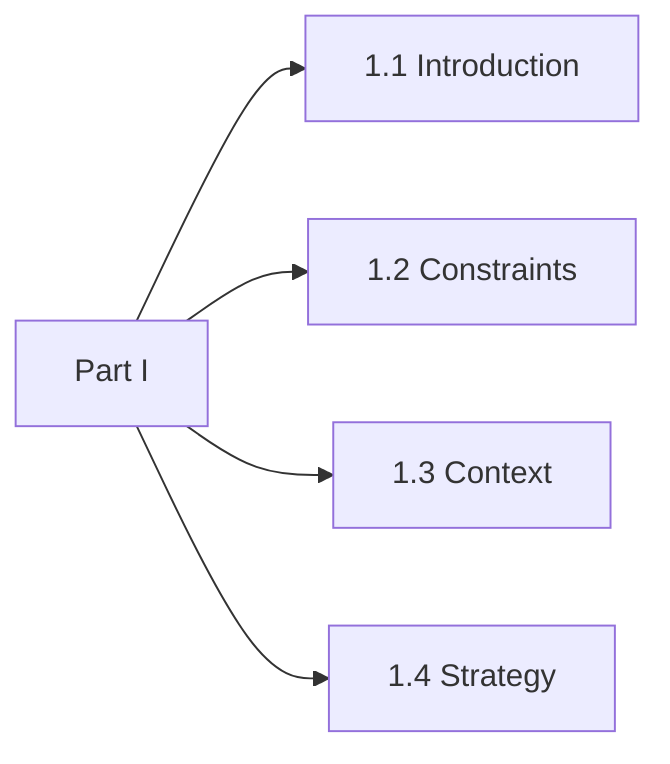

# Part I. Why this shape

Complete for the engineering or risk leader, and for any reader who needs to defend the decision to build.

By the end of this part you can state the claim, name the constraints that are real rather than habitual, fix the vocabulary the rest of the document uses, and defend five moves and eight falsifiable invariants in a design review. You will not yet be able to implement any of them.

That is the intended stop. A reader who leaves here holds a coherent position, not half of one.

*Figure P1 – Part I spine: claim, constraints, vocabulary, five moves.*
