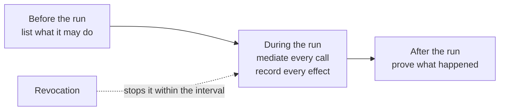
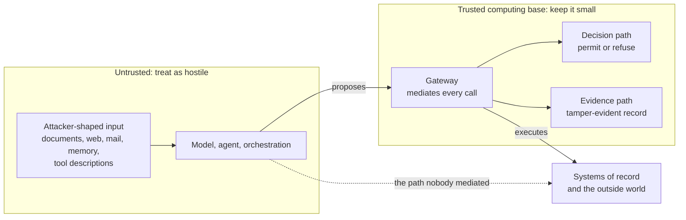
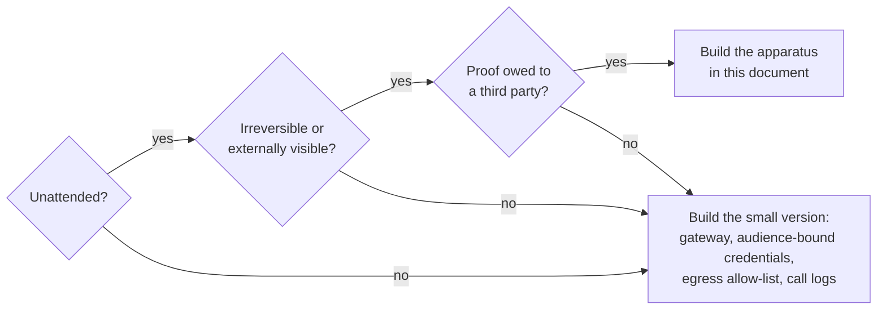

# Introduction

About six weeks into every agent project, somebody gives the agent a tool that can write. Until then you had a demo. Afterwards you have something that holds real credentials, decides at runtime what to do with them, and takes instruction from text that came from outside your building. That change often arrives as four lines in a pull request. Two people approve it on a Tuesday. Nobody treats it as the security event it is.

Two questions follow. Only one has an engineering answer. This document is about the second.

## What actually changed

A payment batch job can move money. Nobody wrote a book about that, because the job does what its code says. Read the code and you know what can happen. The set of effects is fixed at review time. Bad input does not invent new effects.

An agent is different when three things are true at once:

1. It **decides at runtime** which tools to call and in what order. You cannot see the full effect set in the code alone.
2. It **reads input an attacker can shape** – a claim document, a web page, an email, a tool description, a memory entry from an earlier session.
3. It **holds real authority**. An agent that cannot act is a chatbot, and those are not what teams are funding.

Any two of these is a normal engineering problem. All three together is the confused deputy [@hardy1988confused]: a helper with real power that takes orders from whoever is closest. Norm Hardy named this in 1988. The usual fix is to keep authority and instruction apart. We have built a system whose whole interface mixes them on purpose. That mixing is the product.

## The first question, and why we set it aside

The first question is: *how do we stop the agent being fooled?*

It is the natural question. There is a real industry behind it. Injection classifiers help. Guardrail products catch things. A careful system prompt reduces how often an agent does something expensive. If you run agents today with none of this, buy some this quarter.

But notice what kind of answer this is. These controls are filters. A filter needs to be right most of the time. An attacker needs it to be wrong once. They choose the inputs. They can try again and again. They can test against a copy of your filter offline. Published detection rates look good. They are not 100%. The rate that matters – against someone adapting to *your* defence – is rarely published at all. We have not found a published false-negative rate for injection detection measured against an adversary adapting to the defender's own filter. Vendor detection rates are not a substitute.

This is not a temporary gap waiting for a better model. An agent is useful because it follows unstructured text it has never seen before. An agent that cannot be talked into anything is a script. We already had scripts.

So detection is useful. It is not enough to rest a safety case on. Filters fail sometimes. The attacker only needs one miss. Keep the filters. Do not keep the assumption that they close the problem.

## The second question, and the claim

The second question sounds smaller. It is the one we can answer.

*What can the agent do once it has been fooled?*

> **A platform can limit what a compromised agent run can do to a set you listed before the run started, prove afterwards what it actually did, and stop it within a stated time – without help from the agent, even if the model is fully hostile.**

That is three claims. Each can be wrong in a specific way. Each has a test in Appendix F [A-6.1].

The **bound** is wrong if there is a reachable effect that was not on the list. That is a coverage question. Coverage is a number you publish, not a word you claim.

The **proof** is wrong if an external action can happen with no matching evidence record, or if a record can be changed later without detection.

The **stop** is wrong if a run keeps going past the stated time after revocation, or if the switch you rely on has never been tested on a live run.

*Figure 1.1 – When is each part of the claim made true? The bound is fixed before anything runs. The record is written as effects happen. The proof is available afterwards. The stop has to work at any point in between.*

Notice what the claim does *not* say. Nothing about the agent behaving well. Nothing about the model being trustworthy. Nothing about perfect prevention. Everything in this document follows one preference: prevention has a miss rate we do not control; containment has a bound we do [ADR-01].

## What the claim assumes

A claim without its assumptions is marketing. Read this section carefully. It is the one people skip and then quote back in an incident review.

*Figure 1.2 – Which parts must be correct for the claim to hold? Only the three inside the trusted computing base. Everything above them is treated as hostile. The dashed line is the path that decides whether the bound is real or only on paper.*

**Keep the trusted computing base small.** It is the gateway that mediates tool calls, the component that decides whether a call is allowed, the path that writes evidence, and the keys under those three. If an attacker controls any of those, this document does not help. You fall back to your normal control-plane incident response. The design job is to keep that set small enough to defend, and to leave the agent, the model, the orchestration framework, and the tool implementations outside it [A-1.1].

**Treat the model as hostile at any moment**, including between two tool calls. We do not separate “prompt-injected”, “fine-tuned by an attacker”, and “wrong in an expensive way”. For the design, they are the same case. That is why there is no component whose job is to decide whether the model is behaving.

**Effects go through mediated interfaces.** The bound covers what the platform mediates. It does not cover a path nobody knew about. Every organisation has some: a laptop with a production credential, a legacy service account, a sidecar added in March. That is the dashed line in Figure 1.2. It is not a caveat we can talk away. It is a number. The first measurement is usually embarrassing. Chapter 7 is about measuring it anyway.

**The human in the approval loop is competent, honest, and rushed.** Not negligent. The failure we design for is the fourteenth approval before 09:00, not fraud.

**Normal cryptography holds.** Side channels below the platform are out of scope.

## What this document is not about

Not model training, fine-tuning, evaluation, or alignment. Not the internal safety properties of a model. Not consumer or personal agents. Not physical robots. Not general enterprise identity management, except where the agent case breaks it.

A short scope test: **a subject belongs here if a hostile model changes the answer.** If the design is the same whether or not the model is hostile, it is ordinary platform engineering. We cite it. We do not re-explain it.

## Who should not build this

Most organisations reading this should build almost none of it. Better to learn that now than after a week of design meetings.

The full build is worth the cost only when all three conditions hold:

*Figure 1.3 – Three questions. Only one path leads to the expensive build. Most readers should leave at the first or second question.*

**Unattended operation.** The agent acts without a person checking each action. If someone reviews every effect before it happens, you have expensive autocomplete. Most of this document solves a problem you do not have.

**Irreversible or externally visible effects.** Money moves. A customer record changes. A message reaches a customer. A filing reaches a regulator. If one person can undo everything in ten minutes, your control is the undo path, not this apparatus.

**A proof burden you owe someone else.** A supervisor, an auditor, a court, a counterparty. Not “we would like to know what happened”. An obligation to show it, to a third party, on their schedule.

The cost of building the full thing by mistake is real. Four to six engineers for two to three quarters to reach a first defensible version. About 20–40 ms added at p99 on every mediated tool call, mostly in the decision path (you can reduce that, but then you must bound how stale the decision data may be). About one engineer-day a week ongoing for recertification, drills, and finding unmediated paths. And a lasting drag on developers: the approved path now has a gate. If that path is slower than a shortcut, people take the shortcut, and your coverage number falls quietly.

When all three conditions *do* hold, the sum flips. The alternative was never “build nothing”. The alternative is buying the same controls later, under pressure, in front of the person who was owed the proof.

## What this replaces, and why

I wrote a whitepaper first. It is careful and complete. It states conclusions without always showing the argument. A reader who disagrees finds the answer, but not the reasoning that might change their mind.

Then I wrote a book. It derives everything: one system, one adversary, one earned point per chapter. It is still the better thing to hand someone who wants to *learn* the field. It is also about 360 pages with one reading order. That is a poor fit for a delivery team that needs an answer at 16:40 before a review at 17:00.

Both sit in `archive/`. Both stay readable. Neither is maintained.

This is the third attempt. The first two failed in opposite directions. What sits between them is narrow: one artefact an organisation can actually use. The most valuable part of the earlier work was not the design itself. It was the record of what we rejected, why, and what would make us reopen the choice. That record is Appendix B: about thirty decisions. It is the closest thing here to an original contribution [A-2.0].

## How this is arranged

Four parts. Each closes one question and can stand alone.

**Part I** (this part) closes *should we build this, and what shape is it?* By the end you can defend the shape in a design review, even if you cannot yet implement it.

**Part II** closes *how does each piece work, and what does it cost?* Each chapter starts from the failure that forces the mechanism.

**Part III** closes *how do we run it, and what happens when it breaks?* An SRE who inherited the system can read Part III first, without Part II.

**Part IV** is the honest edge: agents calling agents, agents across organisation boundaries, and what an attacker can still do after everything here is built.

Detail sits underneath the spine, not inside it. A mark in brackets points to a decision, an appendix, or a source. You can ignore every mark and the page still makes sense. The same is true of the figures. That is a writing rule, not a reading instruction.

One check before you go on. Take the most autonomous agent you run today. If the model turned hostile between two tool calls, what is the full set of things it could do before anyone noticed? Is that set written down, or does someone invent it from the code when asked?

If it is written down, you are ahead of most teams. Part II will tell you what it costs to make the list shorter. If it is only inferred, the last chapter lists what an attacker can still do after all of this is built and running. That list is not short. Every control here decays, often quietly. A capability you have not practised in a year is a capability you do not have.

The principles behind most of this were published in 1975 [@saltzer1975protection]. We are not short of ideas. We are short of the discipline to keep them true past month fourteen.
