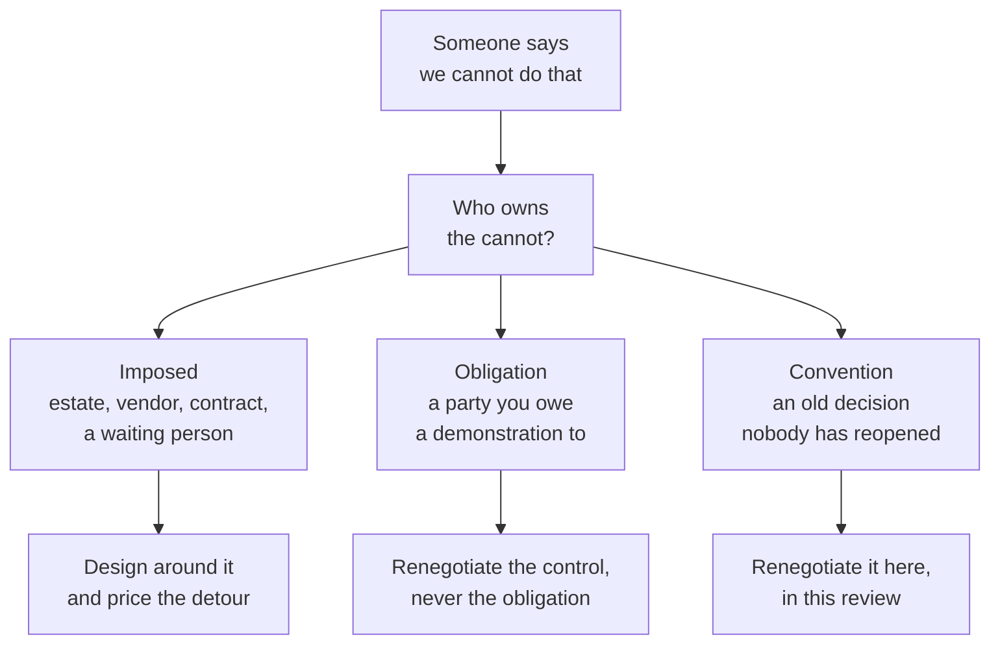

# What the environment forces on you

In the first hour of a design review, somebody says *we cannot do that* three times. The three refusals sound the same. They are not. One is a fact about the world. One is a duty to show something to someone. One is a decision from 2019, made by a team that no longer exists.

Sort them before you draw the shape. The sort decides which later chapters a reader in another organisation can discard. It also decides whether the control register at the back of this document is a set of requirements or a script for compliance theatre [A-1.2]. Most teams find the same surprise when they run it: the constraint everyone treats as hardest – regulation – does not constrain the design at all.

## Three kinds of cannot

Three kinds of constraint arrive wearing the same clothes. Only one is free to change in the room. The other two move elsewhere, or not at all. Mixing them up is how a design gains controls nobody can defend and loses ones it needed.

A constraint is **imposed** when moving it costs more than this project can pay. The identity estate you already run. Tools that already exist and have owners who did not ask for your programme. The model vendor's interface. The latency a waiting person will tolerate. A counterparty's contract. Imposed does not mean forever. It means the lever sits outside this room. Pretending otherwise turns a design review into a wish list.

A constraint is an **obligation** when you owe a party a demonstration. A supervisor, an auditor, a court, a counterparty, an internal risk committee. An obligation names what you must show, and often by when. It almost never names the mechanism. That silence is the most important fact in this chapter.

Everything else is **convention**. That is not an insult. Conventions were correct when they were taken, with the information people had then. They became load-bearing without anyone checking them again. The approval workflow that agent adjustments at Borealis inherit from human ones is one of these: right in 2019, unexamined since. The test is short enough to say out loud. Name the owner of the constraint in one sentence. If the owner is a system or a vendor, it is imposed. If the owner is a person or a body who could one day ask you to show them something, it is an obligation. If nobody can be named, it is a convention until someone proves otherwise.

*Figure 2.1 – When someone says we cannot do that, which kind of cannot is it? Only the third is free in the room, but the second is where most of the architecture is quietly decided.*

## What genuinely does not move

Four imposed constraints show up in almost every deployment. Each one bends the architecture. The mechanism chapters have to work with them, not argue them away.

**The identity estate was built for two principal classes, and an agent run is neither.** A person authenticates interactively and carries entitlements that outlive the session. A service account authenticates once and carries the same authority for years. An agent run is a third thing: an actor that exists for 40 s, runs as a workload, acts for a named human, and carries the intersection of the two rather than the union. Most estates cannot mint that credential today. That is not a defect in the estate. Nobody asked it for that principal class. The teams who built it did the job they were given well enough that it has survived three CIOs. The cost of the gap is a broker on the run-start path: one more component, one more availability dependency, and a share of the 20–40 ms at p99 that chapter 1 put on the table.

**The latency budget comes from a person waiting, not from a document.** The number in the service-level document is usually whatever the previous system happened to achieve. Defending the platform's overhead against it is an argument about archaeology. Marta's triage step at Borealis finishes at a p99 of about 2 s from her click to a rendered recommendation. Forty milliseconds of mediation is 2% of that, which is invisible. The unattended path has a different budget: the overnight run has a 6 h window and roughly 4,000 claims, each averaging a dozen tool calls, so 40 ms per call is about 32 min of the window, or 9%. Both numbers are affordable. Both stop being affordable if nobody measures the decision path. The overnight one fails first, quietly, on a night when claim volume doubles.

**Tools that already exist cannot be rewritten, and some of them will not meet you halfway.** The claims system at Borealis exposes an API that accepts a service credential and offers no token exchange. It will not acquire one because of an agent programme. That single property decides whether *the agent never holds a credential* is a statement about the whole estate or about a fraction of it. The fraction is a number you publish, not a word you claim. The honest design has two paths: one for tools that can join an exchange, and one for tools that need a custodian to hold their credential for the agent. Publish the ratio next to the mediation coverage figure.

**The model is the only dependency that can change behaviour without changing a version string, and the only one whose supplier can retire it on a schedule you do not set.** As of 2026-07 the major vendors publish deprecation notices with migration windows of a few months for hosted models [citation needed: published model deprecation notices and migration window lengths for the major vendors, with retrieval dates]. The migration itself is a configuration change. The cost is revalidating every agent version against a model whose behaviour differs in ways no release note describes. That cost scales with how many agent versions you run. It arrives on the vendor's calendar, not yours. It appears in no first-year budget. Where inference physically runs is the same kind of constraint one layer down: a routing decision you may not own sets the region, and the residency claim you make to a supervisor sits downstream of it.

## Borealis on one page

Borealis Mutual spent one afternoon on the inventory before anyone drew a component. Four people were in the room: the platform lead, Marta as the business owner of `claims-triage`, the engineer who runs the privileged access platform, and someone from group risk who had been invited reluctantly and turned out to be the most useful person there. Eight rows came out of it. Two of them changed the design. One of them changed a team's opinion of the whole programme.

| Constraint | Class | Source | Negotiable | What changes if it moves |
|---|---|---|---|---|
| Identity provider issues credentials for people and for service accounts, not for a run | Imposed | Group identity estate (Entra ID) | No | Broker leaves the run-start path; roughly 10 ms at p99 and one availability dependency disappear |
| Vaulting and session recording already owned by the privileged access platform | Imposed | Incumbent PAM (CyberArk); separate team, separate budget | The seam is; the product is not | Platform would own a control an auditor already accepts elsewhere. Duplication, not coverage |
| Claims API offers no token exchange | Imposed | Guidewire release in production; upgrade owned by core systems | Not before the 2027 upgrade | Custodian path for legacy tools disappears; the second coverage dimension collapses into the first |
| Pinned model deprecated with a 90 d migration window | Imposed | Vendor notice for `gpt-4.x`, dated 2026-06-18 | No | Nothing moves in the design. What moves is revalidation, about 3 engineer-days per agent version |
| Every material claims decision demonstrable to the supervisor on request | Obligation | Group risk, against DORA | No, and the control satisfying it is entirely negotiable | Nothing. This is what an obligation looks like when it has been written down correctly |
| Personal data erasable on request within one month | Obligation | GDPR, via the data protection officer | No | Evidence design. Per-subject content keys exist because of this row and for no other reason |
| Inference and evidence stay in the EU region | Obligation | Group policy, and a reinsurance counterparty's contract | The counterparty clause is; group policy is not | Allowed model set narrows; the residency claim to the supervisor changes |
| Agent adjustments use the same approval workflow as human adjustments | Convention | A 2019 decision by a team that no longer exists | Yes | Approval becomes measurable, and a gate nobody reads can be removed rather than defended |

*Table 2.1 – The first eight rows of the Borealis constraint inventory. Durations in days; effort in engineer-days.*

The privileged access row is the one that changed a team's mind. Tagging it *imposed* put in writing that the platform is not replacing the vault, does not want session recording, and has no opinion about interactive human sessions. That is what the team who owns that product had assumed the programme was quietly for. The row cost nothing to write. It removed an objection that would otherwise have arrived at an architecture board six weeks later with an audience. The approval-workflow row goes the other way: it was the only row anyone argued about, it was tagged *convention* after twenty minutes, and it unlocked the most design freedom.

## What the obligations actually ask for

Cut to their engineering content, the obligations in this chapter all share one shape: be able to show this thing, to this party, within this time. Not one of them names a mechanism.

That shape is the reframe the rest of the document depends on. An obligation is a statement about what you can show. A control is a statement about what you built. Everything expensive in enterprise compliance happens in the translation between the two. The translation is usually done by people who believe they are only copying.

**Regulation (EU) 2022/2554 (DORA)** reaches an agent platform mainly through third-party dependency and resilience testing. The model vendor is an ICT service provider supporting a business function. The obligation is to show a supervisor which services support which critical functions, and to keep that register current [citation needed: DORA article carrying the ICT third-party register obligation]. The testing obligation is of the same kind: show that the function survives the failure of the dependency, with a record that carries a date [citation needed: DORA provisions governing digital operational resilience testing]. Design content: none. Evidence content: an inventory row, a test record, and a name against both.

**Regulation (EU) 2024/1689 (the AI Act)** needs a preliminary honesty. Most agent deployments are not high-risk systems under the classification. A chapter that implies otherwise is doing a vendor's marketing without being paid for it. Where the classification does bite, the two obligations that touch this design are record-keeping across the system's lifetime and human oversight [citation needed: AI Act articles on record-keeping and on human oversight for high-risk systems, and the classification criteria that decide applicability]. Both are demonstration obligations. Neither describes what oversight looks like for a system taking four thousand actions between 03:00 and 09:00 with nobody awake. The field does not currently have an answer to that question. Stating it as unsolved is more useful than a control that names a reviewer who cannot possibly read what they are reviewing.

**Regulation (EU) 2016/679 (GDPR)** binds hardest in two places, and they pull against each other. Purpose limitation constrains memory: content gathered to triage a claim acquires a purpose when it is written, and reusing it for underwriting is a new purpose, not a query. Erasure constrains evidence: a record designed to be tamper-evident is a record designed to resist exactly the operation a data subject is entitled to demand [citation needed: GDPR articles for purpose limitation and for the right to erasure]. The contradiction is real. It has an answer. The answer costs a key-management estate, not a policy exception.

The move that follows is to derive every requirement from an obligation, never from a vendor's control catalogue. The catalogue route is attractive, and it is what a competent, time-poor team will choose: it is fast, the labels are ones an auditor recognises, and it produces a mapping matrix in two weeks rather than two months. It loses on one point. A control catalogue is a set of answers to questions somebody else was asked. Mapping an obligation onto it produces controls that satisfy the citation and stop nothing. That is worse than having no control, because the gap is now documented as closed. The slower route costs about 15 engineer-days plus the risk function's attention. Every requirement then carries an argument somebody can contest. That is slower in the design review and cheaper in the audit [ADR-04].

Where a mechanism exists only because of an obligation, say so in the same sentence. Price it as compliance cost. Do not dress it as security. Evidence retention is the clean example. Operationally, 90 d covers every incident investigation anyone at Borealis has run. The obligation implies years. The difference is a storage line of roughly €5,000 a year at current volumes, which is nothing, plus the cost of showing that a hash chain written in 2026 still verifies in 2031 under a key rotation regime nobody has exercised. That second cost is not nothing. It belongs in the operational budget, not the security one.

## Tiers rather than scores

Risk tiers are discrete. The boundary that matters most is reversibility. A continuous score invites a negotiation at the boundary. A tier invites an argument about which tier. That is a better argument to have in front of an auditor, and a better one to lose.

The failure mode of scoring is specific. An agent scoring 6.8 against a threshold of 7.0 produces a conversation about the 0.2. A competent person under delivery pressure can always find 0.2, because the inputs to the score are estimates and the estimates carry ranges. Nobody involved is behaving badly. The arithmetic offers a lever, and levers get pulled. A discrete boundary offers no lever of that kind. Whether an operation can be undone by one person in ten minutes is a question about the operation. A spreadsheet cannot move it.

The cost of tiers is expressiveness, and it is paid by the agents that fall between them. An agent whose risk profile sits genuinely in the gap is assigned the higher tier and carries controls heavier than its own assessment would have chosen. Our judgement is that this is the right trade, and here is the cost of being wrong: at Borealis roughly 15% of agent versions ended up one step above where their owners would have placed them. Over-control is not free. A team that finds the sanctioned path disproportionate to their risk goes around it, and coverage falls without anyone filing a ticket. If the tier definitions are drawn badly, that is the number that moves first [ADR-05].

## The form you take away

The inventory has five columns. The column that does the work is the last one: Constraint, class, source with a named owner, negotiable, and what changes if it moves. Teams reliably fill the first four and leave the fifth blank. That turns an instrument back into documentation. A row without a consequence has not been thought about and cannot be prioritised against anything. A blank template, with the three class tests printed beside it, is in Appendix E [A-5.1].

Fill it before you read Part II. Two hours, four people, and somebody from the risk function in the room. Every mechanism there is derived against a constraint set. Where yours differs, the derivation changes. Without your own inventory in front of you, the difference is invisible and you inherit a design shaped by somebody else's identity provider.

The inventory is a maintained artefact, not a deliverable. The maintenance is cheap enough to be embarrassing when it is skipped. Half a day of review with the row owners, twice a year, is about 2 engineer-days a year, plus one unscheduled pass whenever a platform migrates or an instrument is revised. It gets skipped for the same reason every cheap recurring commitment gets skipped: nothing breaks in the week you skip it.

## Who owns the gateway

Three constraints decide more of the architecture than everything above, and none of them is technical. Who owns the gateway. Who may sign a policy bundle. Who carries the pager at three in the morning.

Ownership sets the onboarding latency of the sanctioned path. A gateway owned by the platform team onboards a tool in an afternoon. A gateway owned by a security function with a change advisory board onboards it in three weeks. Both arrangements are legitimate governance, defended by people acting in good faith. The difference does not show up as a security property. It shows up as minutes on the paved road. Minutes decide whether engineers use it. Adoption decides the coverage number that the whole containment claim rests on. A control nobody routes through is not a weaker control – it is a control that is not there.

Signing authority sets a hard ceiling on how fast the organisation can say no. If one team may sign a policy bundle and that team meets on Tuesdays, then the fastest possible response to a newly discovered problem is 7 d, no matter what the enforcement mechanism can do in 30 s. That is an organisational constraint capping a technical property. It will not appear in any architecture diagram. It is the reason the policy layer is designed as two artefacts with two signing authorities rather than one.

The pager decides the fail posture, whatever the design document says. Woken at 03:40, a person who wants to end the incident makes the fail-open or fail-closed call in the moment, on partial information, and then defends it in the review. That is what the role is for. It is not a criticism of anyone who has ever done it. The design response is to make the decision in daylight, write it against each dependency and tier, and put a name on it before the night it is needed. Then the person on the pager is executing a decision rather than making one.

Each of those three has an owner today and a different owner in eighteen months. Every other row in the inventory has the same property. The rows that cost you are never the ones you knew were wrong. The claims system ships token exchange in a minor release. The vendor's notice period changes. A reorganisation moves the pager to a team in another country. The design keeps carrying a credential custodian that stopped being necessary in March. Nothing fails. The row stopped being true and nobody re-read it. Which is why the useful question belongs in a calendar rather than in a document: when did we last check whether a constraint we treat as fixed still is?
