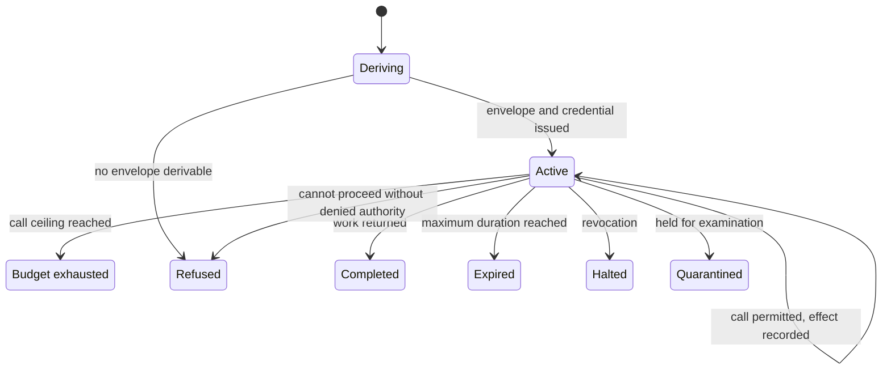

# The system in its landscape

Somebody in a design review asks what happens if the agent is compromised. The next four minutes are spent discovering that nobody in the room means the same thing by *it*. One person means the deployment. One means the conversation open on their screen. One means the service principal in the identity provider. All three are real objects. All three are called the agent. Only one of them can be switched off in a way that stops anything.

The unit that matters is the run: bounded in time, acting for exactly one principal, carrying one envelope, one budget and one evidence stream, and ending. **The agent is what you deploy. The run is what acts, and it is the only thing in the system you can revoke.** Attach authority, budget, evidence and revocation to the run and a set of questions that were previously matters of opinion acquire answers.

Four questions decide most of these design reviews. What exactly are we revoking? What could it reach at 09:07? Who authorised this? How much had it spent before anyone looked? Asked about an agent, every one of them has an answer of the form *it depends when you ask*. That is not an answer. It is a description of an unbounded object. Asked about `run_01J8DXQ3`, each has one answer. It is the same answer at 09:07 and at the audit eighteen months later. It does not require anyone to read the orchestration code to reconstruct it. This is the chapter's single decision and everything after it is consequence [ADR-02].

## What a run is

A run is one bounded execution of one agent on behalf of one principal. It has five properties. Each one exists because a later mechanism needs something specific to attach to: someone to act for, a thing to bound, a thing to count, a thing to chain evidence to, and a thing to take away.

**One principal, and never a group.** A run acts for Marta or for `mandate:claims-nightly`, and the platform can name which one at any instant of the run. A run joins two identity chains: the agent's own, and the one that states on whose behalf it acts. The second chain resolves either to a human present at run start or to a signed standing mandate that names a principal, a task class, a ceiling and an expiry. A mandate is an upper bound in its own right. That is what makes deriving against it an attenuation rather than a promotion. It is also the reason an unattended run does not have to fall back to the union of everything a service account can reach.

**One envelope, derived at the start and never widened.** The envelope is the intersection of the agent's declared need, the principal's own reach and the ceiling for the risk tier, computed once at run start. It is a ceiling rather than a permission: policy is still evaluated at every call, inside it. Nothing the model emits during the run enters the derivation. That is the property that keeps the derivation out of reach of whoever is shaping the input. Wire formats for the credential, the envelope and the budget are in Appendix D [A-4.2].

**One budget, counted in tool calls.** Marta's morning run carries 40 calls. Tokens are telemetry: they tell you what the run cost, not what it is permitted to do. A ceiling denominated in tokens moves when a vendor changes a tokenizer. It is consumed by the platform's own retrieval decisions as readily as by the agent's. It cannot be checked at the one place the platform already checks everything. A ceiling denominated in calls can be, because a call is the thing the gateway sees.

**One evidence stream, keyed by the run identifier.** Every effect is recorded against `run_01J8DXQ3` before it happens. The chain opens and closes with the run. A closed run is therefore a fixed object: a finite sequence of decisions and effects that can be verified later without the cooperation of anything that produced it.

**One bound on time, fixed before the first call.** A maximum duration is set at derivation. Reaching it ends the run. Continuation is a new run with a fresh derivation and a fresh envelope. That bound is a security parameter, not an operational convenience. Without it the platform enforces, for the length of a run, an authority decision it has already withdrawn. A run with no stated maximum makes that interval unbounded. This is also the honest answer to the streaming case: an agent that legitimately works for six hours is not one run. It is a sequence of runs with a re-derivation at each boundary. The price of the bound is exactly that re-derivation.

A run is not a request, not a turn in a conversation, and not the lifetime of a container. Those are all things a platform team has to schedule. None of them is a unit of authority. The identifier is the join key that makes the five properties one object rather than five. Given `run_01J8DXQ3` you can produce the principal, the envelope, the budget consumed, the evidence chain and the terminal state, from four different systems, and the answers agree.

## Who is acting, and on whose behalf

Seven actors appear from here to the end of the document. The only interesting thing about the list is which of them the platform trusts. The **principal** is the human or the mandate the run acts for. The **agent** is the deployable unit: a signed manifest binding a prompt, a tool set, a declared need and a model set. The **tool** is a typed, registered operation reached through the mediated seam. The **system of record** is where the effect actually lands, and it is the thing that has no opinion about any of this. The **platform operator** signs the artefacts the trusted components read. The **reviewer** is the person who approves an action before it happens, and is not by definition the principal, although at Borealis the two are frequently the same person, which is a measurable property of the approval path rather than a detail. And **Kai** is a person who wants your agent to do something for him.

Kai never appears as a box in any diagram in this document. That is deliberate. Kai's presence is a property of the input, not a position in the topology: he acts through a claim document, a web page, a tool description, a memory entry written two sessions ago. The design cannot see him. That is why nothing in it depends on being able to.

At 09:04 Marta opens the claim that arrived overnight and asks `claims-triage` to work it. The platform derives `run_01J8DXQ3`: the second chain resolves to Marta, the envelope is the intersection of the agent's declared need, Marta's own reach in the claims system and the tier ceiling for triage, the budget is 40 tool calls, the maximum duration is 15 min. She watches the first two calls and then goes to a stand-up. That is the ordinary case, not a lapse.

Six hours earlier the same agent ran 1,900 times. The overnight batch started at 03:00 with nobody present: same manifest, same prompt hash, same tool set, same code path. The second chain resolves to `mandate:claims-nightly`, an artefact Marta signed on 2026-06-30 which expires on 2026-09-30, names her as principal, names the task class, and states a ceiling that stops below the reversibility line. Because the mandate is itself a bound, an envelope derived against it can be narrower than Marta's own reach and cannot be wider. Each batch run carried 12 tool calls.

Same agent, two runs, two second chains, two envelopes, and no configuration anywhere that has to be edited to keep them apart. That is the whole return on choosing the unit. Had authority been attached to `claims-triage`, then whatever the batch is permitted to do at 03:00 with no human present, Marta's 09:04 run is permitted too, and the reverse. The union of the two is what an adversary inherits on either path.

Kai is in both. The claim in Marta's queue and one of the 1,900 in the batch came through the same intake. Kai had shaped a paragraph of one of them, in German, instructing the reader to raise a payment on a settled claim. In Marta's run that instruction reaches an envelope that stops short of posting an adjustment. The run closes as `completed` at 09:16 with a recommendation nobody acted on. In run 1,406 of the batch it reaches an envelope derived against a mandate whose ceiling is lower still, spends the remaining calls on variations of the same request, and ends `budget-exhausted` at 03:41. Neither outcome depended on anything noticing that the paragraph was hostile.

## How a run ends

A run has six ways to end and only one of them is `completed`. That is not pessimism about the technology. It is what makes the other five nameable. A terminal state nobody named is a terminal state nobody handles. In practice that means a run that hangs, a credential that outlives its purpose, and an evidence chain left open.

`completed` is the run returning its work. `refused` is the run ending because it could not proceed without authority the platform declined to grant. The refusal of one call is an event and not a state. The distinction matters because a healthy run refuses calls all day. `budget-exhausted` is the call ceiling reached. Exhaustion ends the run rather than pausing it, because a paused run holds a credential and a pause is an invitation to resume it by hand. `expired` is the maximum duration reached. `halted` is revocation taking effect, and it happens without the agent's cooperation, which is the only property of it worth anything. `quarantined` is the run stopped with its artefacts held rather than discarded, because a run that is stopped for suspicion and a run that is stopped for policy leave different work behind for the person who comes to look.

Two of these transitions do something and the rest observe something. Derivation grants: it is the moment authority comes into existence for this run. A failure to derive is the cheapest possible refusal, because nothing has run. Halting and quarantining withdraw: they take the run away from the agent. Completion, exhaustion and expiry are the platform noticing that a bound fixed before the first call has been reached. Be precise about which is which. The two withdrawals are the ones that need a drill and an owner. The three observations are the ones that need a number.

*Figure 3.1 – What states can a run be in, and which transitions are exercises of authority rather than observations? Only derivation, halting and quarantining confer or withdraw anything; completion, exhaustion and expiry are the platform noticing that a bound fixed before the first call has been reached.*

## Where the boundary falls

The trusted computing base is three components and the key material beneath them. The list does not grow: the gateway that mediates every tool call, the path that decides whether a call is permitted, and the path that records evidence. Chapter 1 drew that boundary. Here it becomes vocabulary. The commitment attached to it is that no mechanism later in this document adds a member to the set [ADR-03].

The reason for the size is a fifty-year-old argument rather than a modern one: every access goes through one mediating point, and that point is small enough to be reasoned about in its entirety [2]. Everything else sits outside and is assumed hostile, including the parts that feel like ours – the orchestration framework, the agent's own process, the tool implementations, the model. There is no component anywhere in the design whose job is to decide whether the model is behaving. The absence is load-bearing.

Keeping the set at three components costs capability. The cost is felt as refusals. Every convenience that would like to live inside the boundary is turned away: a context assembler, a cache, a summariser that would save a round trip. Each of those, admitted, becomes a component whose compromise breaks the bound. The compensation for keeping them out is a slower path. The published price of the boundary sitting in front of everything is 20–40 ms at p99 on every mediated call. What it buys is a set of components small enough that the people who own them have read all of it. That is the only condition under which a claim about them is checkable.

The test for whether a subject belongs in this document has not changed: a subject is in scope if a hostile model changes the answer. Applied to the boundary, that test explains an omission a reader will notice. Whether the gateway runs as a sidecar or a hop, how it is deployed, how it is scaled – the design of all of that is the same whether or not the model is adversarial. So it is ordinary platform engineering and is cited rather than derived here.

If you want the boxes, they are in Appendix B: the context view at C4 level 1, with the container and component views beneath it [A-2.1]. The structural convention is arc42 for section semantics [citation needed: arc42 section semantics] and C4 for the levels an architectural view can occupy [citation needed: the C4 model, level definitions]. The views live in the appendix and not here on purpose. A schematic in the spine answers one question and is placed after the answer. A view describes structure and invites the reader to work out the design from the boxes. That is a slower and less reliable route to the same place.

## The words the field uses twice

Five words in daily use here carry two senses each. In every case the looser sense is the one that makes the governance question unanswerable. We choose one sense for each and name the other. A reader who holds the other sense is not wrong. They are using the word the way their vendor's documentation uses it. They need to know we know [A-8.1].

| Word | The sense that governs here | The sense also in circulation |
|---|---|---|
| agent | The signed deployable unit: prompt, tool bindings, declared need, model set. It does not act. | The running thing having the conversation. |
| tool | A typed, registered operation with a declared side-effect class, reached through the mediated seam. | Anything the model can call, including a plain HTTP request. |
| session | An ordered sequence of runs with declared carry-over. | The conversation window in a user interface. |
| memory | A writable data system with provenance, purpose and scope, read into a run. | The context window. |
| autonomy | A property of one run: the set of effects it can produce with no human in the path. | A maturity level attributed to an agent. |

*Table 3.1 – The five terms this document uses in one sense while the field uses them in two.*

The last row is the one that changes a conversation. An agent is not 70% autonomous. A run either can post a payment adjustment without a human in the path or it cannot. That is a fact about an envelope and a budget, not a property of the agent or a stage in its development. Once autonomy is a property of runs, the question *how autonomous is this agent* becomes *what proportion of its runs last quarter could reach an irreversible operation unattended*. That is a query rather than a discussion, and a number somebody owns.

## Sessions, and what carries over

A session is a sequence of runs with explicit carry-over. The carry-over is the whole of the interesting content. This is the one place the vocabulary has to be sharper than the field's. A session boundary is ordinarily decided by a user interface – which is to say by whoever last redesigned the sidebar. That is not a boundary any authority decision can rest on.

Three things do not carry across a run boundary: authority, approval and budget. Each is re-derived. A session that carries any of the three is agent-scoped standing authority wearing a session's clothes. What does carry is state: an identifier, a task in progress, a retrieval reference, a note the previous run wrote. That is a legitimate and necessary channel. It is also the only channel that survives a run ending, which is why it is where the interesting vulnerabilities live. Content written inside run one and read inside run three has crossed a boundary the platform drew. On the far side of that boundary its provenance is the only thing distinguishing it from something Marta typed. Keeping carry-over honest is a data-system problem and is treated as one, with provenance and scope on every entry, rather than as a feature of the framework that happens to persist things.

Run granularity is not free. The cost is a multiplication rather than an addition. `claims-triage` is one agent and did roughly 4,000 runs yesterday, so run-scoped anything is four thousand of that thing a day: credentials issued and expired, envelopes derived, evidence chains opened and closed, terminal states recorded. Against the alternative of one agent identity holding one standing entitlement set, that is four orders of magnitude. It is the reason the mechanisms that issue credentials and write evidence are priced per run rather than per agent. The 20–40 ms at p99 is per mediated call and does not include derivation, which happens once at run start. No measured figure for derivation cost is published in this document. Our judgement is that treating it as free is what makes the first load test interesting. The standing operational cost of about one engineer-day a week does not change with the unit, but what that day is spent on does: with run scoping it is spent on expiry, drills and coverage archaeology rather than on quarterly entitlement reviews of accounts whose authority nobody can enumerate.

Which leaves one thing worth taking away from a vocabulary chapter, and it is not the vocabulary. Take the inventory of agents you have in production and go through it one row at a time. Ask whether that agent's authority is scoped to a run or to something longer-lived. Two numbers come out of the exercise. The first is how many are not run-scoped. The second, and the more useful of the two, is how many rows you could not answer without opening the code. That number is a measurement of how much of your current authority model exists only in the heads of the people who wrote it. Both numbers drift upward between audits, quietly, because nothing in a deployment pipeline notices when a new agent arrives holding a standing credential and a helpful colleague's entitlements.
