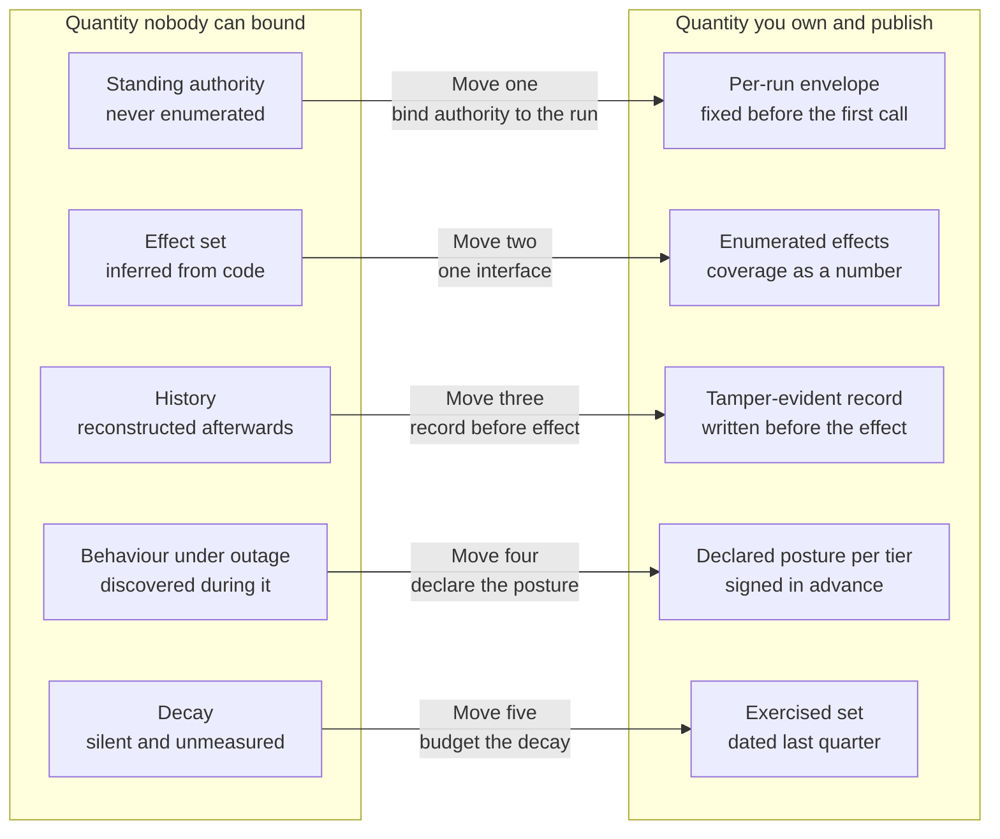

# Five moves and the invariants they buy

Most agent platforms acquire their architecture diagram before they acquire their architecture. A gateway, a policy service, an evidence store, a vault, and six arrows between them: it is an accurate drawing of what is deployed. It says nothing about what the system has made impossible.

The shape argued in this document is five moves rather than five components. Each move does the same thing to a different quantity. It takes something unbounded – something nobody in the room can put a number on – and replaces it with something bounded: something that has a value, an owner, and a specific way of being wrong.

- **Bind authority to a run rather than to an agent.** Standing authority that nobody has enumerated since the service account was created becomes a per-run envelope derived before the first model call.
- **Put one interface between guessing and doing.** An effect set that can only be inferred from code becomes an effect set you can enumerate and a coverage figure you can publish.
- **Make the record a precondition of the effect.** A history reconstructed after the fact from logs written by the component under suspicion becomes a tamper-evident record that exists because the effect was not permitted to happen without it.
- **Decide the failure posture before the failure.** Undefined behaviour under partial outage becomes declared behaviour, written into a matrix and signed by somebody with a name.
- **Budget the decay.** Silent degradation becomes scheduled exercise, with a date against every control saying when it was last shown to work.

**Each move takes a number the adversary chooses and replaces it with a number you choose.** The replacements are all worse than the numbers in a vendor deck and all of them are yours: 20–40 ms at p99 on every mediated call, an envelope derived 4,000 times a day for one triage agent rather than once at onboarding, and a standing operational obligation that shows up as roughly one engineer-day a week and never finishes. That is the whole trade, stated once, before any of it is derived.

*Figure 4.1 – What does each move actually buy? Each one converts a quantity that can only be described into a quantity that can be counted, and the right-hand column is the entire deliverable of this architecture.*

## Why this is five moves and not a component list

A component list invites the reader to shop. Every purchase in that shop is locally rational. The gateway is the obvious first buy. The evidence path looks like something that can wait a quarter. The recertification calendar is not a purchase at all, so it never enters the basket. What arrives at the end of that process is a platform with four of the five properties. That sounds like 80% of the architecture. It is not, because the properties are not additive.

Take any pair. Move two without move three gives you a system that can enumerate what it might do and cannot prove what it did. That is the position of a team that has a gateway and reconstructs incidents from application logs. Move one without move two gives you a carefully derived envelope and an unmeasured path around the gateway. The envelope constrains the well-behaved case and nothing else.

The moves compose because each one bounds a quantity the next one depends on. What matters for assurance is which unbounded paths the design has closed off – not which boxes appear on the diagram. Component inventories are easier to write and easier to shop from, which is why vendor decks favour them.

## Bind authority to the run, not to the agent

Authority attached to an agent has no number attached to it. Authority attached to a run does. Chapter 3 fixed the run as the unit of authority, budget, evidence, and revocation, with terminal states. That makes the question *what exactly are we revoking* answerable for the first time. The move here is the consequence: authority is derived at the start of each run and expires with it, rather than being inherited from whatever the agent's service principal has accumulated [ADR-02].

The derivation is an intersection rather than an inheritance. What the agent declared it needs, what the human principal can actually reach in the systems of record, and what the risk tier permits, with the smallest of the three governing. For one claim triage at Borealis Mutual that comes out at four typed operations against one claim. That is a set a reviewer can read in ten seconds, disagree with, and narrow. The comparison that matters is not against a perfect design but against the honest alternative: a service account whose permission set was last reviewed at onboarding and is now the union of everything anyone has asked for since.

The budget rides on the same boundary. It is counted in tool calls, because tool calls are what produce effects. Tokens are telemetry, useful for cost control and useless as a bound on damage. Chapter 5 derives the identity binding and the standing mandate that makes an unattended run possible without a live human. Chapter 6 derives the envelope arithmetic and attenuation. None of the underlying position is new: the capability tradition in security engineering has argued for decades that authority travels best as a designated, attenuable object rather than as an ambient property of whoever is holding an identity [@miller2003capability].

What it costs: derivation and credential issuance move from per agent to per run. For `claims-triage` that is 4,000 a day rather than one. The cost lands at run start where a person is often waiting. The declared-need artefact needs an owner and a review cadence or it drifts upward until it is a role by another name. And an agent can no longer acquire authority mid-run to handle an exception. That is a real capability foregone: the exception becomes a new run with a human in the derivation, and someone in claims operations will notice that this is slower.

## Put one interface between guessing and doing

The effect set becomes enumerable at the moment every effect has to pass through one interface, and not before. This is complete mediation, which Jerome Saltzer and Michael Schroeder stated in 1975 and which is not new to anyone reading this [@saltzer1975protection]. What is new is the denominator. In an agent system the interface is also the boundary between the part that guesses and the part that acts. Mediation stops being a property of the design and becomes a measured fraction: the proportion of paths to a system of record that go through the interface, counted against paths discovered rather than paths designed.

That number is never 100% at first measurement. The missing percentage points all have names. A credential in a developer's local configuration. A service account from a 2023 integration. A sidecar somebody added in March to unblock a release. Chapter 7 measures the fraction. Chapter 8 takes the seam itself, where a tool protocol decides the point at which the transition from guessing to doing physically happens. The first honest coverage measurement is uncomfortable in a way that a design assertion never is. That is the argument for publishing a number rather than an adjective: an adjective cannot be tracked quarter over quarter and a fraction can [ADR-12].

What it costs: 20–40 ms at p99 on every mediated call, most of it in the decision path. One interface is also one concentration of risk, which is why the design is federated gateways with centralised policy rather than a single gateway with a single failure domain. The heavier cost is organisational. Every tool now has an onboarding step, with a declared side-effect class and a manifest entry. The sanctioned road is therefore slower than the shortcut that goes around it.

## Make the record a precondition of the effect

Ordering is the whole of this move. The evidence record is written and acknowledged before the effect is executed. The absence of a record is then evidence of the absence of an effect, rather than evidence that logging was down. A log is a description of what happened. A precondition is a constraint on what can happen. Only the second survives contact with someone who benefits from the record being incomplete.

This buys two different things. It buys provability: a hash-chained record which is written first can be verified afterwards by someone who does not trust the platform operator, which is the position an auditor is professionally required to take. And it buys a bound on the divergence between what a human approved and what a system of record received. If the approved object is frozen and hash-bound, then the object executed is the object approved or the call is refused. Chapter 11 derives the evidence path, including the awkward part where tamper-evident records meet a legal obligation to erase personal data. Chapter 9 derives the binding between an approval and the effect it authorises.

What it costs: your effect path is now no more available than your evidence path. This is the trade people try to carve out first, usually as a proposal for best-effort logging with an availability exception for the busy hours. The durable write sits on the critical path and is the remainder of the 20–40 ms. The retention volume for a 4,000-run-a-day agent is a storage line item somebody has to sign. Refusing the carve-out is the one posture in this document that is not negotiable. A platform that can act without recording holds, for the duration of that interval, none of the three claims made in chapter 1 [ADR-23].

## Decide the failure posture before the failure

Every dependency in this system has a defined behaviour when it is unavailable. The only question is whether that behaviour was chosen in a design review or discovered at 03:40 UTC by whoever was on call. Undefined behaviour under partial outage is not an absence of a decision. It is a decision, made by the default in a library. It is usually fail-open, because fail-open is what an availability-minded engineer writes when nobody has told them that this particular call moves money.

The move is a matrix with one row per dependency and one column per risk tier, filled in before launch and signed by the person who owns the consequence. Policy service unreachable: refuse, for tier one; permit within a stated staleness budget, for tier three. Evidence path unreachable: no side effects, at every tier. Model provider unavailable, or routing outside the allowed model set: terminate the run rather than continue it on a substitute. You fill these rows in a design review with the business owner in the room. That is the only setting in which the answer is a decision rather than a default [ADR-25].

Revocation belongs to the same discipline. A stop that has never been executed against a live run is a hypothesis. The interval is a number in the matrix and the quarterly drill turns it into a measurement [A-7.1]. Chapter 13 engineers the decision path as the latency-critical component it is. Chapter 14 forces the matrix into a design review. Chapter 15 replaces the single kill switch with five distinct mechanisms.

What it costs: about a day per tier of argument between platform, security, and the business owner, repeated whenever a dependency is added, plus a quarterly drill that is a deliberate outage of your own making. Fail-closed rows cost availability in exactly the hour you will be asked about it. And the emergency path stops being an agent with elevated authority and becomes a human acting directly on the system of record. That is slower, and is the point.

## Budget the decay

Every control in the previous four moves degrades, most of them silently. The difference between an architecture and a diagram of one is whether that degradation has a budget line. The coverage fraction falls when a team ships an integration in a hurry. The envelope widens one declared-need review at a time. The policy bundle accumulates rules that have not fired in 90 days and nobody can now delete safely. The stop mechanism works, presumably, since the last time anyone ran it.

A reviewer will say that this is operational discipline rather than architecture and belongs in Part III with the other things an SRE inherits. The objection is fair. The answer is narrow: move five is the only move that decides whether the other four are still true in month fourteen. Demoting it to an operations chapter is precisely the mistake the field keeps making. The unit that makes it tractable is the signed agent manifest of chapter 12, because recertification needs an object it can diff. Chapter 16 derives the measurements and the calendar that use it. Chapter 17 prices the sanctioned path against the shortcut in minutes, which is the only unit that decides adoption. A control that has not been exercised in a quarter is not a control you have. It is a control you had. The distinction is invisible from the inside until the quarter you need it [ADR-27].

What it costs: roughly one engineer-day a week, permanently. It is the first line cut in a bad quarter because it is the only one whose removal produces no immediate symptom. You are buying an alarm on a slope, and slopes are politically difficult to fund.

## The invariants, and what would falsify each

The five moves are worth exactly what the invariants they buy are worth. So here are the invariants, once, in the only form that lets a reader disagree with them. Each is a statement about the system that could be false. Each is owned by one later chapter. Each has a conformance test in Appendix F [A-6.1]. An invariant with no test is a slogan with a reference number.

| | Invariant | Made true in | Test |
|---|---|---|---|
| I1 | No effect leaves the platform except through a mediated call. | ch. 7, ch. 8 | coverage measurement |
| I2 | No call carries authority beyond the envelope in force at the moment of the call. | ch. 6 | envelope conformance |
| I3 | No delegation widens authority. Widening is unrepresentable, not forbidden. | ch. 6, ch. 18 | attenuation proof |
| I4 | No side effect occurs without a durable, tamper-evident record written first. | ch. 11 | write-before-effect ordering |
| I5 | The object approved and the object executed are the same object. | ch. 9 | hash binding |
| I6 | Revocation takes effect within a stated interval, without the agent's cooperation. | ch. 15 | quarterly drill |
| I7 | Every control has a test, an owner, and a date on which it was last exercised. | ch. 16 | recertification calendar |
| I8 | Authority derivation reads no input the agent can write. | ch. 6 | declared-need immutability audit |

*Table 4.1 – The eight invariants, the chapter that makes each one true, and the test that would show it false.*

Two of them repay a second reading. I3 says that widening is unrepresentable rather than forbidden. That is the difference between a property enforced by construction and a policy rule that holds until someone writes an exception at 17:30 on a Friday. I8 says that nothing the agent can write is an input to its own authority. That sounds obvious until you notice how many designs derive scope from a task description the model produced. It is the reason declared need is a static reviewed artefact rather than a runtime field. Take your own system and ask the question this table is really for: which of these eight currently has no test, and how long has that been true?

## Why containment rather than detection

We prefer containment over prevention for one narrow reason. It is not that detection does not work. It is that detection's failure rate is chosen by the person attacking you. A number chosen by your adversary cannot sit in a safety case in the same column as a number you engineered.

Take the case for detection at its strongest, because it is strong. Injection classifiers catch real attacks. A carefully constructed system prompt measurably lowers the rate at which an agent does something expensive. Frequency reduction is worth money in a form a finance function recognises, in fewer incidents and fewer hours of investigation. A team that deploys a good classifier is better off than a team that does not. Any argument here that concludes otherwise has overreached. The published detection rates are good. The rate that belongs in a safety case, though, is the one measured against somebody adapting to your specific defence with unlimited attempts and a copy of your filter. That number is not published. We have not found a published false-negative rate for injection detection measured against an adversary adapting to the defender's own filter. Vendor detection rates are not a substitute.

Borealis Mutual held its post-incident review on 2026-03-12, 11 days after a claim document containing an instruction in a free-text note caused `claims-triage` to attempt an adjustment posting against a claim it had never been asked to touch. The attempt was caught by a reconciliation report the following morning, not by the classifier, which had scored the note below threshold. The review was competent and it was fast: 11 action items, owners against all of them, dates against nine. Two of the 11 were the wrong kind of item. One raised the classifier threshold. One added four paragraphs to the system prompt instructing the agent to disregard instructions found inside claim documents.

Neither was a bad thing to do. The threshold change plausibly stops the next copy of this attack. The prompt change costs almost nothing. The problem appeared three weeks later, in the assurance pack that went to the risk committee, where both items were listed in the controls column alongside the other nine: the egress allow-list, the narrowed envelope, the evidence gap on adjustment postings, the stop drill. In that column they carry a claim neither can support, which is that the attack no longer succeeds. The threshold change had an operational tail as well. `claims-triage` handles about 4,000 runs a day. The tightened threshold held roughly 3% of them for human review. By the sixth week a queue of about 120 runs a day was being cleared in batches by people who had stopped reading them individually. Kai had not tried again by then. Nothing in the assurance pack would have shown it if he had.

Nobody in that room was wrong about the value of a better prompt. They were wrong about which column of the slide it belonged in. That is a documentation error with a specific consequence: a false-negative rate the adversary selects, presented as though it were a design parameter the organisation selected. The two hygiene items belonged under *reduces frequency*, where they are honest and useful. The nine containment items belonged under *bounds the consequence*, where they can be tested. This is the whole of the decision: keep the filter, keep the prompt, and keep them out of the column that carries the claim. The bound has to hold on the run where the filter was wrong [ADR-01].

The honest limit of the preference is worth stating in the same breath. Containment's bound is only as good as the enumeration behind it and the coverage fraction underneath it. Both of those are quantities the organisation has to measure and keep measuring. That is a materially better position than a rate somebody else controls. It is a position with maintenance, not a position with a guarantee.

## What holding all five costs

The number from chapter 1 has not changed now that the shape is visible: four to six engineers for two to three quarters to a defensible first version, 20–40 ms at p99 added to every mediated tool call, and something like one engineer-day a week thereafter, permanently. What the five moves add is a distribution. The gateway and the decision path consume most of the first quarter and produce the most visible progress. The evidence path consumes most of the second and produces almost none, because its output is a property rather than a feature. This is where the initiative usually loses its sponsor. Move four costs argument rather than engineering. Move five has no completion date at all.

Economy of mechanism is doing quiet work in this cost profile [@saltzer1975protection]. The trusted computing base stays at the gateway, the decision path, the evidence path, and the key material underneath them. Each of the five moves was chosen partly because it adds constraint without adding trusted components. A move that required trusting the orchestration framework would be cheaper to build and would move the cost from the budget to the threat model, where it is harder to see and impossible to price.

The developer-experience cost is the one most often left out of the business case. It is the one that decides whether the coverage fraction holds. A shortcut does not announce itself. It appears as an integration that shipped unusually fast. Price the paved road as a product with an owner, or accept the fraction falling one hurried release at a time.

## What the five moves do not buy

None of this makes the agent correct: a run that stays inside its envelope, records every effect, and stops on command can still post a wrong adjustment to the right claim, and the platform will prove faithfully that it did so. None of it covers a path the platform does not mediate, which is why the coverage fraction is the one figure here worth arguing about in your own setting rather than accepting from ours. And none of it survives its own maintenance calendar being cut in a bad quarter. That is the only failure mode in this document with no alarm attached to it, and the reason chapter 21 exists.
