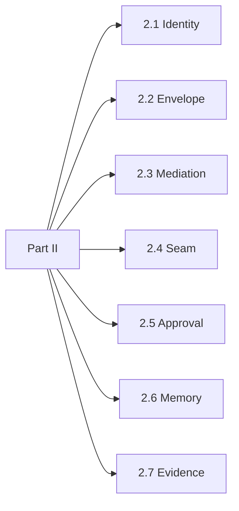

# Part II. The mechanisms

Complete for the architect and the platform engineer.

Each chapter starts from the failure that forces one mechanism. Each ends with what the mechanism costs and how you would know it had quietly stopped working. The rhythm is performed and never printed: the promise a competent engineer would like to believe, the circumstance in which it fails, a worked moment on a fixed cast, the move that survives, the artefact, the cost, and the decay question.

**Cold open.** You may start at any single chapter of this part. Part I is not a prerequisite. Each chapter opens with the plain claim in ordinary language before the invariant codes. A sibling chapter helps when the orientation strip says so; it is never assumed.

A reader who arrived from Part I can defend the shape. A reader who finishes this part can build the pieces. A reader who opens at a single chapter should leave able to argue for or against that mechanism in a design review without having read the others.

*Figure P2 – Part II spine: seven mechanisms, each from one failure.*
