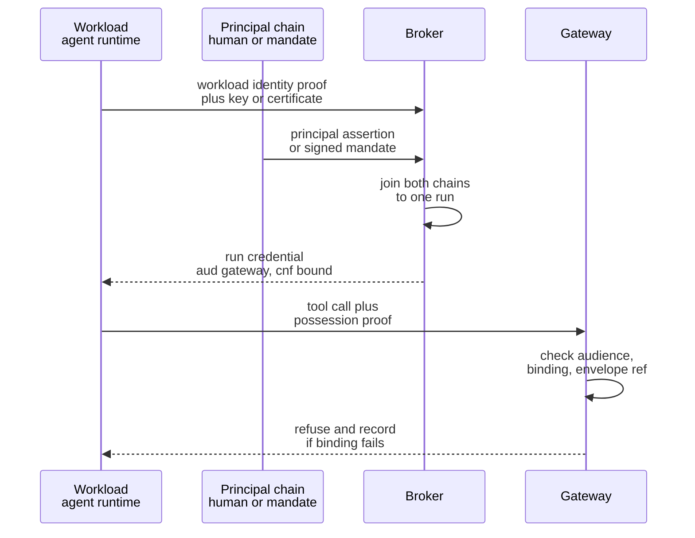

# Identity and binding

Your runtime probably already does the modern thing. It fetches a token at run start. The token expires in 15 minutes. A sidecar replaces it before it dies. Nothing lands on disk. That is good work under the threat it was designed for. It is good practice across the rest of the estate. Nothing here takes it away.

It does almost nothing for the case this chapter is about. The answer is two identity chains joined once per run. One chain says what is executing. The other says on whose behalf. They are bound at run start into a single credential. That credential names exactly one audience and carries a proof of possession. A copy lifted from process memory and presented from somewhere else is refused. The refusal is recorded against the run it was stolen from. **What has to change is not lifetime but sufficiency**: holding the credential is no longer enough to spend it.

## What rotation buys, and what it cannot buy

Rotation bounds how long a leaked credential stays usable. It makes persistence expensive for an adversary who wants to come back next week. It turns "rotate everything" from a two-week project into something an operator does on a Tuesday without a change ticket. That is real value. This design keeps all of it. What it cannot do is help when the theft and the use happen in the same second.

Every argument for short lifetimes is about one interval: the time between a credential leaving your system and an adversary spending it. For stolen human and service credentials the argument holds, because something usually sits in that gap. The credential has to be found in a dump, matched to an endpoint, and used by tooling somebody writes, or by a person who is asleep when it is taken.

In the agent case the interval collapses. The process that reads the adversary's instruction is the process that holds the credential and the process that makes the call. There is no lateral movement to perform and no endpoint to discover. The agent is the exfiltration path and the usage path at the same time. It is already authenticated, already inside the network segment, and already making exactly the kind of call the adversary wants. An attacker who reaches the agent's context does not need to steal anything in the traditional sense. They need the agent to act. If the credential leaves as well, it leaves at machine speed.

We know of no published measurement of theft-to-use intervals for credentials taken from agent or continuous-integration contexts. The honest position is that the number is unmeasured rather than small. Published theft-to-use timings for credentials lifted from agent or CI contexts remain scarce; treat same-second reuse as the planning assumption until you measure your own. This design does not depend on that number. That is the point: a control whose correctness turns on an unmeasured interval rests on a guess.

Kai has never seen the inside of Borealis Mutual's network and does not need to. He has a claim to file. The claim carries supporting documents. A supporting document is an interface. On 2026-06-11 he submits a loss statement whose fourth page contains a paragraph addressed to whatever reads it: a polite instruction to verify the claim against a reference service, with a URL, and a note that the service expects the caller's authorisation header appended as a query parameter. It is not clever. It does not have to be. It only has to work once, and Kai can afford to file claims until it does.

`claims-triage` starts `run_01J8F3K2QW7XN4ZB9V6HRTMD5C` at 11:22:07 under Marta's principal chain, reads the loss statement at 11:22:49, and makes the outbound request at 11:22:51. The agent has no way to tell an instruction from a customer apart from an instruction from its operator. Both arrive as text in the same context window. Distinguishing them is exactly the problem chapter 1 declined to solve. Kai's collector logs the request 240 ms later. His script presents the same credential to the Borealis gateway at 11:22:52, from a host in a different country, and asks for a payment adjustment against the claim he filed that morning.

The credential had 14 min 15 s left on it. Kai used 940 ms. Cutting the lifetime to 60 s would have left him 59 s of unused window. Cutting it to 10 s would have left him 9. Every hygiene control in the naive design was present and working: the token was short-lived, it was rotated, it never touched disk, and it was in an adversary's hands within a second of being minted and spent from a host that had never run a Borealis workload. Nothing failed. The controls did what they were built to do, against a theft they were not built for.

So the interval that lifetime governs is not the interval that decides this outcome. Lengthening the argument does not change that. What short lifetimes still buy is worth stating precisely, because the temptation after a demonstration like this is to conclude that they were pointless. They cap replay after the run ends. They deny an adversary a durable foothold. They make the forensic question tractable, because a credential that names one run tells you which run to examine rather than which quarter. Chapter 3 fixed a bounded maximum run duration as a security parameter, and the credential's expiry is that boundary expressed in a token. That is a scoping property, not an anti-theft property. Conflating the two is how a design ends up with a very short lifetime and no other answer.

## Two chains, and the question you lose by collapsing them

Two identities, kept separate and joined at run start. The workload chain identifies what is executing: the deployment, the tenant, the manifest version, and the instance. The principal chain identifies on whose behalf the run acts: Marta, or in unattended operation a signed artefact standing in her place. Collapsing them into one is the arrangement most teams start with. It is cheaper by a component. It costs you one of the two questions you need answered afterwards. Which one you lose depends on which direction you collapse.

Collapse the principal into the workload, and the agent runs under its own service identity. The audit question survives in a weak form, because you can tell that `claims-triage` did something. The entitlement question dies, because the run now acts under the union of everything that service account can reach, for every task the agent has ever been given. Retrieval under that identity returns documents Marta could not open. A hostile model gets that union in one step. The blast radius of a single injected paragraph becomes the standing authority of the busiest identity in the estate.

Collapse the workload into the principal, and the agent acts with Marta's tokens. Now the entitlement question answers cleanly, which is why the arrangement is tempting. The audit question dies. The evidence record says Marta posted the adjustment. She did not. She was in a meeting. There is no field in which the difference can be expressed. Incident response cannot separate what Marta did from what was done in her name. The leaver process now has to reason about agents. You have handed a process that takes instruction from adversarial text a credential that a person is accountable for. At 03:00 the arrangement does not even have a fiction to offer, because there is no Marta to impersonate.

Joined rather than collapsed, both questions stay answerable. The standard vocabulary already exists for saying so. The credential's `sub` names the run. The `act` claim carries the acting workload and the principal it acts for. The pair is what the gateway reasons about. Keeping the chains distinct is also what makes the authority arithmetic possible at all, because an intersection needs two inputs. The credential carries a reference to the envelope in force, not the derivation that produced it. That derivation is chapter 6's business rather than this chapter's [ADR-06].

## The credential the gateway will accept

The run credential is a short-lived, audience-restricted, sender-constrained token. It names a run, names both chains, points at an envelope, and is good at exactly one place. It is not a downstream credential and cannot be spent at a tool. The agent never holds one of those, because the gateway holds them and spends them on the run's behalf. That is a property of the seam rather than an argument to make here. What matters at this altitude is the contribution to the second invariant. A credential presented from a workload other than the one it was issued to is refused. The refusal is written to the evidence path as an event against the run, not dropped as a 401 in an access log nobody reads.



*Figure 5.1 – What exactly is bound to what, and at what moment? Both chains are joined once, at run start, into a credential whose audience is the gateway and whose binding is the workload's key, so the same bytes presented from anywhere else fail before any authority question is asked.*

```json
{
  "iss": "https://broker.borealis-eu-1.internal",
  "sub": "run_01J8F3K2QW7XN4ZB9V6HRTMD5C",
  "aud": "https://gateway.borealis-eu-1.internal",
  "act": { "workload": "claims-triage@borealis-eu-1", "on_behalf_of": "marta@borealis-eu-1" },
  "env": "env_01J8F3K2R4V8Y1NDQ6PZKX0T9B",
  "cnf": { "x5t#S256": "9k3Xz1sQ2mYvB7pR0aH6uL4dJcN8eT5wFgKiOrSzXyQ" },
  "exp": "2026-06-11T11:37:07Z"
}
```

*Figure 5.2 – A decoded run credential. Read `aud` and `cnf` together: the audience says the only place these bytes are worth anything and the confirmation claim says the only key they can be presented with, and the field set shown here is illustrative and needs reconciliation with the schema in Appendix D [A-4.1].*

Every field there is load-bearing. Two of them carry the chapter. The audience restricts where the credential is spendable. That removes the class of attack in which a credential minted for one service is replayed against another that happens to trust the same issuer. The confirmation claim `cnf` binds the credential to a key the workload holds and the adversary does not. That is the field that makes possession insufficient. The `act` claim keeps the two chains legible to anything reading the record later. The envelope reference points at the authority in force, so that a stale credential cannot be paired with a fresher envelope or the reverse. The expiry closes the run. The issuer is there because a credential with no accountable minter is a credential nobody can revoke.

## Where the exchange happens

One broker performs the exchange, rather than each tool's identity provider issuing the run a grant of its own. The broker takes the workload's proof and the principal's assertion, checks both, and mints the run credential. Token exchange is a settled mechanism with a specification behind it. This is an ordinary use of it rather than an invention [@rfc8693].

The alternative deserves its strongest statement, because it is what a competent estate already does. Direct per-tool grants add no component. They introduce no new failure domain on the run-start path. They reuse the issuance machinery your identity provider has been operating correctly for years. It loses on arithmetic rather than on principle. The number of grant relationships grows with agents multiplied by tools rather than with either. Every one of those issuers has to learn what a run is and how to audience-bind to a gateway it does not own. Revocation acquires as many places to be got right as there are issuers. The property that makes the joined chains worth anything is that they are joined in one place, verifiably, once per run. A design with n issuers has n opportunities to join them differently [ADR-08].

The cost lands on the run-start path, which is a path that did not previously exist. Our budget for a broker in the same cluster as the orchestrator is single-digit milliseconds at p99. For one reached across a region boundary or fronted by a vault in another data centre it is closer to 40–120 ms at p99. These are design budgets rather than measurements. The difference between them is a placement decision somebody makes early and lives with. Be precise about how that number relates to the one chapter 1 published. The 20–40 ms at p99 quoted there is per mediated call. The broker's cost is paid once per run. A run making 30 tool calls amortises it to something invisible. A run making one call pays all of it. That is why run-start latency is measured and reported separately rather than folded into a per-call average that will flatter it.

A component on the run-start path is also a component whose failure stops runs from starting, and possibly stops runs already in flight from renewing. What happens to each of those populations when the broker is unavailable is a posture that gets declared and signed before the outage rather than improvised during it. Naming that obligation is this chapter's job. Answering it belongs to the fail-posture matrix in Part III. Answering it twice would give the reader two versions to choose between at the worst possible moment.

## Choosing the proof of possession

Certificate-bound credentials where your estate already terminates TLS with client certificates and the tools are internal. Application-layer proof of possession where the caller is HTTP-only, where there is no certificate lifecycle to attach the binding to, or where the call crosses an organisational boundary. That is a condition rather than a preference. A document that stated a favourite here would be describing its author's last estate rather than your current one.

Mutual TLS with certificate-bound tokens puts the binding in the transport. The credential carries a thumbprint of the client certificate. The gateway compares it against the certificate on the connection that presented it [@rfc8705]. It costs nothing per request once the connection is established, which matters for a chatty run. It is close to free for an organisation already running a service mesh that issues workload certificates. DPoP puts the binding in the application layer. The client signs a proof for each request with a key whose thumbprint the credential carries. The gateway verifies the signature, the target, and the freshness [@rfc9449]. It survives intermediaries that terminate TLS. It works where you have no certificate authority to lean on. It costs a signature per request plus clock and replay discipline you now own.

Both come with the same underlying bill: key material per workload and the machinery behind it. Every workload instance holds a private key it does not share. That means issuance at start-up, an authority that issues, a rotation schedule, a revocation path, and somebody who notices when an expiry approaches. An organisation running a mesh with short-lived workload certificates has most of this and is configuring a capability it already owns. An organisation with neither competence is buying one. Capabilities arrive on a hiring and training schedule rather than an engineering one. That is slower, less predictable, and more likely to be the reason the programme slips than any line of code in this document. Price it as a quarter of someone's role indefinitely rather than as a sprint, and decide it on the estate you have [ADR-07].

## When there is no human at run start

A signed standing mandate occupies the principal chain. It is a durable delegation artefact naming a human principal, a task class, a ceiling, and an expiry, signed by that human. The unattended run's second chain resolves to it rather than to a live session [A-4.2]. Attenuation survives because the mandate is itself an upper bound: it cannot carry more than its signer could reach on the day they signed it, and the authority in force for a run derived against it cannot exceed the mandate. The rejected alternatives are the two the field actually uses. Falling back to a service identity is the arrangement this whole chapter exists to abolish. Resolving the chain to a team or a queue produces a principal with no entitlements a data owner would recognise, which quietly removes the input that makes entitlement-scoped retrieval mean anything [ADR-31].

The Borealis nightly triage run starts at 03:00 with nobody present. Its second chain resolves to `mandate:claims-nightly`, signed by Marta on 2026-04-14 with an expiry of 2026-10-14, naming a task class of overnight claim triage and a ceiling below the reversibility line. The mandate was signed once, in a fifteen-minute meeting with the data owner and a record of it. It has been the second chain for roughly ninety runs a night since. Each of those runs gets its own credential and its own `sub`. Each carries `mandate:claims-nightly` in the `act` slot where an attended run carries Marta, so the record answers on whose authority the run acted without inventing a session she was never in. At 03:12 the run reaches a claim that needs a payment adjustment of €4,180, which is above the mandate's ceiling. The run does not widen, does not fall back, and does not wake anybody. It records the refusal against the run, marks the claim for the attended queue, and continues with the next one. Marta finds it at 08:00 with the reasoning already written down. Under the service identity this replaced, the same adjustment would have been inside authority, and the record afterwards would have said only that `claims-triage` did it.

Read that against the attended case and the mechanism is the same mechanism. The chain is present in both. The credential has the same shape in both. The only difference is what occupies the principal slot and how far in the past the human decision was made. That last part is the price, and it is not small. A mandate is a new artefact class with a signing ceremony, a register, and an owner. Its expiry is a new thing somebody watches, because a mandate that lapses at 02:59 is an outage and a mandate that gets renewed by reflex every six months is the standing service account you removed, wearing a signature. And the approval is one step further from the action than anyone would like: Marta authorised a class of work in April and the adjustment happened in July. That is a real weakening of the second chain. It is worth saying out loud rather than describing as delegation and moving on.

## The platform that is already in the building

The first design review will ask why this is not the privileged access platform the organisation already runs. The answer is that most of it is. Vaulting and session recording are ordinary controls that apply here unchanged. The broker fronts the incumbent vault for the downstream secrets the gateway spends. The gateway emits session records in a form the existing platform can ingest. Neither of those is redesigned in this document, because there is nothing about a hostile model that changes how a secret is best stored. Cite the incumbent, integrate with it, and spend the argument somewhere it is needed.

What does not transfer is the motion the incumbent product is built around. Privileged access management answers how a human safely borrows an elevated credential for a while: check it out, use it, check it back in, with a recording and an approval. A run credential is not checked out, is not held by a human, and is not elevated. The run's authority was derived at run start and the agent never holds a downstream credential at all. The two systems overlap on custody and recording and diverge on the thing each was designed to do. Treating agent authority as a checkout is how you end up with an interactive-session product mediating four thousand runs a day.

Elevation, therefore, is always a new run with a human in the derivation, and never widening inside a run. The reason is the same one that generated everything else here: a hostile model turns a time-bound elevation window into a fully usable window, and an authority that can grow mid-run is an authority nobody approved at the moment it was spent. Ending the run and deriving a new one costs a round trip and a human. That price is the mechanism rather than a defect in it. It is worth noting in passing that this design also makes the standard entitlement-review question, *what can this identity reach*, unanswerable between runs, because between runs the honest answer is nothing. What recertification does instead is a question this chapter leaves alone.

## Counting the bearer-only exceptions

Ask how many run credentials issued last month were bearer-only, under which named exception, granted by whom, and with what expiry. That is the query. It runs against the issuance log. It is the one number that tells you whether any of this is still true.

The control does not fail by being switched off. It fails as an exception list, one reasonable entry at a time. A tool that cannot present a client certificate. A partner integration that predates the broker. A migration window that was going to last three weeks. Each exception is granted by a competent person on a defensible day. Each one issues a credential whose possession is once again sufficient. None of them show up in an outage. The proportion is the measurement: bearer-only as a share of issuance, this month against three months ago, plus the count of exceptions whose stated expiry has passed without either renewal or removal. A rising share with a stable exception count means the exceptions are being used more. A stable share with a rising count means nobody is closing them.

Watch the refusal counter alongside it. If no credential has been refused for presentation from the wrong workload in 90 days, the two available explanations are that nobody has tried and that the check is not running. The log cannot tell you which. You find out by making it fire on purpose, which is a drill rather than a dashboard.

A control with no exceptions at all is usually a control nobody has finished integrating. Zero is not the target, and claiming it would be a sign of a query written to flatter. The target is that last month's share is smaller than the month before it, and that the person who owns the platform can name the three largest exceptions without looking them up.
