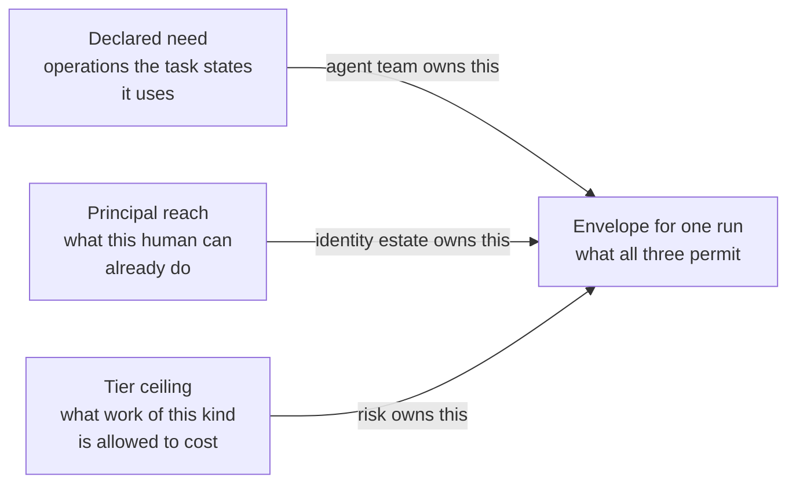
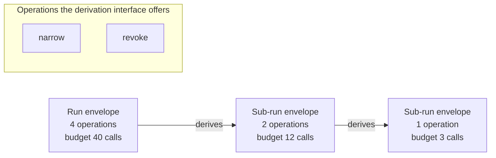

# The envelope

Open your identity provider and find the group your agent authenticates into. Count what is in it. Then count the operations the agent actually performs in one run. The first number is larger. It grew every month since the agent shipped. It is the same number on every run, regardless of what the run was asked to do.

Authority for a run is derived at run start as the intersection of three inputs owned by three different parts of the organisation. It is fixed for the life of that run. The only operations available to it afterwards make it smaller. That object is the envelope: the short list of typed operations this specific run may perform, with scopes and ceilings attached, computed before the first model call.

Three properties ride on that object. No call may carry more authority than the envelope in force at the moment of the call (I2). No delegation may widen authority (I3) – and that holds not because a rule forbids widening, but because the widening operation does not exist. Authority derivation reads no input the agent can write (I8).

## The union nobody decided to build

The role attached to your agent is not wide because anyone was careless with it. It is wide because a role is a union over every task the agent might perform, and any single run performs one of them.

Role-based access control with tightly scoped roles and a quarterly recertification is good practice. It is how the rest of the estate works. It survives audit. For human and service traffic it is close to the best available answer. It works for humans for a reason that is easy to miss: a person holding a wide role is still a serial device. They do one thing at a time, in working hours, at the speed of a mouse. The awkwardness of doing something outside their normal work is itself a control. None of those throttles survive the transfer to an agent that starts 4,000 runs a day, unattended, on input that arrives from outside the building.

Three things then happen to the role, and they happen everywhere. Permissions accrete, because each new task needs one and nobody is ever thanked for removing one. The quarterly review becomes unevaluable, because a reviewer is shown a list of rows and no mapping from any row to the task that justified it, and the only answer available to a reviewer who cannot evaluate a row is to approve it. And every run holds the maximum, because the role is what the run authenticates as, so an agent triaging a routine claim carries the authority it needs for the worst task in its repertoire.

On 2026-07-14 at 09:04 Marta opened a claim in the queue and started a run. The `claims-triage` role in the directory carried 47 tool permissions across nine systems, accumulated over 19 months as the agent picked up work: claim reads, document fetches, adjustment postings, claimant letters, a treaty read added for a reinsurance question in March, a payments-core read added for a reconciliation exercise that ran twice and was never removed. The signed manifest for `claims-triage` version 2.3.1 declares the triage task's need as six operations. Marta, a claims lead, can reach four of those six in her own right. The payments-core read and the reinsurance cession sit outside her entitlements and always have. The envelope derived for `run_01J8F3K2QW7XN4ZB9V6HRTMD5C` therefore carried four operations, scoped to the one claim, with the adjustment capped at €5,000 by the tier and a budget of 40 tool calls. The tier ceiling removed nothing that morning which reach had not already removed. That is worth noticing rather than celebrating.

Kai had filed a supporting document into that claim three days earlier. The agent read it as content and acted on it as instruction, which is the failure this document assumes rather than the one it tries to prevent. The run then used three of its four operations with hostile arguments: it read the claim, it fetched the attachment, and it posted an adjustment. Every one of those calls was permitted. The envelope refused none of them. What the envelope decided, before Kai arrived and without knowing he would, was the size of what he could reach: one claim, €5,000, one recorded adjustment, and no path at all to the payee record. `tool:payments-core/change-payee` was not among the four, was not among the six, and could not be added by anything happening inside the run. Under the role union it would have been one of 47, and so would the other 43.

## Three inputs, and none of them alone

Three parties decide what a run may do, and the run receives only what all three permit. The team that owns the agent declares what the task needs. The identity estate supplies what the human principal can reach. The risk tier supplies the ceiling for work of this kind. The envelope is the intersection, computed at run start. It is empty if any of the three is empty.

Each input answers a question the other two cannot. Declared need knows what the task does and knows nothing about who is asking. Principal reach knows Marta's entitlements and has no opinion about claims triage. The tier knows what a category of work is allowed to cost when it goes wrong and knows nothing about either. Take any one of them alone and you have a familiar failure. Need alone is the agent team granting itself authority. Reach alone is the agent inheriting a human's whole working life. The ceiling alone is a policy that permits everything the worst case permits. Least privilege has been the settled answer for fifty years [@saltzer1975protection]. The intersection is what that principle looks like when it stops being an aspiration and becomes a computation performed by a machine at a specific moment, on inputs that have owners and can be produced in an incident review [ADR-09].



*Figure 6.1 – Who decides what an agent may do? Three parties who do not report to each other, and a run gets only the operations on which all three agree.*

The three owners disagreeing is the mechanism working rather than a process failure. Borealis met that on the first day: the agent team declared a need for two operations that the claims lead cannot reach, and the derivation removed both without asking anyone. What follows is a conversation about whether the task really needs them, who would have to hold them, and whether that person should be the principal for this run. That conversation is the control. An architecture in which the three inputs always agree is an architecture in which two of them are decorative.

The gateway injects the envelope into every mediated call and enforces it there. It does not derive it. It cannot amend it. It has no interface that would let it try.

## The input the agent cannot write

Authority derivation reads no input the agent can write. That sentence is short. It looks like housekeeping. It closes the most patient attack in this chapter.

Consider what an adversary does once widening inside a run is unavailable. Kai stops attacking the run and starts attacking the next one. If the declared need for a task were computed at run start from anything the previous run touched – a memory entry, a task record, a note appended to a case file, a retrieved document summarised into a plan – then the shortest path to a wider envelope runs through the store rather than through the authority model. Write the request in session one, have it read back as need in session three, and the derivation obligingly launders it. Attenuation within a run buys nothing if authority can be widened between runs by an agent patient enough to leave itself a note.

So declared need is a static field of the signed manifest, reviewed by a human, versioned with the agent, and identical for every run of that version. It is an artefact of the agent, not a computation over the agent's history. The other two inputs have the same property: entitlements come from the identity estate, and the ceiling comes from a signed policy bundle. Nothing in the derivation path is writable by the thing whose authority is being derived. The audit for this invariant is mechanical rather than judgemental, because it asks one question about each input and the answer is a provenance, not an opinion.

The cost is honest and is paid in the manifest. Declared need cannot adapt to a task that turns out to be unusual, because adaptation is exactly the property being removed. A run that meets work outside its declaration does not stretch. It stops and hands the problem to a derivation that a human is part of.

## A ceiling, not a cached answer

The envelope is an upper bound fixed at derivation, not a cached policy result. Policy is evaluated per call, inside that bound, against the arguments of the call. It can refuse anything the envelope permits.

This is the seam a hostile reviewer finds fastest, so it is worth having the answer before the question. If policy narrows while a run is in flight – a tool is quarantined at 09:11, a counterparty is added to a block list, a value threshold drops – the next call the run makes is evaluated against the new policy and is refused. Narrowing is immediate, because narrowing happens where the decision happens. If policy widens while a run is in flight, nothing happens at all. The run finishes under the ceiling it was born with, and the wider authority becomes available to the next run that derives one. A ceiling that moved during a run would not be a ceiling. An envelope that tracked policy would be a cache with a staleness budget, which would put the authority model in the hot path and make its correctness a property of a distribution mechanism rather than of a derivation [ADR-35].

What this concedes is precise, and stating it is cheaper than being caught with it. For the remaining lifetime of a run in flight, the platform is enforcing a ceiling that has been withdrawn. That window has a maximum, and the maximum is the maximum run duration. That is why that parameter is a security parameter and not an operational convenience. Borealis runs T2 work with a 30 min ceiling. Whether 30 min is acceptable is a risk decision, taken with the knowledge that everything derived before the withdrawal keeps its old bound for at most that long. Where 30 min is too long, the answer is not to make the envelope mutable. The answer is revocation, which stops the run rather than editing its authority, and which has its own interval and its own drill.

That is also what the phrase *in force at the moment of the call* is doing in I2. An envelope that has expired is not in force. A revoked envelope is not in force. A call arriving after either is refused on the same code path as a call for an operation that was never in the set.

## Widening is absent rather than forbidden

Delegation narrows because the interface that derives a child envelope from a parent offers narrowing and revocation, and offers no third operation. There is no widening call to authorise, to audit, or to get wrong.

The alternative is the one most systems have: a rule in the policy engine saying that a sub-agent's authority does not exceed its parent's. That rule is reviewable. It is testable. It is enforced by code that a competent team wrote on a Thursday. **A rule that can be violated by a bug is not an invariant.** It is a control with an unmeasured failure rate, sitting exactly where the blast radius is largest. Its failure mode is silent, because a widened envelope looks like a working system. Making the operation absent moves the property out of the enforcement path and into the shape of the data, where a bug produces an error rather than an escalation [ADR-10].

This is the capability tradition's actual contribution, and it is older than the problem we are applying it to. Authority is held as a reference that cannot be forged or named from outside. The only thing a holder can do with it is pass on something equal or weaker [@miller2003capability]. That property, rather than any quantity of exhortation, is what resolves the confused deputy [@hardy1988confused]. The deputy's problem was never that it was stupid. It was that authority and instruction shared one channel, so text arriving in the channel could designate authority the deputy held. Here, the run cannot name its authority. It names an operation and arguments, and the ceiling those are checked against is not addressable from inside the run. Instructions that arrive in a claim document can ask for anything they like. There is nothing for the asking to point at.



*Figure 6.2 – What can a delegating run pass on? Less than it holds, or nothing, because the interface has two operations and there is no third one to misuse.*

Attenuation is established here. It is the property that survives composition, which is the reason chapter 18 can discuss agents calling agents without reopening the authority model.

## Naming what exists rather than what is dangerous

The catalogue is an allow-list of typed operations. An operation that is not registered, typed and named is not callable. The platform has no generic escape hatch through which an unregistered effect can be reached.

The deny-list is the alternative and it deserves its strongest form, because it is what most estates run and it is not stupid. It scales with what you have learned. It never blocks a delivery. It concentrates security attention on the operations that actually frightened somebody. It loses on one property: its completeness depends on having enumerated what an adversary will think of, and the tool catalogue grows faster than the list of things anyone has thought of. An allow-list is wrong in the direction that produces a refusal and a ticket. A deny-list is wrong in the direction that produces an effect and an incident review [ADR-11].

Typing is the half of that decision which does the quiet work. An operation carries a declared shape for its arguments. That is what allows the tier to cap an adjustment at €5,000 rather than making a binary decision about whether posting adjustments is permitted at all. Without types, every ceiling collapses into a yes or a no, and yes is the only answer that lets the work proceed.

The uncomfortable consequence is worth stating rather than burying. A new operation cannot be used on the day it ships. It has to be registered, typed, assigned a side-effect class, and admitted to a tier before any envelope can contain it. Until then a developer who built it in the morning cannot call it in the afternoon. That is a real tax on delivery. It is paid by the people whose goodwill the platform depends on. The answer to it is not a story about how security is everyone's responsibility. The answer is chapter 17, which is about making that interval short enough that nobody looks for a way around it.

## When a run needs more than it was given

A run that turns out to need authority it was not given does not get it. The run ends. A new run is derived. A human sees the difference between what was declared and what was asked for.

The argument for in-run expansion is a good one and it is about throughput. The work is half done. The context is assembled. The model has read the file. A widening call would cost milliseconds against the several minutes that starting over will cost. The reason we refuse it anyway is positional rather than moral: an expansion mechanism is an operation that grants authority, and it sits inside the run, which is precisely where the adversary is. Any path that can widen a run's authority is a path Kai can drive. The justification attached to the request will be excellent, because producing a plausible justification is the cheapest thing in the entire system.

Price the loss properly, because it is not small. Every escalation costs a second derivation, the human latency of somebody deciding, and whatever in-run context was not written to a system of record. If one run in a hundred needs more authority, a queue running 4,000 runs a day generates 40 human decisions a day, which is a person. That number is the reader's to calculate with their own escalation rate. If it comes out unaffordable, the correct response is to fix the declared need rather than to build the expansion path.

What you get for it is a delta somebody can see. An expansion call inside a run leaves a log line in a stream nobody reads. A run that quietly did more than its task declared is indistinguishable afterwards from a run that did exactly what it should. A new derivation leaves a record naming the three inputs, the operations added, and the human who accepted them. The escalation rate then becomes a measurement of how wrong the declarations are, which is information the expansion design destroys at the moment it is most useful. Elevation as a new run is the same rule the platform applies to privileged human access. That is convenient, because it means the operational pattern is already familiar to whoever runs your vault.

## The object itself

The derived envelope is the object the run credential refers to. The credential's issuance is chapter 5's business rather than this chapter's. What matters here is what the object contains and what it deliberately does not.

```json
{
  "envelope_id": "env_01J8F3K2R0YB6D8QW1XN4ZB9V6",
  "run_id": "run_01J8F3K2QW7XN4ZB9V6HRTMD5C",
  "tenant": "borealis-eu-1",
  "agent": "claims-triage",
  "agent_version": "2.3.1",
  "principal": { "id": "user:marta", "role": "claims-lead" },
  "tier": "T2",
  "derived_at": "2026-07-14T09:04:11Z",
  "expires_at": "2026-07-14T09:34:11Z",
  "operations": [
    { "op": "tool:claims-core/read-claim", "scope": { "claim": "CLM-2026-448120" } },
    { "op": "tool:document-store/fetch-attachment", "scope": { "claim": "CLM-2026-448120" } },
    { "op": "tool:claims-core/post-adjustment", "scope": { "claim": "CLM-2026-448120" }, "constraints": { "max_value_eur": 5000 } },
    { "op": "tool:notify/send-claimant-letter", "scope": { "claim": "CLM-2026-448120" }, "constraints": { "template_set": "claims-standard" } }
  ],
  "budget": { "tool_calls": 40 },
  "parent_envelope": null,
  "derived_from": {
    "declared_need": { "manifest": "claims-triage@2.3.1", "digest": "sha256:9f2c1d4b…", "operations": 6 },
    "principal_reach": { "source": "entitlement-service", "evaluated_at": "2026-07-14T09:04:11Z", "removed": 2 },
    "tier_ceiling": { "tier": "T2", "bundle": "policy-2026-07-09", "digest": "sha256:41ab7c05…" }
  }
}
```

*Read `derived_from` first: three inputs, three provenances, and not one of them writable by the run this envelope governs; then notice that there is no field anywhere in the object by which it could be made larger [A-4.2].*

## Who pays, and at what moment

Three parties pay for this, and only one of them is the platform team.

The run-start path pays first. Derivation reads a manifest field, evaluates entitlements for the principal, and applies a tier ceiling from a signed bundle. Our judgement is that this belongs in a budget of tens of milliseconds at p99 when the entitlement lookup is local and cached, rising into the hundreds when it crosses a network the platform does not own. Against a run whose model work takes seconds, that latency is not the interesting cost. The interesting cost is the coupling: no entitlement answer means no derivation, and no derivation means no run starts at all. That is a fail posture rather than a performance figure, and it belongs in the matrix you sign before the outage.

The declared-need artefact is paid for by the agent team, permanently. Somebody writes it. Somebody reviews it. Somebody keeps it true as the task changes. In the first quarter it will be wrong in both directions. Over-declaration is the dangerous error, because a need declaration copied from the role restores the union with additional paperwork. Under-declaration is the loud one: the run hits an operation it was not given, stops, and turns into an escalation and a bad afternoon. Expect a high refusal rate in the first weeks and expect it to fall. If it does not fall by the end of the second month, what is broken is the declaration process rather than the mechanism, and no amount of tuning the ceiling will fix it.

Developers pay the third price, and they pay it at the worst possible moment. The friction of this design does not land during design review, when there is time to discuss it. It lands when someone has working code, a demo tomorrow, and an operation that is not yet in the catalogue. A platform that answers that person in a week has taught them to route around it. Every such lesson removes a path from the mediated set and puts it back in the estate as something nobody is watching.

## When the intersection becomes a constant

Measure one number every week: the fraction of derived envelopes whose operation count sits within 10% of what the tier ceiling would have permitted. A tolerable system produces envelopes materially narrower than the ceiling, because the ceiling is a bound on a category and the task is one member of it.

A rising fraction means the declarations have become copies of the ceiling. That is what happens when writing a need declaration is treated as a form to be cleared rather than a statement to be defended. The honest reading is that the intersection has become a constant. At that point the arithmetic still runs, the ADR is still in the appendix, and the envelope is the role union again with three signatures on it and a shorter lifetime.

Two supporting numbers make the first one legible. How often principal reach removes anything at all: if the answer approaches never, either the principals are unusually well provisioned or the runs are being derived against a service identity that has quietly become everyone's proxy. And how many operations in the derived envelopes were never exercised: an operation declared, granted and unused for a quarter is a declaration nobody has revisited, and the recertification query that finds them is one of the cheapest controls in this document.

The 10% line is not a magic number, and the threshold matters less than the direction it moves in. Take the measurement weekly, plot it, and put it in front of the people who write the declarations. The measurement costs a query. The failure it detects takes a year to arrive, produces no error, and will still be reported to you as a working system.
