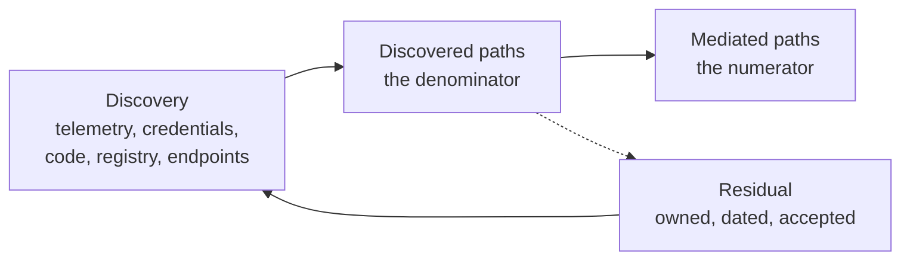

# Complete mediation

Open the architecture diagram for your agent platform and count the arrows that reach a system of record. Every one of them passes through the gateway, because you drew it that way. The drawing is correct.

The diagram cannot tell you how many arrows exist that nobody drew. That number is not zero anywhere. Complete mediation is therefore not a property a design document can assert. It is a ratio between the paths the platform mediates and the paths that exist. The second of those is discovered rather than designed. The only honest form of the claim is a figure with a date and a denominator attached to it. Invariant I1 says that no effect leaves the platform except through a mediated call. The coverage number is the statement of how true that is this quarter [A-6.2].

This is the dashed line from the trust-boundary schematic in chapter 1, promoted to the subject of a chapter. Everything the preceding two chapters built – the two identity chains, the per-run envelope, the arithmetic that narrows a standing role down to the operations one run needs – bounds what happens on the paths the platform sits on. None of it constrains a path the platform is not on. An envelope is a bound on mediated authority. On an unmediated path there is nothing for it to bind.

## The principle everyone agrees with

Complete mediation is the least glamorous of Saltzer and Schroeder's principles and the one most reliably lost. The reason is structural rather than cultural: it is the only one of them that cannot be satisfied by building something [@saltzer1975protection].

The principle says that every access to every object is checked for authority, with no cached answer standing in for a check and no route around the checker [@saltzer1975protection]. In 1975 that was a statement about a machine. There was a kernel. The reference monitor was a place. A route around it was a defect in a component that somebody owned. An enterprise has no kernel. It has a procurement history. Complete mediation in that setting is a claim about everything the organisation has ever bought, built, or inherited. That is a claim no component can make on the organisation's behalf.

The other principles admit an owner and a diff. Least privilege lives in a derivation and is testable against an envelope. Fail-safe defaults live in a decision function. Economy of mechanism lives in the size of the trusted computing base, which is three components and the key material beneath them, and stays that size because somebody defends the number in review. Complete mediation is satisfied by an absence. Absence has no maintainer. No test in your repository fails on the day it stops being true.

So the principle survives as an adjective, and the adjective is usually applied in good faith. A team that writes *all tool access is mediated by the gateway* into a design document is describing what it built and what it intends. On the day the sentence is written it is true of everything the authors know about. The sentence then sits unchanged for two years while the estate underneath it changes every week. The sentence does not decay. The estate does.

## How a path escapes

Paths escape because each one was the cheapest correct answer to a real problem on a day when nobody was thinking about agents. Not one of them looked like a security decision at the time.

Five recur everywhere. The sidecar added in March to move a nightly file, because the alternative was a change request against a system with a quarterly release train. The developer laptop holding a production credential, issued for a migration that finished in 2024 and revoked by nobody, because revocation was in no one's definition of done. The legacy service account that predates the identity estate, authenticates with a password in a vault, and cannot be federated until a vendor ships an upgrade the vendor has not scheduled. The batch job somebody reused for a new purpose because it already held the access, which saved a two-week request. The direct call to a vendor SDK inside a service that also hosts an agent, where the direct call is three lines and the mediated call is a client library, a registration, a side-effect classification, and a review.

They have one shape in common. Each is an authenticated route to a system of record whose authority was granted to a human or a service before agents existed, and which an agent can now reach because it runs inside the trust context that route was built for. Nothing about the route changed. What changed is that something non-deterministic, reading input that arrives from outside the building, now shares the context.

The last of the five deserves separate attention, because it is the one that reproduces itself. When the mediated path costs a developer an afternoon and the direct call costs three lines, the direct call is what ships on a Thursday. It ships from somebody who is not being careless but is being measured on delivery. Coverage falls whenever the sanctioned path is slower than the shortcut, reliably, and without a decision anywhere in the process that anyone would recognise as one. That is a fact about developer minutes rather than about intent. The remedy for it is chapter 17's. No quantity of measurement changes the arithmetic that produces it.

The newest path is the one growing fastest and it is not on the list above, which is a list from 2024. The runtime a developer already runs – the editor, the desktop application, the vendor client – speaks the tool protocol natively and carries its own connector configuration in a file on the endpoint. Adding a connector takes a minute and no request. Under a benign model that is a productivity story and a good one. Under the assumption this document works from, it is an unmediated route to a production system with a fully authenticated user behind it. Counting it is this chapter's business. Enforcing on the endpoint belongs to configuration management, which is a real control owned by a team that will not read this document. The platform's obligation is to hand that team a list rather than to design their tooling [A-1.7].

Borealis Mutual closed its first coverage audit on 2026-06-12. The platform team expected a number in the high nineties and got one: 94% of effect-bearing calls into the four systems of record went through the gateway, measured by weight over 30 days. Weight was the flattering denominator. Counted by distinct integration path instead of by call volume, the audit found 61 routes into those systems, of which 44 were mediated, which is 72%. The 17 in the remainder were the interesting ones, because a path carrying almost no traffic is a path nobody is watching.

One of the 17 was a connector configuration in a developer's editor, on a laptop, pointing at production Guidewire. It had been there since a data-quality exercise in March. The credential behind it belonged to a service account with write access to claim documents, which was the correct grant for that exercise and had outlived it by four months. Nothing about the configuration violated a policy on the day it was written. No control in the estate would have found it, because the file lives on an endpoint and the platform reads no files on endpoints.

On 2026-07-11 a supporting document was written into `CLM-2026-448120` through that route. Three days later Marta opened the claim and started `run_01J8F3K2QW7XN4ZB9V6HRTMD5C` at 09:04. The agent read the document as content and acted on it as instruction. How Kai reached the laptop is a question for the endpoint team and it has an answer. The question this chapter can answer is why the platform had nothing at all to say about the write: there was no mediated call, so there was no decision, no evidence record, and no provenance attached to the document that the run later read as an instruction. The path was found by an audit six weeks before it mattered. It was still open on the day it mattered, because finding a path and closing one are separate pieces of work with separate owners and separate queues.

## Finding what you did not draw

Coverage is measured by discovery. Discovery is a standing function rather than a project. The useful contribution here is the method, because no published measurement exists of how many unmediated integration paths a typical enterprise carries No organisation we can cite publishes its own unmediated-path denominator; the first number you will see is therefore your own.. Vendors publish detection rates. No organisation publishes its own denominator. That is why the first number you see will be your own.

Four sources, none sufficient alone, each blind in a way the others partly cover. Egress telemetry answers what talks to what, and goes blind inside a trust zone and wherever traffic is TLS to the same endpoints the mediated path already uses. Credential usage attribution asks each system of record who authenticated against it over 30 days and reconciles that against who the platform believes is calling. That is the strongest single source, because an effect needs a credential and a credential leaves a record. It goes blind on shared and legacy accounts, which is exactly where the oldest routes live. Dependency and code scanning finds SDK clients compiled into services, and goes blind on configuration and on anything outside your own repositories. And the reconciliation between what the tool registry says exists and what the network says is talking produces two lists whose difference is the finding, in both directions, since a registered tool nobody calls is information too and a cheaper problem to hold.

A fifth source arrives from a different team, on a different cadence, in a different format: the endpoint configuration inventory, which is the only route by which the connector on the laptop is ever counted [A-7.2].

None of the five finds everything and their union does not either. That is why the number is reported against discovered paths and why the discovered set carries a date. A coverage figure without its denominator beside it is an opinion with a percentage sign on it.

*Figure 7.1 – What is coverage a ratio of, and what moves it? The numerator is the paths the platform mediates and the denominator is the paths discovery has found, so the number improves either by closing a path or by failing to look for one.*

The consequence takes a moment to accept: a good quarter lowers the number. Discovery finds nine routes nobody had counted. The denominator grows by nine. The ratio falls. The estate is in better condition on the day the ratio falls than it was the week before, because a path that is counted has an owner and a path that is not counted has users. A ratio that rises every quarter without exception is not evidence of progress. It is evidence that the denominator is being maintained by the people who are measured on the numerator.

## One interface, several of them

Mediation is one interface and several deployments. One contract, one decision path, one evidence format, and a gateway per domain rather than a single gateway for the whole estate.

The single central gateway is the stronger design on the property this chapter cares about most. Conceding that is cheaper than pretending otherwise. One place to count turns coverage into a query rather than a reconciliation. One policy version removes the distribution problem entirely. One deployment means one upgrade, one key rotation, and one rotation of people who know how the thing behaves at three in the morning. An organisation in a position to have that is better off with it. A small estate with one network and one change window is in that position.

It loses on three properties that arrive together as the estate grows. Latency: every call crosses the network to one location, which for a domain whose system of record sits in another region is tens of milliseconds at p99 before the decision path has done anything, on top of the 20–40 ms at p99 the decision itself already costs. Blast radius: the component that mediates everything is the component whose failure stops everything, and its fail posture stops being a per-domain risk decision and becomes one decision taken centrally by people who cannot hold every domain's tolerance in their heads. Organisational reality: one gateway needs one team holding change control over every integration in the company, and the claims platform's release train is not the treaty system's, so the first domain that cannot take an upgrade holds everybody else's.

Federating moves the difficulty rather than removing it, and the place it moves to is expensive. With one gateway the policy bundle sits where the decisions are made. With several, one signed bundle reaches several places at slightly different moments. Bundle staleness acquires a number. That number becomes a security parameter. The hot path acquires a distribution dependency it did not have before. Chapter 13 pays that bill and it is not a rounding error. Coverage measurement gets dearer too, because the number becomes a sum across deployments with a reconciliation underneath it and more places for a path to be counted twice or not at all [ADR-13].

One contract is what keeps this from being several platforms wearing one name. Each deployment presents the same call shape, evaluates against the same signed policy, and writes the same evidence format. A domain that negotiates a variation on any of the three has left the mediated set while continuing to appear in the numerator. What that call shape actually is, and what the protocol carrying it does and does not guarantee, is chapter 8's subject. This chapter's business is only how many of them there are.

## The number on the slide

Publish the number. Publish the denominator next to it. Give discovery to somebody who does not own coverage.

The alternative is mediation as a design assertion, and it is not dishonest. A design document exists to state intent. The intent is right. *All tool access is mediated by the gateway* is what the team is building towards. The defect is that an assertion has no failure mode anyone notices. It cannot be wrong on a Tuesday. It can only be discovered, eighteen months later, to have been wrong since the spring. An unmeasured hundred per cent is not a better number than a measured 60%: it is the same estate with the measurement missing, and only one of those two organisations knows which path to close first.

Publishing carries a governance consequence that survives every good intention. Once the number is on a slide it becomes a target. A targeted ratio is gamed from the denominator, because the denominator is where every ratio is gamed. Nobody has to lie for this to happen. It is enough for discovery to slip one quarter while a delivery date is live, for a scan to be scoped to the systems that came back clean last time, or for a category of path to be reclassified as out of scope with a defensible paragraph attached to it. The counter-measure is structural rather than cultural: discovery is owned by somebody whose objective is finding paths, coverage is owned by somebody whose objective is closing them, and the two do not share a manager below the level at which that trade-off is supposed to be made. It costs an organisational argument. The argument is winnable while the programme is new and considerably harder afterwards. Winning it is the difference between a number that measures the estate and a number that measures the reporting [ADR-12].

A path you cannot close this quarter is not a gap in a report. It is a risk acceptance with a named owner, a date, and a compensating control where one exists, recorded in the same register as every other risk acceptance the organisation carries and visible to the same people [A-1.7]. A register holding 17 open paths, each with an owner and a date, is a plan. The same 17 in a footnote is a finding that somebody else will make later, with worse timing and a larger audience.

There is a second dimension to the number, and it is the one nobody volunteers. A path can be mediated and still be one whose downstream credential the gateway holds at rest. Where the system of record supports token exchange, the gateway brokers and keeps nothing that outlives the run. Where it does not, and the legacy half of the estate is where it does not, the gateway is a custodian, with material in a hardware module and separation per tool. Both are mediated. Both count in the numerator. They are not the same risk: the first concentrates authority for the length of a run, the second concentrates it permanently in the component that already sees every call. A coverage report that adds them together is reporting a mediation ratio while quietly reporting nothing about concentration. So the report carries two figures, the share of discovered paths that are mediated and the share of mediated paths brokered rather than custodied. The second one starts low, moves only when a downstream system gains a capability the platform does not control, and leaves a residual that belongs to chapter 21.

## What it costs to know

The measurement costs more than the mediation. Most of what it costs is attention rather than tooling.

The tooling is assembly rather than invention. Network telemetry, identity provider logs, code scanning, and an endpoint inventory exist in most estates already. Joining them into a path list is weeks of work rather than quarters. The standing attention is the expensive half and it never falls to zero. Somebody reconciles five incomplete lists, argues about whether a shared account reaching three schemas is one path or three, holds that definition stable so this quarter's number is comparable with last quarter's, and chases the owner of a route who has since changed team. Budget a person for a week per quarter per domain. Note that this comes out of the same roughly one engineer-day a week the platform already owes. That is a way of saying the standing obligation was underestimated rather than that this part of it is free.

A gateway per domain multiplies the operational surface. The multiplication lands on the on-call rotation rather than on the build. Each deployment is a thing to upgrade, key-rotate, monitor, drill, and understand under pressure. Four domains do not cost four times one, because the runbook and the tooling are shared. They cost materially more than one, because the failure modes are per deployment, the policy bundle reaches four places on four slightly different clocks, and the coverage number now has four sources that have to agree.

The third cost is political and it is the one that is routinely underestimated, because it does not appear in any estimate. A first measurement that comes back at 60% is a statement about the organisation's last five years, delivered by whoever was asked to take the measurement. Publishing it requires an organisation that can look at 60% without punishing the person who found it. The cheap way to find out whether yours is that organisation is to publish the first number internally, to the smallest audience that includes somebody who can fund the remediation. If that meeting turns into a discussion of methodology rather than of the 17 open paths, you have your answer early, and the second measurement will be higher and less true.

## When the number stops moving

A coverage programme dies in the denominator, quietly, while the headline number improves.

Ask what this quarter's coverage number is, and expect two figures rather than one: the share of discovered paths that are mediated, and the share of mediated paths brokered rather than custodied. A single figure has already thrown away the half of the answer that concerns concentration. That half does not improve on its own.

Then ask whether the denominator is larger than last quarter's. A denominator that grew means discovery ran. A denominator identical to last quarter's, path for path, means somebody re-ran a saved query and the programme has become a report. A denominator that shrank has an explanation. The explanation is either a decommissioning with a change record behind it or a scoping decision that somebody made without having to argue for it. Those two look the same in a slide and nothing like each other in a register.

And ask who read it. Not who received it: a distribution list is not a reader. If the number reached a governance forum, appeared on a slide, and produced no argument, then it was measured, published, and unread. That is the estate you had before with a ritual on top of it. A measurement is only a control for as long as somebody is annoyed by it. It helps a great deal if that somebody controls a budget.
