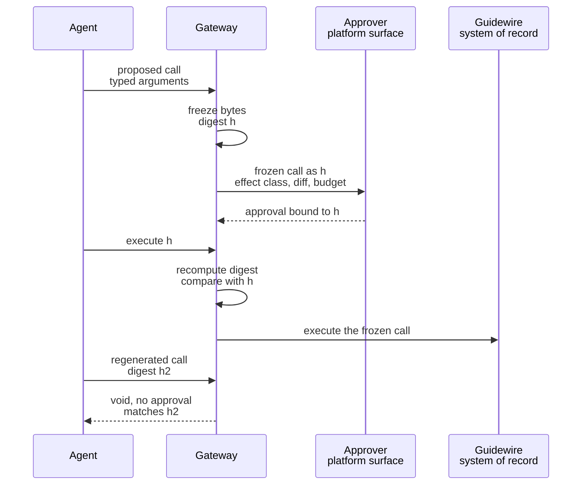

# Approval and effect integrity

Somewhere in the design you already have, there is a queue. Somebody senior sits in it. The card shows a claim number, an amount, one sentence of explanation, and two buttons. The person looking at it has thirteen more before their first meeting.

For that queue to be a control, two things have to be true. Most designs supply neither.

First, the object the human approved has to be the object the system executes. That check happens at execution, not at approval time. This is invariant I5. You freeze the call and compare hashes.

Second, somebody has to be reading. A gate nobody reads creates confidence without control. There are only two honest responses: fix the gate, or take it out and lower what the action is allowed to do.

## The gate the risk committee asked for

A human in the loop for consequential actions is the right control above the reversibility line. It is the first thing every risk committee asks for. It is not a formality by nature.

A person brings something the decision path cannot. Policy checks the arguments of a call against types, scopes, and ceilings. A human checks the action against the world. An adjustment can sit inside its cap, inside its scope, and inside budget, and still be obviously wrong to anyone who has read the claim's history. No rule expresses that. Where the human is genuinely reading, the gate catches a class of error nothing else here catches.

That is the case for the gate. It fails in two independent ways.

It fails on integrity when the human approves one artefact and the platform executes another. The reading was accurate and irrelevant.

It fails on attention when the gate is the fourteenth of the morning and the decision has become a motor action.

The independence matters operationally. Hash binding with an unread queue produces a compliant record of a decision nobody made. A diligent reviewer with no binding is a diligent reviewer of the wrong object. Most implementations address neither. Both are invisible while things work. Both produce the same artefact a working gate produces.

## Approval consumes authority rather than granting it

An approval can only ever be about something the envelope already permits. The envelope was derived at run start from three inputs the run cannot write. Nothing inside the run enlarges it. So an approval is not a grant of authority. It is a condition attached to spending authority that already existed.

That inversion is why a gate is safe to put inside a run. The approval surface has no interface through which authority can be created. An adversary who reaches the surface reaches a switch that only turns down.

A reviewer will raise the legitimate edge case immediately. Somebody genuinely needs to authorise an action outside what the run was given: the claim needs an adjustment above the cap, or an operation nobody declared. That approval does not happen inside the run. The run ends. A new run is derived with the human in the derivation. The difference between what was declared and what was asked for is visible in the second derivation's record. There is no in-run widening and no break-glass path the agent can take. A mechanism that grants authority inside a run sits precisely where the adversary is. The justification attached to the request will be excellent. Producing a plausible justification is the cheapest operation in the system.

The approval surface itself belongs to the platform, not to anything on the far side of the seam. This is the part most often built wrong. A tool server that can raise a question in front of an approver has been handed the ability to write the text a human decision is made on. That is a shorter path to an effect than any this document defends against. A request of that kind is terminated at the gateway rather than forwarded. What the human sees is composed by the platform from fields the platform owns.

## Two objects with one name

What the human read and what the platform will execute are two different artefacts unless something forces them to be one object. The distance between them is where the interesting attack lives. This is not a claim about sloppy rendering. A summary is a projection. A projection discards fields. A projection that discards the wrong field is not lying about anything it shows.

They come apart in three ways. Only the first is usually anticipated.

The rendered view can be faithful in every field it displays and silent about the field that decides the effect. The renderer was written against the fields somebody thought a reviewer needed.

The payload can be produced after the approval, regenerated by the same non-deterministic process that produced the first one. The executed object then relates to the approved one only through a shared intention.

The object named in the summary can change meaning between approval and execution. The summary referenced state, and the state moved underneath it.

At 08:47 on 2026-07-14 Marta approved her fourteenth adjustment since sitting down at 08:02. The card showed a claim, an amount of €3,410, one line of reasoning about a deductible applied to the wrong policy year, and two buttons. Every figure on the card matched the payload exactly. What the card did not show was a field called `settlement_type`, which the payload carried with the value `final`. The approval view had been built against claim, amount, and rationale – the three things a claims lead had asked for in a workshop, and three of the nine fields the operation accepts. `final` is the value that releases payment rather than moving a reserve. That is the difference between an internal ledger entry and money leaving the building. The argument that set it came from a paragraph in a supporting document filed three days earlier. That is the failure this document assumes rather than the one it tries to prevent.

Marta took three seconds. Her median that week was 4 s, across roughly sixty decisions a day. She was doing exactly what nine months of a gate that had never once shown her something wrong had taught her to do. She was not careless and she had not been trained badly. She was reading the fields the interface offered her, in the order it offered them, at the speed the queue demanded. The field that mattered was not among them. The reversal took a manual ledger correction, a letter to the claimant, and a note in an incident review that recorded the finding as *human error in the approval step*. That is the least useful true sentence available.

Notice what the envelope did and did not do there. The two mechanisms are often expected to cover for each other. €3,410 was inside the €5,000 cap. `tool:claims-core/post-adjustment` was one of the four permitted operations. The run was inside its budget of 40 tool calls. The envelope bounded the damage to one adjustment on one claim. That is its job, and it did it. It has no opinion about which fields inside a permitted call a human actually read. Giving it one would be asking the authority model to do the interface's work.

## Freeze at the seam, then compare bytes

Stop approving intentions. The gateway freezes the proposed call, hashes the frozen bytes, derives what the human sees from those same bytes, records the approval against the digest, and recomputes the digest immediately before execution. A payload that is not byte-for-byte the frozen call reaches execution with nothing that authorises it. It is refused because a comparison failed, not because a rule fired. Regeneration voids the approval as a mechanical fact. That is stronger than a prohibition: there is no correct implementation of *execute the regenerated call anyway*, because the object the approval points at no longer exists.

This is possible because the thing being frozen is a call at the seam – a typed operation with typed arguments, emitted at the one boundary where the non-deterministic side has to hand the deterministic side something parseable. An intention has no canonical byte representation and cannot be hashed. A call has one. That is chapter 8's contribution rather than this chapter's, and it is why the mechanism lives here and could not have lived one layer up.

The alternative deserves its strongest statement. It is what most implementations do, and it arrives for free. Approve the rendered summary, keep the approval as a flag on the task, and let the orchestration layer produce the call when the flag is set. It survives retries without special handling. It lives entirely in the layer the agent team already owns. It tolerates a tool whose argument shape changes next quarter. It loses on one property, and the property is the whole point: *approved* now names a description rather than an object. The divergence between what was seen and what was done is not merely undetected. It is inexpressible. Nobody can ask the system whether the two matched, because the system never held both. Hash binding costs a durable store for frozen calls, a digest on the record, and a comparison on the execution path. It buys a question that can be asked 18 months later and answered in bytes [ADR-18].



*Figure 9.1 – What makes a regenerated payload impossible to hide? The approval is bound to a digest rather than to an intention, so an object that is not the frozen call reaches execution with nothing attached to it, and the void path is a comparison failing rather than a check somebody remembered to write.*

The frozen call lives in a store the run cannot write, for the life of the approval window and no longer. A run able to edit the object awaiting approval reproduces the same problem with a better audit trail.

## What the human is looking at

Four things belong on the card. The interesting half of the design is what stays off it.

The declared side-effect class for the operation. Whether the action can be undone, by whom, and by what path. The diff against current state. And the budget consumed so far in the run.

The effect class does the heaviest work and is the least likely to be there. It is declared per operation at onboarding rather than inferred from the operation's name. That is chapter 8's decision. It matters here because `tool:claims-core/post-adjustment` tells a reviewer nothing about whether money leaves the building. A reviewer shown *externally visible, irreversible without a compensating action performed by a human* has been told the one thing that decides how much of their attention this decision deserves. The compensating path is shown separately from the class. The useful question at 08:47 is not philosophical: if this is wrong, who fixes it, and how long does that take.

The diff is expensive and worth it. Showing the state that will change means reading current state. That is an operation inside the envelope with an entitlement behind it. So the diff carries a cost per approval and an access-control question of its own. Marta sees the before and after because she can already read that record. A reviewer who could not read it is not a reviewer for this action. The budget line is nearly free and disproportionately useful. *12 of 40 tool calls* tells the reviewer where in the run they are. A run asking for an irreversible effect on its thirty-eighth call is a different proposition from one asking on its fourth.

Two things stay off the card. The prompt, because a reviewer cannot evaluate it in the time available and its presence invites them to try. And the model's account of its own reasoning, which is the most persuasive and least evidential artefact the platform could put on the screen. It is recorded, labelled as non-evidential, and kept off the decision surface. Our judgement is that a fluent rationale raises the approval rate without improving the decision. If we are wrong, we are wrong in the direction of a reviewer with less to read [A-1.4].

## Attention is not a training problem

The attention failure is structural. It does not respond to exhortation. Decades of evidence in aviation and in clinical decision support point the same way: a human supervising a system that is almost always right becomes progressively worse at catching the occasions when it is not. The degradation is a property of the task rather than of the person performing it [citation needed: canonical automation-bias and vigilance literature from aviation and clinical decision support, with effect sizes and the task conditions under which they were measured]. That evidence changes what kind of problem this is. Awareness training, a sterner interface, and a memo about the seriousness of approvals are interventions against a cultural failure. This is not one. What moves the number is measurement, followed by the removal of gates that fail it.

We know of no published measurement of approval behaviour in an agent platform. What follows is a proposed instrument rather than a reported result [citation needed: measured approval rates and time-to-decision distributions from any deployed approval gate, preferably from outside this field]. Three measurements, per gate rather than in aggregate, because aggregating across gates hides the one that failed.

The distribution of time to decision, never its mean. A mean of 45 s can be a room full of careful reviewers, or a mass at 3 s with a thin tail at 4 min. Those are two behaviours wearing one number. The approval rate per gate, read against its own history: a gate that has refused nothing in 60 days is either protecting a population of proposals that are all correct, which is possible and worth knowing, or it has stopped being a decision. And whether the detail view was ever opened, which is the cheapest of the three and the most damning. A gate approved 900 times with the diff expanded twice is not a gate that needs improving.

## A gate that fails its measurement

A gate that fails its measurement is fixed or it is removed. When it is removed, the action is demoted to a tier that does not call for it. There is no third option in which the gate stays and its failure is known. That option is the one most organisations choose. It survives because it is comfortable: the gate is in the control register, it was described to a supervisor in a sentence still true in form, and taking it out means a conversation with the person who asked for it. Keeping it is cheap on the day and costs the safety case its integrity. The organisation is then carrying a control whose failure rate it has measured and not acted on, at exactly the point where it decided proof was owed to somebody else. It also moves the accountability onto whoever is clicking, for behaviour the system produced in them [ADR-19].

Demotion is a real loss. Pretending otherwise would be dishonest. An action below the reversibility line carries a lower cap, or becomes unavailable to unattended runs, or returns to the queue a person works directly. Somebody's throughput falls, usually the team whose delivery target depended on the automation. That argument is the honest version of one you were previously having with the record. The alternative is a control load-bearing in a document and absent in operation. The first person to find the difference will do so under conditions you did not choose. The conformance test for I5 is mechanical – a call whose payload is altered after approval is refused at execution – and it says nothing about whether anybody read the card. That is why the measurement sits beside the test rather than inside it [A-6.4].

## The record that answers who authorised this

The approval record is an evidence event. It inherits its integrity properties from the evidence path. What this chapter owes is the field set rather than the chain. The field set has to survive one question asked at a distance: it is 2028, somebody is asking who authorised the payment on claim `CLM-2026-448120`, and *Marta approved it* is not an answer. The question behind the question is whether what Marta saw described what happened.

That is answerable with three digests and some decision telemetry. The digest of the frozen call establishes what was executed. The digest of the rendered view, with the view's version and the fields it displayed, establishes what the approver was looking at. It is the field most implementations omit and most reviews later need. The verification at execution establishes that the two were one object. Approver and run principal are recorded separately even when they are the same person. The case where they diverge is the interesting one, and a schema that assumed identity could not express it.

```json
{
  "event": "approval.granted",
  "approval_id": "apv_01J8F3M7QK2ZR5T0YB6D8QW1XN",
  "run_id": "run_01J8F3K2QW7XN4ZB9V6HRTMD5C",
  "envelope_id": "env_01J8F3K2R0YB6D8QW1XN4ZB9V6",
  "tenant": "borealis-eu-1",
  "agent": "claims-triage",
  "agent_version": "2.3.1",
  "call": {
    "op": "tool:claims-core/post-adjustment",
    "frozen_at": "2026-07-14T09:11:42Z",
    "call_digest": "sha256:7d1e8c33…",
    "effect_class": "irreversible-external",
    "compensation": { "available": true, "actor": "human", "path": "ledger correction and claimant letter" }
  },
  "rendered": {
    "view": "approval-card/claims-adjustment@1.4",
    "view_digest": "sha256:c04b91af…",
    "fields_shown": ["claim", "amount_eur", "settlement_type", "effect_class", "compensation", "diff", "budget"]
  },
  "decision": {
    "outcome": "granted",
    "approver": "user:marta",
    "run_principal": "user:marta",
    "decided_at": "2026-07-14T09:12:19Z",
    "time_to_decision_s": 37,
    "detail_view_opened": true
  },
  "budget_at_decision": { "tool_calls_used": 12, "tool_calls_limit": 40 },
  "verified_at_execution": { "at": "2026-07-14T09:12:20Z", "digest_match": true }
}
```

*Read the three digests together – the frozen call, the view Marta was actually shown, and the comparison performed at execution – because that triple is what turns "who authorised this" from a name into an answer [A-4.4].*

## Minutes, and a ceiling measured in people

A human in the loop is latency measured in minutes and a throughput ceiling measured in people. Both numbers are calculable before anything is built. A run that would complete in 40 s completes in minutes. The upper bound is not the reviewer's patience. It is the maximum run duration, 30 min for tier two work at Borealis, which is a security parameter rather than an operational convenience. An approval granted at 09:35 against a run that started at 09:04 meets an envelope no longer in force. The call is refused on the same code path as any expired envelope. The queue's service-level objective is therefore downstream of a security parameter. That is worth stating in the design review rather than finding in production.

The ceiling is arithmetic and the reader owns the inputs. Take 4,000 runs a day. If 6% of them reach a gate, that is 240 decisions. An honest review of a diff and an effect class takes 60–90 s. That is four to six hours of somebody's day, permanently. That somebody is a claims lead rather than an operator, because the value of the gate rests on domain judgement, and claims leads do not scale with the platform's success. Run the calculation with your own rate before deciding how many actions sit above the reversibility line. The answer decides the tiering rather than the other way round.

The second price is the one nobody budgets for: the approval interface is now a security component. It renders content an adversary shaped, since the claim text Kai wrote appears inside the diff a human is reading. It holds the release of an effect that money depends on. Its telemetry is evidence, which makes a bug in the time-to-decision field a bug in an audit trail. So it inherits what security components get – a threat model, adversarial tests, change review, and an on-call rotation – and it is usually built by whichever team builds internal tooling, on the reasonable assumption that it is a screen with two buttons. Nobody tells them otherwise until the first penetration test, if there is one.

## When the median falls

Take one number per gate every week and plot it against volume: the median time to decision. A gate that launched with a 40 s median and a 12% refusal rate, and reads at month nine as a 4 s median with a 99.4% approval rate over three times the volume, has not become more efficient. Nothing about the decision got easier. The reviewer learned that the proposals are almost always fine. That is a correct inference from the evidence available to them, and the mechanism the vigilance literature describes.

Read the detail-view share beside it. A falling median with a falling expansion rate is a gate turning into a formality. The pair is more diagnostic than either number alone, because a median can fall for the honest reason that the interface got better at showing the decisive field. Approval decay is one of the named decay modes. It belongs on the same dashboard as the others rather than in a calendar of its own.

What makes this failure worth measuring rather than watching for is that it arrives without an event. No alert fires. No error is logged. The queue drains faster. Throughput improves. Every dimension the platform dashboard displays gets better. The first person to encounter the failure directly is whoever opens the record in 18 months, looks for the basis of an authorisation, and finds a four-second decision on the object they came to ask about.
