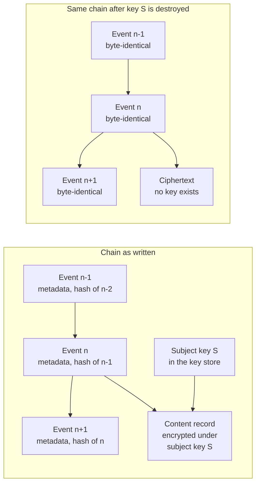

# Evidence

A letter arrives on 2028-01-19 and asks what your agent did to one claim on 2026-07-14, under whose authority, and on whose behalf. The person who built the agent has left. The cluster's application logs rolled over after 30 d. The date by which you answer was chosen by somebody else.

Two obligations are wanted at once, and they look mutually exclusive: a record nobody can alter, and personal data that can be erased on request. Keep the chain and destroy the key.

The harder decision is ordering, and it goes in the direction that costs money. The record is durable before the effect happens. A record written afterwards has a failure mode in which the effect exists and the record does not. That is the state this document exists to prevent. One statement in the invariant set belongs to this chapter – no side effect occurs without a durable, tamper-evident record written first (I4) – and it is the one obligation here that no fail posture is permitted to negotiate.

## The conflict, and why the easy resolutions lose

The data protection officer who tells you that your immutable log is a problem is right. The argument does not improve by being had eighteen months later with the log already full.

A hash chain is a data structure whose entire purpose is that history cannot be revised without the revision showing. The erasure right in Article 17 of the General Data Protection Regulation (GDPR) is a right, held by a person, to have their personal data revised out of existence on request [@eu2016gdpr]. Pulling the other way, financial-sector record-keeping and operational-resilience obligations require that certain records survive for a period measured in years [@eu2022dora]. Chapter 2 mapped which obligation lands where. It did not resolve the collision, because that is a design problem rather than a mapping problem.

The collision is genuine at the level of the data structure. The two ordinary resolutions are both worse than they look.

The first is redaction in place: find the field, overwrite it, and accept either that the chain no longer verifies at that link or that a parallel redaction record tells verification to skip the altered entry. That produces a system in which the object you can verify and the object you can read are different objects. The difference between them is where an argument about tampering would take place.

The second is an exemption claim, on the grounds that the log is retained under a legal obligation to which the erasure right yields. That argument is real and it sometimes wins. It is also a bet that the design's correctness rests on a legal opinion you do not control. When it loses you are holding an immutable store full of personal data and no mechanism for getting it out.

## Keep the chain, destroy the key

Split the record. Metadata is chained and never encrypted: sequence number, the hash of the previous event, the operation, the identifiers, the envelope, the timestamps. Content is encrypted under a key held per data subject and referenced from the chain rather than embedded in it. Erasure destroys the key. Verification touches only metadata, so the chain still verifies with the content permanently unreadable. That single property is what makes the arrangement work rather than merely sound clever [ADR-22].



*Figure 11.1 – How can one record be both unalterable and erased? Nothing in the chain changes when the key dies, so the sequence remains verifiable while the content it pointed at becomes permanently unreadable.*

Our judgement is that key destruction is defensible rather than settled. Supervisory opinion is not uniform on whether rendering data permanently unreadable amounts to erasure. Supervisory positions on key destruction as erasure vary by jurisdiction and date; confirm with counsel before treating the mechanism as settled law. Plan the fallback rather than the appeal. If your supervisor rejects key destruction, the next position is deleting the ciphertext object itself. That leaves the metadata chain intact and a dangling reference where the content was. A dangling reference is a fact about the past rather than personal data. If that is rejected too, you have a conflict between two legal obligations rather than an engineering problem. That is worth knowing before four engineers spend a quarter on it.

The metadata is not anonymous merely because the content is encrypted. Pretending otherwise is how this design fails its first review. A chain entry carrying a claim number, a timestamp and a subject reference still asserts that a particular person was processed at a particular moment. So the metadata carries pseudonymous subject references and no free text at all. The mapping from a subject key identifier to a person lives in the key store and dies with the key. What survives destruction is the fact that some subject was processed. That is a residual rather than a solution.

Kai gets a lever here, and it is better named than demonstrated. An erasure request is a mechanism for destroying evidence content, filed through a process that sits outside this platform and is usually operated by people who have never been asked to treat it as an attack surface. What the lever cannot reach is the chain: the sequence, the operations, the envelope, the authority, the approval reference and every hash stay where they were. An adversary who erases himself removes payload detail and leaves the fact pattern. That is a poor trade for him and a deliberate one on our side.

## What the record has to answer

Four questions arrive eighteen months later, from somebody with no interest in your architecture: what happened, under whose authority, on whose behalf, and what did the platform know at the time. Everything in the event schema exists to answer one of those four. A field that answers none of them is telemetry wearing an evidence badge.

The stream has a stable schema because chapter 8 established that every call at the seam is an evidence event. That is why this chapter can discuss integrity properties rather than re-derive the seam. Approval records are evidence events and inherit everything here without a second construction. That is chapter 9's business. Evidence also chains across composed runs by parent identifier, and it is one of only two things that compose at all.

The fourth question is the expensive one. The resolution is deliberately weaker than a reader would prefer. What the platform knew is mostly what it retrieved. Retrieved content lives in memory, which chapter 10 establishes as mutable by design: items are corrected, superseded and forgotten as normal operation. So the record carries a retrieval reference and a content hash rather than the content. Copying retrieved content into the evidence store would duplicate personal data into the one system built to resist deletion, on every call. The consequence is worth stating rather than discovering: the record is verifiable and not always reconstructible. If the claim note was corrected in September, the hash no longer matches. What you learn eighteen months later is that the item changed, not what it said at the time.

Above the reversibility line the record additionally carries a hash of the full assembled context. Below it, references alone are enough [ADR-39]. The reason for the split is that the assembled context is the largest object in the system, the most sensitive object in the system and the most useful object in an incident, all three at once. The balance between those three changes when the effect at the end of the call cannot be undone. Notice what a hash does and does not buy. This is where the design would be misread: it commits, it does not preserve. You cannot reconstruct a context from its digest. You can prove whether a context somebody produces later is the one the model actually saw. That turns an argument about reassembly into an arithmetic check and costs deletability nothing. The price is not storage, since a digest is 32 bytes. It is canonical serialisation: the hash requires a deterministic byte representation of prompt template, retrieved items, tool descriptions and ordering. That representation breaks quietly whenever a template is reformatted or a provider changes how it renders a message. Somebody owns that canonicalisation. From the day it drifts, every hash after the drift verifies against nothing.

Effects are evidence and model reasoning is not. The reason is structural rather than sceptical. Every entry in the chain commits to bytes that existed and can be recomputed by anyone holding the bytes. A model's stated rationale is a pre-image of nothing: no artefact it commits to, no recomputation that checks it, and no obligation on the model to have described its own computation rather than produced a plausible account of one. Re-running the same prompt against the same pinned version yields different text, persuasive both times. The platform can record the rationale, labelled non-evidential and outside the chain, because it genuinely helps a responder at 03:00 form a hypothesis. It is also the most dangerous artefact in the file at a hearing, because it is the most readable thing there and the least verifiable. The record answers what was done and under what authority. It does not answer why in the sense a person means by why.

The letter that arrives on 2028-01-19 concerns `CLM-2026-448120` and one run, `run_01J8F3K2QW7XN4ZB9V6HRTMD5C`. Borealis Mutual returns the chain segment for that run: 63 events, sequence-contiguous, verified against the checkpoint published the following morning. Inside it sit the envelope with its three derivation inputs, four policy decisions, Marta's approval record with the hash of the adjustment payload, and eleven retrieval references with their content hashes. Two of the eleven no longer match, because the claim note was corrected on 2026-09-08. The reply says so in one sentence and gives the correction's own reference. What Borealis does not send is any account of why the model proposed €4,180 rather than €2,000, because nothing in the file would survive being called evidence. Three months earlier, on 2027-11-03, an unrelated erasure request had arrived from a claimant whose personal data appeared in the content records of 214 evidence events across 37 runs. The data protection team identified one subject key from a query built when the platform shipped, and destroyed it with a witnessed record. The nightly verification on 2027-11-04 passed. The 214 events are still there, still in sequence, still hashed into their neighbours, and the content behind them is unreadable for good.

```json
{
  "event_id": "evt_01J8F3K3B2M7YQ4XN0ZB9V6HRT",
  "seq": 41207788,
  "prev_event_hash": "sha256:6b1f9c0e…",
  "event_hash": "sha256:d40a72f1…",
  "recorded_at": "2026-07-14T09:12:38.104Z",
  "tenant": "borealis-eu-1",
  "run_id": "run_01J8F3K2QW7XN4ZB9V6HRTMD5C",
  "parent_run_id": null,
  "tier": "T2",
  "effect_state": "declared",
  "settled_by": null,
  "what_happened": {
    "op": "tool:claims-core/post-adjustment",
    "target": { "system": "guidewire", "claim": "CLM-2026-448120" },
    "arguments_hash": "sha256:8e5b03aa…",
    "side_effect_class": "irreversible-external",
    "value_eur": 4180
  },
  "under_whose_authority": {
    "envelope_id": "env_01J8F3K2R0YB6D8QW1XN4ZB9V6",
    "envelope_digest": "sha256:c17d9be4…",
    "policy_decision": "pdp_01J8F3K3A9YB6D8QW1XN4ZB9V6",
    "policy_bundle": "policy-2026-07-09",
    "approval_record": "apv_01J8F3K3AZM7YQ4XN0ZB9V6HRT"
  },
  "on_whose_behalf": {
    "principal": "user:marta",
    "mandate": null,
    "agent": "claims-triage",
    "agent_version": "2.3.1",
    "manifest_digest": "sha256:9f2c1d4b…"
  },
  "what_the_platform_knew": {
    "assembled_context_hash": "sha256:f7c2e881…",
    "retrieval_refs": [
      { "ref": "mem:borealis-eu-1/claim/CLM-2026-448120/note/7", "content_hash": "sha256:2a9e40cd…", "provenance": "external-authored" },
      { "ref": "doc:document-store/CLM-2026-448120/att/3", "content_hash": "sha256:b83f16d2…", "provenance": "external-authored" }
    ],
    "model": { "set": "claims-tier2-approved", "pinned": "primary@2026-05-11" }
  },
  "content": {
    "subject_key_id": "sk_borealis-eu-1_7Q2M0X",
    "ciphertext_ref": "evc://borealis-eu-1/2026/07/14/evt_01J8F3K3B2M7YQ4XN0ZB9V6HRT",
    "cipher": "AES-256-GCM"
  },
  "non_evidential": {
    "evidential": false,
    "model_rationale_ref": "nev://borealis-eu-1/run_01J8F3K2QW7XN4ZB9V6HRTMD5C/12"
  }
}
```

*Four top-level objects answer the four questions, and `effect_state` is `declared` with `settled_by` still null, because this event was written and acknowledged before the adjustment reached Guidewire [A-4.5].*

## Nothing happens until the record is durable

The record is a precondition of the effect rather than a consequence of it. The gateway holds the call until the evidence write is acknowledged as durable. If the acknowledgement does not arrive, the call is refused and the run is told that the tool failed.

The alternative deserves its strongest form. Most estates run it, and it was good engineering. Asynchronous best-effort logging keeps the effect path fast, decouples a critical path from a storage system, and is what every observability stack teaches, correctly, for telemetry. It rests on one assumption: that the log is a diagnostic. The moment the log becomes the proof, the assumption inverts and one degradation dominates everything else. While the evidence store is unavailable, effects continue and records do not. The system degrades into actions with no evidence. It degrades silently, and it degrades at the worst possible time. That is not a coincidence – the store is frequently unavailable for the same underlying reason the incident is happening.

At 09:12 Marta's run proposes `tool:claims-core/post-adjustment` for €4,180 on `CLM-2026-448120`, inside a tier two envelope capped at €5,000 with a budget of 40 tool calls. The approval is already recorded. The gateway writes the declared-effect event, and the evidence store's primary is midway through a failover, so the durability acknowledgement does not return inside the 400 ms the gateway allows it. The call is refused with a retryable refusal, and the run retries. Two retries later, at 09:12:41 UTC, the write acknowledges, the adjustment posts to Guidewire, and a settlement event links back to the declared one. Three of the 40 tool calls are gone, and Marta saw a delay of 37 s and no error. Now run the same failover with best-effort logging. The adjustment posts at 09:12:04, the log write dies on a queue that dies with its process, and what remains is a €4,180 movement in Guidewire, correct in every respect, that nobody authorised as far as any record shows. None of that is visible at the time. It is visible on 2028-01-19, when the reply has to say that the platform holds no record of an adjustment the claims system holds, and every other record in the reply becomes less believable for standing next to it.

Two events per effect is the shape this forces. It introduces a state worth naming: a declared event with no settlement event is an effect whose completion is unknown. That is a genuine outcome rather than a bug. It happens whenever a process dies between the write and the tool response. The reconciliation job that resolves those against the system of record is standing operational work with an owner.

Price it in the right budget. Chapter 1's 20–40 ms at p99 is the decision path. That tax lands on every mediated call. This write is additive and lands only on calls that carry an effect, which at Borealis is a low single-digit number per run rather than on every call. Our judgement, and it is judgement rather than measurement, is that a quorum-durable append inside one availability domain belongs in a budget of 5–15 ms at p99, and that a quorum spanning regions moves it to 40–80 ms at p99, which residency requirements sometimes force. An effect-bearing call above the reversibility line therefore sits at 25–55 ms at p99 in the good case. This is the largest latency item in the document after the decision path itself. Volume is not the problem at this scale: 4,000 claims a day and roughly 1,900 runs a night produce a few thousand durable appends across the batch window, about one per second at the peak. The expense is the coupling, not the rate.

The coupling is also a gift to Kai. He is entitled to notice it before you do. Making evidence a precondition makes the evidence store a component whose unavailability stops the business. That is a denial-of-service path needing nothing compromised, only one write made slow. We accept the trade. The reason is asymmetry rather than courage. A stopped claims queue is visible within minutes, has an owner, and is recoverable. An hour of irreversible external effects with no record is none of those, and it is not recoverable at all, because authority cannot be reconstructed after the fact. This is the one row in chapter 14's fail-posture matrix that does not vary by dependency or tier. Chapter 14 restates it operationally rather than re-arguing it [ADR-23].

Below the reversibility line, a bounded queue with a stated loss window is a real design rather than a compromise to apologise for. Tier one, reversible internal effects: an in-memory queue bounded at 256 events and flushed every 100 ms takes the write out of the effect path and gives an accepted worst case, on unclean process exit, of 256 events or 100 ms of effects, whichever binds first. The defect is not the count. The defect is that you cannot enumerate which 256. The test for whether that is tolerable is a sentence rather than a threshold: say out loud what you would tell a supervisor. *Up to 256 reversible internal effects may have occurred with no record, and we cannot list them* is a sentence a competent risk owner can accept. The same sentence about money leaving the organisation is not acceptable at any queue depth. That is why the boundary is the reversibility line and not a latency budget [A-6.4].

## Storage grows with runs, keys grow with people

Two cost curves. Neither of them scales with the thing your capacity model is probably indexed on. Storage grows with runs and tool calls, not with customers. Keys grow with data subjects, and their lifecycle is individual.

Take Borealis at roughly 6,000 runs a day, a dozen evidence events each: about 72,000 events a day, some 26 M a year, at around 2 KB of chained metadata each, so tens of gigabytes a year before content ciphertext. The volume is not the interesting part. Nobody's budget breaks on 50 GB. The interesting part is that on the day somebody asks, you retrieve one run's 63 events out of 26 M and verify the segment they sit in. That makes indexing, segment boundaries and cold-storage tiering decisions taken at the start rather than repairs made under a deadline.

Key management is the item most likely to be under-planned. Few teams have run it before outside payment tokenisation. One key per data subject means millions of keys for an insurer, created on first appearance, destroyed individually on request with a witnessed record of each destruction, and available for the whole retention window otherwise. That makes the key store a dependency of reading evidence at all. And destruction is only erasure if every copy dies: the backups, the replicas, and any snapshot regime quietly holding a key store from 2027-06 in a vault whose entire selling point is that nothing in it can be deleted. Most backup regimes do not meet that requirement today. Finding out which of yours does belongs in the first quarter rather than the fourth [A-1.6].

## Who verifies, how often, and what a break means at 03:00

Verification has a named owner, a stated interval and a runbook, or the chain is a compliance artefact with good cryptography in it. Tamper-evident is a claim about a verifier, not a property of a log.

Verification means recomputing the hashes over a segment and comparing that segment's head against a checkpoint held somewhere the platform team cannot rewrite. The second half is the half that gets dropped. Dropping it voids the property: an operator who controls the store can rewrite an entry, recompute every hash after it, and hand you a chain that verifies perfectly [@schneier1999hashchain]. So the head is published periodically into custody the platform team does not hold – a signing authority under different control, a counter-signature from internal audit, an external notary – and the interval between publications is the window inside which a sufficiently privileged insider can still rewrite history undetectably. Name that window. It is a security parameter. At Borealis it is 1 h.

The current segment is verified continuously as it is written. That is cheap. The whole retention window is verified end to end on a stated cadence. That is not. The owner of that job is deliberately not the team that operates the store, because that is the party the verification exists to check. Segregation of duty here is not ceremony: a verification job run by the people who benefit from its silence produces a green tick with no information in it.

A break at 03:00 is not a broken log. Treating it as one wastes the first hour. It is a statement that between two checkpoints the record set cannot be relied on. Before it is malicious it is almost always one of three ordinary things: a restore from backup that replayed a segment, a migration that rewrote a field and changed the canonical serialisation, or a clock. The runbook starts with those three. Its fourth step is the one that matters – if the break falls in the current segment, stop the nightly batch, because appending to a chain you cannot verify extends the window you cannot account for, at roughly 1,900 runs a night. Then reconcile the effects in the window against the systems of record. Guidewire is authoritative on what happened to a claim and the chain is authoritative on who authorised it, so a break leaves you holding the first without the second. The output of the job goes somewhere with a person attached. A job that emails a green tick to a distribution list fails by the email being absent, and nobody has ever noticed an absent email [A-7.3].

## What this does not buy

None of this prevents anything. Kai's adjustment posted. The chain recorded it faithfully. The record was written before it happened. That changed nothing about whether it happened.

Be equally honest about incidents. Evidence does not shorten detection and does not shorten the stop. Both belong to other mechanisms. Where it pays is after the stop, when the question turns from making it stop to what it touched. The difference between a bounded answer and an assumption is the difference between reversing 63 known effects and re-examining a quarter. Inflating that into faster incident response would be the kind of claim this document loses credibility by making.

Which leaves the uncomfortable part: the value of this control is realised entirely in a conversation that may never happen. It is therefore first on the list when a quarter goes badly. The argument for keeping it cannot be the word compliance. The argument is three specific conversations. A supervisory query answered from a record instead of a reconstruction. An incident scoped rather than assumed. An erasure request satisfied without a fight about your log. If none of the three is plausibly in your future, chapter 1's three questions already told you to build the small version. This chapter is pricing something you have no reason to carry.

There is one question worth putting in front of whoever inherits this. When was the chain last verified end to end – not the current segment, the whole retention window – who ran it, and did a person read the result? If the first answer is a date somebody has to go and look up, and the third is that the job has been green for fourteen months, then what you are relying on in front of the supervisor is not integrity. It is that nobody has tried.
