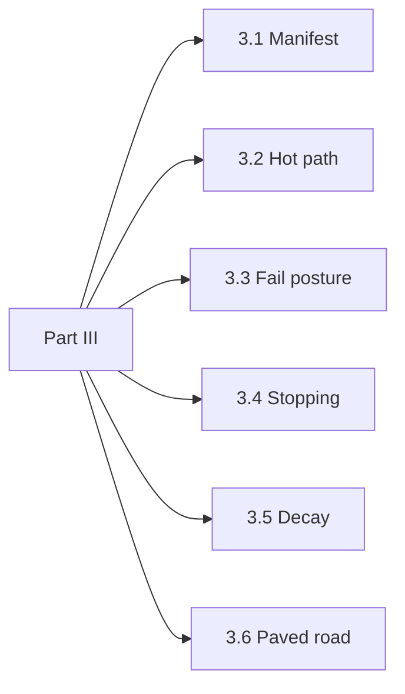

# Part III. Operating it

Complete for the SRE and the platform owner. Written so it can be read first, by someone who inherited the system rather than built it.

This part answers four questions: what fails, what fails closed, what can be stopped, and what happens to runs in flight. Under those sit the deployable unit the rest of the apparatus attaches to, the hot path that will be removed if it is slow, the decay that turns every control here into a maintenance schedule, and the paved road without which coverage quietly falls.

Part II is not a prerequisite. The vocabulary of Part I helps. The mechanisms of Part II explain why the dials sit where they sit. Neither is required to operate the thing at 03:40.

*Figure P3 – Part III spine: deploy, decide, fail, stop, maintain, adopt.*
