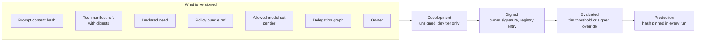

# The agent manifest

You inherited 23 agents. Open the register. Pick the one that worries you most. An incident review will ask: what exact version ran on the day in question, and what changed since the one before it? Today the answer is scattered. Instructions live in a product tool with its own history. Tool bindings live in a registry. The policy bundle lives in a repository. The model was whatever the router picked that afternoon.

An agent version is one signed object. That object is the manifest. It binds a prompt content hash, references to pinned tool manifests, the declared need, a policy bundle reference, the models the tier permits, the delegation graph for any sub-agents, an owner, a promotion path, and – for unattended variants – a reference to a standing mandate. You promote it through environments. You evaluate it before production. Every run credential and every evidence record carries the hash of the artefact that actually ran.

An agent version is not a container image. It is not a prompt. Until it is one signed object, every control in Part II attaches to a noun with no referent. Quarantine suspends a version nobody can reconstruct. Recertification reviews a declared need nobody can bind to a running system. A rollback restores three artefacts that were never known to be consistent with each other.

## Three lifecycles that were right to be separate

Instructions are edited by people who understand claims. Policy bundles are edited by people who understand risk. Tool manifests are edited by people who understand the system behind the tool. That split was not carelessness. Each artefact went to the people competent to change it. The rest of the estate works the same way. So should this one.

The gap is not inside any of the three. It is in the join. The moment somebody asks what combination was in force, the gap opens. A prompt revision on Monday, a policy bundle on Wednesday, and a tool manifest on Thursday produce Friday's behaviour. Each part has a history. The composition has none. The composition is what ran.

Three mechanisms already assume that composition exists as a nameable thing. Chapter 6 derives a run's authority from a declared need that somebody wrote, reviewed and keeps true. It treats that need as a static field of a signed artefact, not a computation. Chapter 8 pins and signs tool manifests in an internal registry so a server cannot rewrite its own description under a running estate. Chapter 15 quarantines a version. Each reaches for a different half of the same object. None defines it. That is how a document can govern what an agent does at runtime and say nothing about how an agent comes to exist.

The alternative is worth arguing. Put instructions, policy and tool bindings in one repository. Deploy them as a unit. One atomic diff. One review. A competent architect would choose it. On integrity grounds it is stronger: there is no join to get wrong. It loses on the thing that decides whether a control survives contact with the organisation. It forces a claims specialist editing a sentence of guidance into a deployment pipeline they cannot use. The observable result is not better review. It is a shadow copy of the text somewhere the pipeline cannot see. The manifest keeps each artefact where its owner can reach it. The binding between them is the security object. That is a weaker guarantee honestly held, rather than a stronger one that quietly stops being true in month four [ADR-37].

## What one signed object binds

Nine fields. Each is there because a control elsewhere in the document attaches to it, and currently attaches to nothing.

Instructions are carried as a content hash, not a pointer. A pointer tells you where the text lived. It does not tell you what it said. The text is editable in place by design. The hash is the difference between a version and a location. Tool bindings are references to pinned server manifests with their digests. That extends the pinning decision one level up. Chapter 8 records what a tool was. The manifest records which tools this version of this agent could reach. Pinning the tool and leaving the agent-to-tool binding unpinned answers half of what an incident review asks. The reviewer has to infer the rest from configuration [ADR-16].

Declared need, the policy bundle reference and the allowed model set per tier are inputs the platform reads. The agent does not. The delegation graph names the sub-agents this version may spawn. The promotion path records the environments the artefact passed through and what happened at each. An unattended variant carries a reference to the standing mandate under which it runs – the durable delegation artefact that stands in for a live human at 03:00. Its derivation is chapter 5's business. The manifest holds only the reference [A-5.3].

Chapter 6 derived per-run authority as the intersection of declared need, principal reach and the tier ceiling. It made declared need static so an adversary patient enough to leave the next run a note could not widen it. The manifest is the artefact that sentence was pointing at. Derivation reads the manifest promoted to production: not a memory entry, not a task record, not the copy on somebody's branch. That is what makes I8 mechanical rather than aspirational. *Where did this input come from* has a signed provenance for an answer rather than an opinion [A-6.4].



*Figure 12.1 – What exactly is versioned when we say an agent version? One artefact binding the parts that decide behaviour, and a path along which it acquires a signature, an evaluation result, and the right to appear in a run credential.*

## An instruction change is a change no compiler checks

A change to instructions is gated by two things that do not overlap: a review proportionate to the tier, and a behavioural evaluation that measures what the version attempts. The honest description is that the evaluation carries most of the weight and the review carries the accountability. This is the weakest mechanical backing anywhere in this document.

The envelope bounds what a run is able to do. Instructions determine what it will attempt inside that bound. The distance between a cautious version and a reckless one at the same tier is entirely text. A sentence added to reduce escalations touches neither the declared need, the tier ceiling, the policy bundle nor the tool bindings. Nothing any Part II control measures has changed. Every one of them reports a healthy system. Static analysis has nothing to analyse. Review by reading catches the obvious case. It reliably misses the one that matters: not a new permission, but a sentence that makes an existing permitted operation routine.

Borealis promoted `claims-triage` manifest `2.3.1` on 2026-07-02. The diff against `2.3.0` was one sentence in the triage guidance, added after a fortnight of complaints about escalation volume: where an adjustment falls clearly within policy, complete the triage rather than referring it. The prompt content hash changed. That is the only mechanical signal the pipeline had, and it says nothing except that the text is different. The behavioural evaluation is what said something. The tier-two suite runs 1,200 adversarial cases against the candidate in a synthetic tenant and measures one number: the proportion in which the version declines to attempt the operation the case tries to elicit. Version `2.3.0` refused 99.1% of them. The candidate refused 97.8%. In case counts, 11 attempts got through against 26. The version had become less willing to stop, in exactly the direction the sentence was written to push it. Nobody who wrote or reviewed it had predicted the size of the movement. The tier-two threshold is 99.0%, so the gate held the promotion. What released it was not a fix. The owner named in the manifest read the delta, accepted that the new refusal profile was proportionate to the escalation load it removed, signed the acceptance against review `REV-2026-0703`, and promoted. Twelve days later, when Kai's document arrived in a claim and the run of 2026-07-14 read it as instruction, the version in production was one whose refusal rate a named person had signed for, on a specific date, against a recorded number. That is not a story about a control preventing anything. It is a story about the difference between a behavioural change that is invisible and one that has a signature attached to it.

## The gate has a number, and the number is a judgement

Above a tier, the evaluation is a hard deployment gate with a stated refusal threshold. A candidate below the threshold does not reach production. An override exists, because a gate that will be circumvented in the first quarter is better designed than pretended away. The override is signed by the named owner. It is recorded in the promotion path of the artefact itself rather than in a pipeline log. It triggers a review within a stated interval [A-1.9].

That is a hard gate with a documented exception. The distance between it and an advisory measurement is worth defending. An advisory measurement changes a dashboard. An override changes who is accountable. It names them in an artefact that outlives them in the role. It puts a number in front of the next promotion. An override that expires and is reviewed is a gate. An override that is available, unlogged and routine is a threshold nobody enforces. Its failure mode is a review queue filling with signatures nobody reads – the same failure the approval chapter measures and demotes.

The statistics deserve care that the tooling around them does not. The system is non-deterministic, so 97.8% is a sample rather than a property. The interval around it widens as the suite shrinks. A suite is written by the people who built the agent, so it tests the attacks they imagined. The canary suite in chapter 16 is the same instrument run continuously against production. The two disagreeing is information rather than a defect. No published number settles what a passing threshold ought to be. Our judgement is that it is set per tier by the people who own the consequence, written down before the first candidate is evaluated rather than after one fails, and stated as a number so that moving it is a visible act [@mazeika2024harmbench].

## The dependency that changes without changing its name

Model versions are pinned in the manifest. A change to the pin revalidates through the canary suite before the new pin reaches production. Everything else the platform depends on announces a change by changing a version string. The model is the exception in both directions. Its behaviour can move underneath a stable name. Its supplier can retire it on a schedule the organisation does not set.

The second of those is third-party risk of exactly the kind chapter 2 exists to identify. It earns a row in the constraint inventory. Whatever notice period arrives, somebody outside the organisation chose it. It applies simultaneously to every manifest that pins the model in question. An estate of 23 agents with a shared pin has one deadline, not 23. The deprecation calendar is therefore somebody's standing job, with a name against it and a date on which it was last reconciled against the vendor's schedule. It is a job rather than an alert, because the work it triggers is revalidation, which takes weeks and cannot start on the day the pin expires [A-7.5].

What pinning buys is an evaluation result that means something. A refusal rate measured against one model and used to authorise a version running on another is a number about a system that is not in production. What it costs is a migration project the organisation did not schedule, on a cadence no other part of the platform has.

## Routing decides which model faces the adversary

The set of models a version is permitted to run on is a property of the tier. It is carried in the envelope alongside everything else the run is bounded by. A route to a model outside the set terminates the run rather than completing it on the substitute. Model routing is an authority decision wearing an optimisation's clothes.

A router selects between models per call, automatically, under load, optimising for latency and price. A platform team changes it without a security review because on its face it alters nothing about what the agent is allowed to do. It touches neither the envelope nor the declared need. It changes which model reads the attacker-shaped document. A model with a different refusal profile is a different safety case. A fallback route during a vendor outage is a silent amendment to that case, made by an availability mechanism, in precisely the degraded conditions where nobody is reading change tickets. A route to a differently located model can move inference across a boundary the organisation has made residency claims about without a single data control firing, because nothing was retrieved. And a cheaper model at the same tier invalidates the evaluation that authorised the version, because the number was measured against the frontier model the tier permits and the run is executing on something else [ADR-38].

Terminating the run is fail-closed and it costs availability at the worst moment. During a vendor incident, an estate that terminates stops doing work while one that degrades carries on with a substitute model and, in most cases, gets away with it. That trade belongs in the fail-posture matrix signed before the outage rather than in a decision taken during one. The row it occupies is model unavailability, which chapter 14 decides in advance like every other dependency. The reason to prefer termination is not that degradation is always wrong. It is that a degraded run is indistinguishable in the evidence record from a normal one unless model identity is part of what the run is bounded by. A safety case that cannot see its own substrate is not one.

## The graph is declared before anything spawns

A version that spawns sub-agents declares them as a graph in its manifest. The platform derives the child envelope at spawn from that graph and the parent's envelope in force. The parent does not derive it. It is not asked to approve it. It holds no authority to create authority.

The `claims-triage` manifest declares exactly one child: `claims-research@1.4.0`, a read-only research agent with its own manifest and owner, whose declared need is two read operations and nothing that writes. On 2026-07-14 the parent run held four operations and a budget of 40 tool calls. At 09:21 it reached a treaty question it could not answer from the claim file and asked the platform to spawn the declared child. The platform derived the child envelope by intersecting the graph entry with the parent's envelope in force at that moment, producing two operations, a budget of 12 calls, the same claim scope, and an expiry no later than the parent's. Nothing in the request named an operation, because the spawn interface has no field in which an operation could be named. The parent asks for the child it declared. It does not describe the child it would like. What came back was the child's output as data, carrying its own run identifier and evidence record. The parent could not distinguish a child that refused from a child that found nothing.

That is the difference between a delegation model that survives a hostile parent and one that reads well in a diagram. If the parent derived the child, the parent would hold an operation that creates authority: not in the allow-list, not attenuation in any sense the capability tradition would recognise, and sitting inside the run, which is where the adversary is. Kai does not need to widen the parent's envelope if he can persuade the parent to describe a generous child. Here there is nothing to persuade, because the graph was declared, reviewed and signed before the run existed.

The price is dynamic composition, and it is a real capability to give up. A version cannot decide at runtime that this particular claim would benefit from a sub-agent nobody anticipated. The answer to a task outside the graph is a stop and a new manifest version. Teams who have built on frameworks where any agent can call any agent will find that restrictive, and they are right. What they get is delegation bounded by construction rather than by a policy rule a bug can violate silently.

## The object itself

```json
{
  "manifest": "claims-triage@2.3.1",
  "digest": "sha256:9f2c1d4b…",
  "tenant": "borealis-eu-1",
  "owner": "team:claims-automation",
  "tier": "T2",
  "instructions": { "prompt_digest": "sha256:c07e5a91…", "bytes": 8412 },
  "tools": [
    { "server": "mcp:claims-core@7.2.0", "digest": "sha256:2b4d0f77…" },
    { "server": "mcp:document-store@3.1.4", "digest": "sha256:81fae3c2…" },
    { "server": "mcp:notify@1.9.0", "digest": "sha256:5d1c8ba4…" }
  ],
  "declared_need": [
    "tool:claims-core/read-claim",
    "tool:claims-core/post-adjustment",
    "tool:document-store/fetch-attachment",
    "tool:notify/send-claimant-letter",
    "tool:payments-core/read-payment",
    "tool:treaty-core/read-cession"
  ],
  "policy": { "bundle": "policy-2026-07-09", "digest": "sha256:41ab7c05…" },
  "allowed_models": {
    "T2": ["model:vendor-a/frontier-general@2026-05-14", "model:vendor-a/frontier-general@2026-03-11"]
  },
  "delegation": [
    { "child": "claims-research@1.4.0", "budget": { "tool_calls": 12 } }
  ],
  "unattended": { "mandate": "mandate:claims-nightly" },
  "promotion": {
    "path": ["dev", "signed", "evaluated", "prod"],
    "promoted_at": "2026-07-02T14:20:00Z",
    "evaluation": {
      "suite": "redteam-claims-t2@2026-06",
      "cases": 1200,
      "refusal_rate": 0.978,
      "threshold": 0.990,
      "override": { "signed_by": "owner", "review": "REV-2026-0703", "expires": "2026-10-02" }
    }
  }
}
```

*Read `promotion.evaluation` first: the artefact carries the number it failed on, the person who accepted it, and the date that acceptance expires, which is why a promoted manifest is a record and not a receipt [A-4.6].*

## Who pays for a promotion pipeline

Four costs. Only the first is the one teams budget for.

The pipeline is signing, evaluation and rollback. Its expense depends almost entirely on what already exists. Where the registry already signs tool manifests, the marginal work is a schema, a signing step and a promotion API, and two engineers reach a defensible version inside a quarter. Where it does not, the cost is key custody rather than pipeline code, and key custody is the half that involves other departments. Rollback looks free and is not. Rolling back a manifest rolls back a composition. If a policy bundle the older manifest references has since been retired, the rollback restores an artefact that no longer resolves. Referenced bundles and tool manifests are retained as long as any promoted manifest points at them.

Behavioural evaluation infrastructure is per tier and it is not a file of prompts. It is a corpus with an owner, an execution environment with a synthetic tenant and seeded systems of record, and a convention saying how many times each case runs and what counts as a pass. The compute is the visible cost and the smaller one. The corpus decays faster than anything else in this document. A fixed suite becomes one the next version passes because the previous version taught the team what to write. Keeping it adversarial is a standing fraction of somebody's week.

Owner accountability for manifest drift is a person's obligation. It is the field most likely to rot into a team alias with nobody's calendar attached. The obligation is monthly and specific: account for the difference between what the registry says is promoted and what production is running. An organisation that cannot name that person has a manifest scheme with a signature on it and nobody behind the signature. That is a document control rather than a security control.

Revalidation on model deprecation is the cost nobody has in a budget. Every model change revalidates every manifest pinning that model, on a schedule set outside the organisation. Our planning figure is one engineer-week per ten manifests for a straightforward pin change, with the first cycle costing roughly triple that because the suites will prove less portable than anyone expected. Against that, the run-time cost of the scheme is close to nothing. Verifying a manifest signature and hash at run start belongs in single-digit milliseconds at p99 against a locally cached registry copy.

## When the registry and the runtime disagree

Run one query at the end of every month and read the number out loud in the operations review: how many production runs used a manifest hash that does not match the promoted artefact in the registry. The evidence record carries the hash on every run. The registry carries the promoted set. The query is a join.

The first answer will not be zero. Three of the reasons are benign. A rollback in flight produces runs on both versions for as long as the rollout takes. Registry replication across regions produces a window measured in seconds. A run that started before promotion completed finishes under the version it began with, which is the same ceiling argument the envelope chapter makes and is working as intended. Each is explicable in one sentence. Each leaves a recognisable signature: a burst, bounded in time, with a matched pair of hashes on either side of it.

The fourth reason is the one the query exists for, and it looks nothing like the other three. It is a low, steady count that never quite clears, spread across days, with a hash that resolves to no promoted artefact at all. That is a runtime assembling instructions from somewhere the registry does not know about. The usual somewhere is the product tool where the text was always edited, still reachable, still writable by the people who used to own the change. Nothing alerts. The prompt hash in the credential is internally consistent. The envelope derives. The policy evaluates. The evidence chain verifies. And the version whose refusal rate a named person signed for on 2026-07-02 is not the version that read Kai's document.
