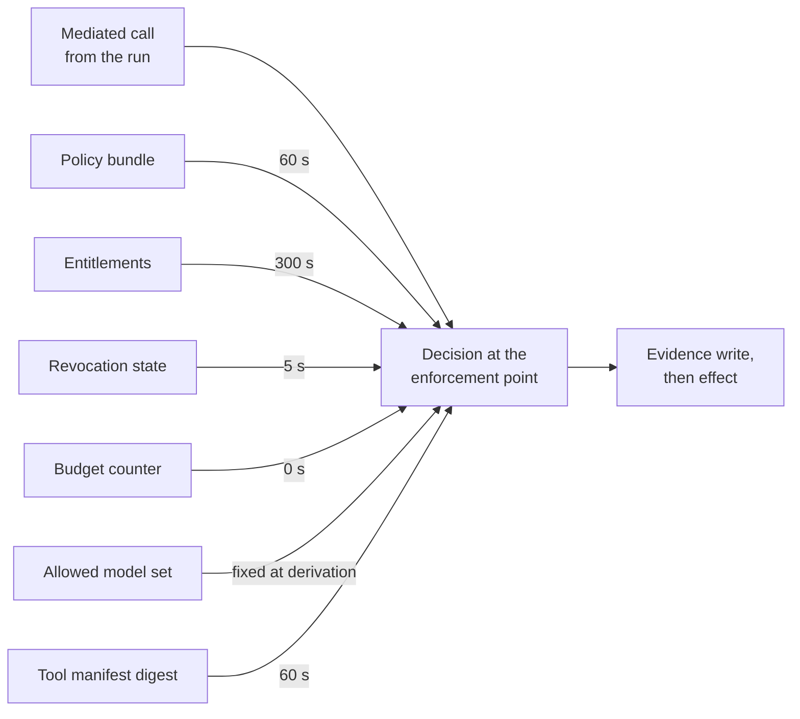

# Governance in the hot path

Somebody has put a flame graph of a mediated tool call on a screen and found that the box labelled `authz` accounts for 180 ms at p99. The change that removes it will be titled *reduce p99 on the tool path*. It will be accurate about the latency. Two people will approve it on a Tuesday.

A decision path that adds 200 ms at p99 will be removed. Well-meaning engineers under delivery pressure will remove it and call it an optimisation. So the decision path is a latency-critical component and gets engineered as one. Policy is evaluated in-process at the enforcement point against a signed bundle that arrived before the call did. Every other input the decision reads is a local copy. Each copy carries a declared maximum age. That age is a security statement, not a cache setting.

## What a decision is allowed to cost

Our budget for everything the platform adds to a mediated tool call is 20–40 ms at p99. That figure appears in chapter 1 and is defended here. Before anyone quotes it, say exactly what kind of number it is: it is a design budget, not a measurement, and it is our judgement rather than a published benchmark.

It is a budget for a specific shape of decision. Local evaluation in the enforcement point's own process against a bundle already resident there. Entitlements and the run's budget counter read from local state rather than fetched. A policy of the complexity Borealis actually runs – a few hundred rules over a typed operation catalogue rather than a general-purpose program over open-world input. Change any of those three and the budget is void. A network hop for entitlements puts someone else's availability inside your p99. A policy language admitting arbitrary computation puts an unbounded quantity there. No published benchmark settles the figure for this shape of workload. The number is a target the platform is held to rather than an observation reported back [citation needed: dated vendor and open-source documentation for policy-as-code evaluators that distribute signed, versioned bundles to in-process evaluators, with published evaluation latency at a stated percentile and policy size].

The split is where the budget becomes arguable, which is the point of publishing it. Roughly 4–8 ms at p99 for the seam itself – the extra hop to a gateway co-located with the runtime, and materially worse when it is not. Roughly 10–20 ms at p99 for the decision: bundle evaluation, the entitlement lookup, the budget read, the revocation check. Roughly 6–12 ms at p99 for the evidence write that has to be durable before the effect happens. That last piece is the one component of the budget that buys an invariant rather than an answer. Those add to 20–40 ms at p99. If your gateway sits in another zone, the seam alone consumes the whole of it.

What is left is the work the user is waiting for. At Borealis it is most of the wall clock. Marta's triage step completes at a p99 of about 2 s from her click to a rendered recommendation, so 40 ms at p99 is 2% of it and nobody perceives it. The unattended path fails first. The overnight window is 6 h. The queue is roughly 4,000 claims averaging a dozen tool calls each. Forty milliseconds per call at p99 is about 32 min, or 9% of the window. Both are affordable. Neither survives an evening when claim volume doubles and nobody has measured the decision path since it shipped.

## Evaluate where the call is, decide where the policy is

Policy is authored centrally. It is compiled into a versioned and signed bundle. It is distributed to every enforcement point in advance. It is evaluated as a local function call. There is no synchronous call to a policy service on the decision path.

The rejected alternative is a network call to a central policy decision point for every decision. It is genuinely better on the property that matters most here. Freshness is exact. A rule narrowed at 14:02 is in force at 14:02 everywhere. There is no propagation to measure, no staleness table to write, and no class of incident in which two enforcement points disagree about what the policy says. It is also easier to operate: one deployment, one version, one place to look when a decision surprises somebody. Anyone who has run an estate with a central authorisation service knows it works. The reason teams reach for it is not naivety.

It loses on two properties, both about a bad day rather than a good one. The first is arithmetic. A synchronous round trip inside every decision adds a network to a path that had none. The p99 of a remote call under load is not the p99 of a local one. The second is correlation. A central decision point is a component whose degradation is a governance outage across every agent at once. The fail posture for one dependency decides whether the whole platform refuses or permits. Kai does not need to defeat the policy to reach that state. He needs the platform loaded enough that its operators are choosing between refusing everything and turning the check off. Local evaluation removes the round trip and decomposes the failure. It pays for both in freshness [ADR-24].

## Two artefacts, and only one of them expires

Policy ships as two things. A slow-moving bundle with the full change control a code release gets. And a fast deny list with its own signing authority and a mandatory expiry.

The single-artefact answers both fail, in opposite directions, for the same reason. Put the bundle under full change control and the fastest available way to narrow authority during an incident is slower than the incident: the review, the pipeline, the staged rollout, and somewhere in the middle a run that is still permitted to do the thing you decided at 14:02 it may not do. Take the change control away and there is now an unreviewed path to widening authority in the system. That defeats the entire apparatus more cheaply than any attack in the threat model. Kai's best move against a platform like this was never an exploit. It was a plausible policy change on a Friday.

What makes the asymmetry safe is that the fast artefact is one-directional and temporary. The deny list can refuse and cannot permit. The worst outcome of an unreviewed entry is a self-inflicted refusal somebody notices within minutes, rather than an authority granted at speed and read by nobody. Every entry carries an expiry, capped at 24 h at Borealis. After that it is gone unless a human renews it or the change has landed in the bundle through the ordinary path. An incident-time narrowing that cannot become permanent policy is a narrowing nobody has to remember to review. The price is a second policy system with a second signing authority, a second audit trail, and a precedence rule between them. That is a real operational cost rather than a rounding error [ADR-34].

## When two rules disagree, and when one of them never ends

Conflicts resolve deny-overrides, with an explicit precedence order for the exceptional case. Evaluation is bounded by construction in the policy language rather than by a timeout.

Deny-overrides is the obvious resolution. It has a consequence worth naming rather than discovering: it makes every policy author capable of breaking production alone. That changes who is willing to author policy. An organisation that responds by restricting authorship to three people has made policy change slow again through the back door. The precedence order handles the narrow set of cases where a deny has to be overridable at all. The deny list is evaluated first and is final. Then the bundle's deny rules. Then bundle permits. The exception rules that grant against a deny are enumerated by identifier rather than inferred from rule ordering. Enumerating them is the control. An exception nobody can name is an exception nobody reviewed.

Termination is the half with security content. A policy evaluation that can loop or backtrack without bound is a denial of service sitting on the decision path. Its inputs are partly shaped by whoever writes into the claim documents your agent reads. Kai does not need the policy to reach the wrong answer if he can arrange for it to reach no answer at all, at a moment he selects. The reflex mitigation is a timeout. A timeout does not remove the problem. It converts it into a fail-posture question. The behaviour under attack is either a refusal storm or a permit, chosen by someone with an outage in progress. Bounding evaluation by construction removes the reachable state instead. The language admits no unbounded recursion and no unbounded iteration. Evaluation cost is a function of rule count and input size. The bound is computed at build time rather than hoped for at runtime [A-1.9]. That constrains the choice of policy language. It is a real design consequence and rules out the general-purpose embedded scripting most teams reach for first.

## How old the answer is allowed to be

Every input the decision reads carries a declared maximum age. The age is not a cache setting. It is a sentence about what the platform is willing to be wrong about, for how long, in production, on purpose.

There is no row here for the envelope, and the absence is deliberate rather than an oversight. The envelope is not a cached policy result that could go stale. It is an upper bound fixed at derivation. Policy is evaluated per call inside it. What bounds a withdrawn ceiling is therefore maximum run duration – 1,800 s for T2 work at Borealis – rather than any propagation figure. That is why that parameter is a security parameter and appears in chapter 6 as one.

*Figure 13.1 – When this permits a call, how old is the information it permitted it on? Every input edge carries the maximum age at p99 the platform accepts for that input, and the single edge without a number is fixed at run start rather than refreshed during the run.*

| Input | Tolerable age at p99 (s) | What the platform accepts being wrong about for that long |
|---|---|---|
| Policy bundle | 60 | A rule narrowed centrally is not yet in force at every point, so a call the organisation has already decided to refuse is permitted. |
| Entitlements | 300 | An entitlement withdrawn in the directory is still honoured, so a run acts with reach its principal no longer has. |
| Revocation state | 5 | A run that has been halted issues whatever calls it can fit into 5 s. This budget is set by the claim in chapter 1 rather than by cost. |
| Budget counters | 0 | Nothing at all. The counter is read and incremented at the point that permits the call, which is what keeps a run's ceiling a ceiling. |
| Allowed model set | 1,800 | A run keeps routing inference to a model version withdrawn from its tier, for at most one maximum run duration. |
| Tool manifest digest | 60 | A server whose pinned digest changed is still callable at a lagging point; quarantining a server travels on the deny list instead. |

*Table 13.1 – The declared staleness budget per decision input. Ages are the maximum accepted at p99, in seconds, measured from the moment the authoritative source changed.*

On 2026-07-16 the risk owner narrowed T2 claim adjustments after a finding, and the bundle `policy-2026-07-16` was signed at 14:02:07. It reduced the ceiling on `tool:claims-core/post-adjustment` from €5,000 to €500 for one claim category. The median enforcement point had it at 14:02:11, 4 s later, which is the number that went into the release note. The gateway serving the Nordic branch had it at 14:03:37. For 90 s that gateway permitted calls the organisation had already decided to refuse. During the window it permitted three of them, one of which was a €3,200 adjustment on a claim in the narrowed category. The declared budget is 60 s at p99. The observed figure was 90 s, over budget by 30 s, on a distribution path that had been fine every time anyone had looked at the average.

Nothing paged anyone, because a permitted call is not an error and the gateway was working exactly as built. The bundle epoch panel showed one enforcement point behind the current version for 90 s, which is the sort of thing a dashboard shows to nobody at 14:03 on a Thursday. Marta found the adjustment the next morning in the reconciliation queue, reversed it, and asked the question that produced this section: if the policy said €500 at 14:02, why did the system pay €3,200 at 14:03. The answer is that the policy said €500 at the centre and €5,000 at the edge, and that the platform had never declared how far apart those two were allowed to be.

The move that survives is to stop treating propagation as a background property. Every enforcement point reports the version and the age of the bundle it is deciding on. That age is a first-class metric with the same standing as decision latency. A point whose bundle is older than the declared budget stops deciding rather than continuing on a policy it knows is stale. A gateway that refuses is a visible outage with an owner. A gateway that permits on a policy from 20 min ago is a security property that has quietly stopped being true. The difference between those two outcomes is one comparison against a number the design has to have chosen in advance [A-6.4].

## Revocation does not wait for a cache to expire

Revocation is the input whose budget comes from the claim rather than from the economics. It cannot be served by ordinary cache expiry. Its propagation runs on a dedicated push channel with a bounded acknowledgement from every enforcement point. A decision fails closed when the point cannot establish that its own channel is current.

Cache expiry is a pull model with a period. A period is a floor on how long a revoked run keeps acting. Chapter 1 claimed a stop inside a stated interval. At Borealis that interval is 5 s at p99. That is not a number you reach by shortening a poll until the load becomes uncomfortable. The acknowledgement is the part that does the work. Without it you have a broadcast and an assumption. The failure you care about is exactly the one where a point stops receiving and nobody learns of it, because a silent receiver looks identical to a receiver with nothing to receive.

The fail posture for this one input is decided here rather than in the matrix, and it does not vary by tier. A point that cannot establish the freshness of its revocation channel does not know whether the run in front of it is still authorised. Permitting on that basis converts an unknown into an effect. Everything else about how a run is stopped – the five mechanisms, who holds each one, and the drill that proves any of them work – belongs to chapter 15. This chapter's obligation to it is that the number the drill measures is a number the decision path can deliver [A-7.3].

## What is never read from a copy

Three things are never cached, at any tier, under any latency pressure: the run's budget counter, a one-use approval binding, and the acknowledgement that an evidence record is durable.

The list is short because there is a single property that puts something on it. Each of those three is a consumable – a thing whose entire meaning is that it can be spent exactly once. A cache is a copy. A copy of a consumable is a second one. A budget counter read from a replica permits a run to spend its ceiling once per replica, which is not a ceiling. An approval decision held for reuse is a replay of a human's signature on an object they saw once. A cached durability acknowledgement is a claim that a write happened, standing in for the write, which inverts the ordering the whole evidence path exists to guarantee.

The list is absolute for the same reason. Staleness elsewhere degrades accuracy by a bounded amount, and the bound is the number in the table, which is what makes those budgets negotiable in a design review. Caching a consumable does not degrade a property by a bounded amount. It removes the property, completely, on the first cache hit. No percentile expresses that.

## Rules that never fire, and rules that always do

Policy gets the treatment every other control in this document gets: rule-level firing telemetry, with a quarterly review of the rules that never fired and the rules that fired on everything, plus a build-time test suite that gates the release on a stated coverage threshold over the rule set. An unreachable rule is dead code with an audit trail and a reassuring name. A rule that fires on every request is either load-bearing or vestigial, and nobody can tell which by reading it. Both are answerable with a counter per rule identifier and a query. That is among the cheapest measurements in this document and the one most likely to be skipped, because policy feels like configuration rather than software. The calendar that makes the review happen is chapter 16's, along with everything else that decays [A-7.1].

## Who pays for the milliseconds

The bundle pipeline is a supply chain. It gets the treatment chapter 8 gives tool manifests, for the same reason: it produces a signed artefact that decides what a hostile model is allowed to do, distributed to every point that enforces anything. Authoring under review. A build that emits a versioned artefact. A signing authority whose key material is held like the platform's other key material. A pinned digest at every enforcement point. A verified signature before load. And a rollback that has been executed rather than documented. Add the deny list's separate signing authority and the platform owns two release paths for policy, with somebody's name against both.

The standing cost is a permanent tension with whoever owns the user-facing latency target. That person is not being obstructive. They own a number. The platform's decision path sits inside it. Every quarter their number gets harder. The survivable arrangement is to publish the platform's share separately from the total, per call and per run, so the conversation is about a measured figure both sides can see rather than about whether governance is worth it in the abstract. Hold the 20–40 ms at p99 as an objective the platform breaches and reports rather than a virtue it claims, and the argument stays technical. Lose the separate measurement and it becomes political. That is an argument the decision path loses one optimisation at a time, in changes that are individually correct.

## The number that goes stale first

So: what is the actual p99 bundle propagation time in your estate, across every enforcement point rather than the ones in the same region as the build? Not the average, which is 4 s and has been 4 s since the day it was built. The p99, which is where the Nordic gateway lives.

When was it last measured rather than assumed – measured by signing a bundle whose only content is a version bump, watching every point acknowledge it, and taking the slowest one? If the answer is a date, check whether a region, a gateway or a network path has been added since. If the answer is that the panel is green, the panel is showing you the points that are reporting.

And does the figure still fit inside the budget you declared? A propagation budget of 60 s at p99 with an observed p99 of 90 s is not a monitoring gap. It is a staleness budget the platform published, failed, and continued to operate against. The difference between those two numbers is the length of time your organisation enforces a decision it has already made in the opposite direction.
