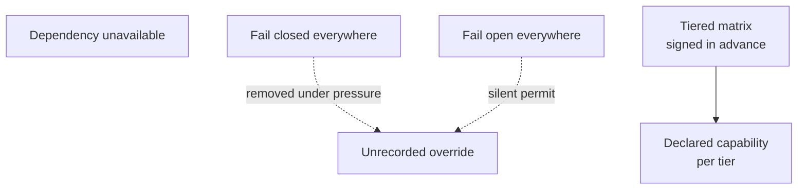
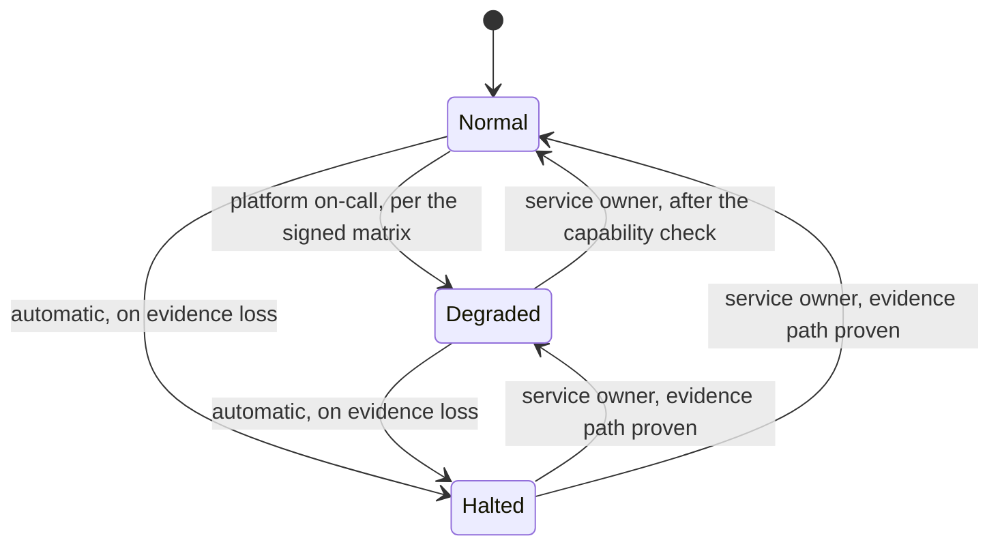

# The outage you decide in advance

At 03:40 UTC the policy bundle is 90 min stale. The fourth refresh has failed. Nineteen hundred nightly runs are in flight. Somebody holding a pager is about to decide whether those runs keep working. Whatever they decide will be reasoned out loud, on partial information, by a person whose actual job at that moment is to make the alert stop.

That decision has an owner, and it is not them. The answer to what the platform does when a dependency is unavailable is neither a principle nor a preference. It is a matrix: one row per dependency and one column per risk tier, filled in while everyone is calm and signed by a person who can be named afterwards. Every cell states two things: what the platform does when that dependency is gone, and what a run can still do while it is gone. One row does not vary by dependency or by tier. It is the row this chapter spends the most argument defending.

*Figure 14.1 – Why not one answer for every outage? Both uniform postures fail predictably; the matrix is the only option that survives contact with a person holding a pager at 03:40.*

## Both uniform answers lose

Both uniform answers are coherent. Both are gone within a year: one removed by the business during an outage, the other never noticed because its failure is silent. Take fail-closed everywhere at its strongest first, because it is the position a security engineer arrives with and it is not a foolish one. Every dependency in this platform exists because something about the run needs governing. A dependency that cannot answer is a governance question the platform cannot answer. Acting anyway is acting outside the safety case. The rule is also uniform, which is worth more than it sounds at 03:40: there is nothing to look up, nothing to interpret, and no cell anybody can argue about while an incident is running. Uniformity is a real property and this position owns it.

It loses on what happens next rather than on what it says. Fail-closed everywhere is a self-inflicted denial of service against the business. It is available to Kai for the price of one slow write to one dependency. The claims queue stops for a reason nobody outside the platform team can parse. Within about forty minutes somebody senior enough to end the argument ends it. The override happens verbally, at night, on a bridge call, and produces no artefact: no record of what was permitted, for how long, at which tier, or on whose authority. The control did not fail. It was removed, by a competent person acting reasonably, and the removal is invisible to every subsequent review. A posture that predictably converts into an unrecorded exception is worse than a weaker posture that survives, because the weaker one is at least the one you documented.

Fail-open is negligence with extra steps, and it deserves the same courtesy of being stated properly. Its argument is availability arithmetic: the agent is doing work that has value, the governance layer is a control on that work rather than the work itself, and a control that stops the business during its own outage has inverted the priority. Most estates run this way today, not by decision but because it is what a library returns when a call times out, and it is written by engineers optimising for the thing they were asked to optimise for. The reason it fails is not that it is reckless. It is that the failure is silent and correlated. The window in which the platform is permitting calls it cannot govern is precisely the window in which something is already wrong, and the two are frequently wrong for the same underlying reason. You learn what happened during that window afterwards, from the systems of record, if at all.

What both positions share is the assumption that one answer covers a payment adjustment and a document summary. The tiering already rejected that assumption everywhere else in the document. There is no reason the outage case is the one place it holds.

## What goes in the cells

Six dependencies against three tiers is eighteen cells. That is two hours of argument and not more. The tiers are the discrete ones chapter 2 fixed, in ascending order of consequence. T1 is reversible internal effect. T2 is irreversible or externally visible effect under a stated cap with a human gate, which at Borealis Mutual is a claims adjustment up to €5,000. T3 is effect that reaches a third party you owe proof to – money leaving the organisation, a filing, or a communication to a customer [A-1.7].

| Dependency | T1 · reversible internal | T2 · irreversible, capped, gated | T3 · reaches a third party |
|---|---|---|---|
| Broker, run credentials | Runs in flight finish on the credential they hold; new runs start against the last entitlement snapshot for 15 min. Capability: full. | Runs in flight finish; no new runs admitted. Capability: work already started. | Runs in flight finish the current call, then terminate at the next derivation point. Capability: none. |
| Policy distribution | Continue on the last signed bundle to the declared staleness budget of 60 min, then refuse. Capability: full within the bundle. | Continue to 15 min, then refuse effect-bearing calls. Capability: read-only. | Refuse at the first failed refresh. Capability: none. |
| Evidence store | No record, no effect. Capability: everything that produces no effect, plus the bounded queue's declared loss window. | No record, no effect. Capability: retrieval, drafting, proposals held unexecuted. | No record, no effect. Capability: retrieval, drafting, proposals held unexecuted. |
| Retrieval and entitlement resolution | Proceed with the withheld count declared in context. Capability: full, grounded on what resolved. | Stop rather than proceed ungrounded. Capability: the current call, then nothing. | Terminate. Capability: none. |
| The seam's registry | Continue on pinned manifests. Capability: full; onboarding and promotion stop. | Continue on pinned manifests to the digest re-verification window of 24 h. Capability: full. | Continue to 4 h, then refuse. Capability: read-only after the window. |
| Model provider | Fail over inside the allowed model set, three entries. A route outside the set terminates the run. Capability: full. | Fail over inside the allowed set, two entries. A route outside the set terminates the run. Capability: full while inside. | No substitute inside the set: terminate. Capability: none. |

*Table 14.1 – The fail-posture matrix as Borealis Mutual signed it. Each cell states what the platform does when the dependency is unavailable and what a run can still do while it is.*

Two rows repay reading against each other, because between them they show what the rest of the document already bought. The registry row is the cheapest outage in the table. Pinned, signed manifests fetched at promotion rather than discovered at runtime mean a registry outage stops onboarding and stops nothing else, until the digest re-verification window expires. That is not a resilience achievement. It is chapter 8 having given up runtime discovery, priced at the time as a loss of developer convenience, showing up six chapters later as an availability property nobody paid for twice. The model-provider row is the opposite shape. It is the only row in the table whose posture is termination at every tier rather than degradation, because the allowed model set is a property of the tier carried in the envelope, and a route to a model outside that set is a change to the safety case made by a component optimising for latency and price. Terminating a run is expensive and visible. Continuing it on a substitute whose refusal profile was never measured is cheap and invisible. The evaluation result that authorised the tier was measured against the model that is no longer executing.

On 2026-06-16, a Tuesday, Marta and four other people spend two hours filling in eighteen cells in a room where nothing is on fire. The broker row takes forty minutes of it. The platform lead wants T2 runs in flight to complete and the head of claims wants them stopped. The argument is genuinely close: a half-made adjustment is worse than one never started, and a claims queue that stalls at 09:00 is a complaint by 11:00. They settle on completion in flight, no new runs, and the reasoning goes into a two-line note beside the cell, which turns out to be the most consulted text in the document. The model-provider row takes ninety seconds. Everyone agrees that a T2 claims run whose model is unavailable terminates rather than falling back to something outside `claims-tier2-approved`. Nobody in the room has ever seen it happen. It is signed off with the faint embarrassment of a formality. Marta signs the sheet: a name, a date, and the digest of the matrix version, stored where the runbook reaches it at 03:00 [A-7.2].

On 2026-11-19 at 06:12 UTC the primary provider starts returning 503s on roughly a third of requests. The router does what routers do and reaches for the secondary, which is outside `claims-tier2-approved` because it was never evaluated at that tier. The gateway terminates the run at the derivation check instead. Over the next 38 min it terminates 214 runs the same way, each with a refusal recorded against it naming the requested model, the allowed set, and the matrix version in force. Nobody is woken to make a decision. The on-call engineer pastes the row into the incident channel in the first four minutes and spends the rest of the outage on the thing that is actually broken. By 09:00 the attended queue is 214 claims deep and Marta works them with people, which is a bad morning and a known one. What did not happen that morning is the only interesting part: no fallback to an unevaluated model, no override, no decision, and no conversation afterwards about who had authorised what. That is the entire product of a Tuesday in June.

## Degraded is a state the product has, not a state it falls into

Degraded mode is a designed state with a name, an entry authority, an exit authority, and a behaviour a user can see. The alternative on offer is not a different design. It is the absence of the normal state, which is what an estate has when it has never named this. In an unnamed degraded state nobody can say whether the platform is in it, when it entered, what it is currently able to do, or who is allowed to end it. Every one of those questions gets asked during the outage by someone who needed the answer ten minutes earlier. Naming it is also where the regulatory frame is unusually well matched to the engineering. Operational resilience obligations ask for documented procedures for operating under disruption and for those procedures to be tested rather than written. That is the same demand this section makes for its own reasons [@eu2022dora]. The resilience engineering literature has treated graceful degradation as a designed state rather than a failure mode for longer than this field has existed. The framing is borrowed rather than derived here [@hollnagel2006resilience].

*Figure 14.2 – Who puts the platform into each state, and who takes it out? Entry into degraded operation is cheaper than exit from it by design, and the halted state is the one no human is needed to enter.*

The asymmetry in the figure is the design. Entry into degraded operation costs one on-call engineer executing a signed row, because an entry authority any higher than that produces a delay measured in the time it takes to find a director at 03:40. Exit costs the service owner and a capability check, because the temptation at the end of an incident is to declare normality while the dependency is still flapping, and the person best placed to resist that temptation is the one who signed the row rather than the one who has been awake since two. The halted state has no human in its entry path at all. That is the one automatic transition in this document, and the evidence row is the reason it is automatic.

What a user sees is part of the specification rather than a courtesy. In degraded operation a refused call returns the platform's refusal object carrying the posture, the matrix version, and the capability set currently in force. The run receives a refusal it can reason about instead of an undifferentiated failure. Marta's queue shows why an action is unavailable rather than showing it greyed out [A-4.7]. A degraded platform that looks like a broken one produces the same phone calls as a broken one. The phone calls are a cost you can remove for the price of one field.

## The signature is the control

What counts as a control is a signed row with a named owner, not the unsigned matrix on its own. This is the political content of the decision rather than a flourish attached to it. An unsigned matrix is a recommendation from the platform team. A recommendation loses to a phone call from someone whose queue has stopped, every time, and correctly, because nobody in that call has been given the authority to hold the line. A signed row is a decision with a person's name on it, taken with time to think. That changes what happens on the bridge: the conversation moves from *what do we do* to *do we override Marta's June decision*, and those are conversations with different outcomes and different records. The purpose of the whole exercise is to make the decision attributable before it is urgent. Everything else the matrix does is secondary to that. This is also why the signer is the person who owns the consequence of the outage rather than the person who owns the platform, and why a refusal to sign is a useful outcome rather than a failed meeting. A row nobody will sign is a row whose cost the business has not accepted. Finding that out in June is cheap [ADR-25].

## The row that does not move

If the evidence path cannot write, effects do not happen, at every tier and for every dependency. Chapter 11 argued this as an ordering property. The operational form is narrower and more useful than the principle: the platform does not have a posture available to it here, because the only alternative is a period of action with no record, which is the exact state this document exists to make impossible [ADR-23]. The period is what makes it unrecoverable. A stopped queue is visible in minutes, has an owner, and ends. An hour of external effects with no record is discovered later, cannot be enumerated, and cannot be repaired, because authority is not reconstructible after the fact.

State the cost in availability arithmetic and let the number carry the argument, because *integrity* is a word and 43 min is not. An evidence store engineered to 99.9% is unavailable for about 43 min in a 30 d month. Put it in series with a gateway at 99.95% and effect-bearing calls are available about 99.85% of the time, which is roughly 65 min a month in which the platform refuses to let money move. That is the price of the row. It is knowable before launch rather than after. It is the figure to take into the room. What it buys is 0 min of unrecorded external effect. If 65 min a month is intolerable for the business, the answer is to buy availability in the evidence store rather than in the posture: a second quorum, a separate failure domain, and the 5–15 ms at p99 durability budget defended as a product target. That is expensive. It is expensive in a budget line with an owner rather than in a risk nobody priced.

What varies by tier is not the rule but what counts as the record being written. Above the reversibility line it is a durable quorum-acknowledged append before the call proceeds. Below it, chapter 11's bounded queue with its declared loss window is the record being written, and the loss window is a number a risk owner accepted in advance rather than a gap discovered later. So the row reads the same in all three columns and resolves differently in each. A reader who takes it as *the platform stops entirely* has read it as stricter than it is. Halted is a statement about the effect path rather than about the platform. Runs continue inside it: they retrieve, they reason, they draft, and they hold proposals unexecuted until the evidence path returns. For a claims run that means the morning's work is done and unposted rather than lost.

A reviewer will ask for the exception. It is always the same one: a case where acting without a record beats not acting, usually life safety, usually posed with an example nobody wants to argue against. The honest answer is a boundary rather than a carve-out. This document's scope is enterprise agents holding real authority under a burden of proof owed to a third party, which chapter 1 fixed with three conditions. A system in the path of a person's safety is a different system with a different hazard analysis, a different safety case, a different regulator, and a different answer to what unrecorded action costs. It is not built by taking this architecture and cutting a hole in its evidence row. If that is the system you are building, the exception you are looking for is not here, and the safety case you need was never the one written in this document.

## Nobody goes faster in an emergency

There is no break-glass run. The emergency path is a human acting directly against the system of record, with their own credentials, under whatever four-eyes procedure the organisation already runs. The platform's obligation is that this path exists, is roughly as fast as the agent path, and is recorded. The alternative that was seriously considered is a break-glass run derived under an emergency mandate with a hard expiry and two signatures. It is not a strawman: attenuation survives it, because the mandate is itself a bound, and every enterprise already has the organisational muscle for exactly that ceremony. It was rejected on what it creates rather than on what it permits. A legitimate, high-authority, seldom-exercised derivation path is the most attractive object in the estate to a patient person. It is attractive precisely because it is the one path whose use under pressure nobody questions. Kai does not need to defeat the envelope if the organisation has built a supported way to be handed a wider one [ADR-33].

The cost is a manual path somebody maintains and exercises. That is another row on the drill calendar and a genuinely unpopular one, because the manual path is slow, is used twice a year, and is the first thing to rot when the system of record changes its screens [A-7.4]. An emergency path that has not been walked in a year is not an emergency path. It is a paragraph. And the reason this belongs in a chapter about outages rather than in the chapter about stopping things is that *what no switch can undo* and *what no envelope permits* are one conversation approached from opposite ends. The switches themselves are chapter 15's material. The speed limit is this chapter's.

## What the second system costs

Degraded mode is a second system. An untested second system is a rumour. It has its own code paths, its own refusal behaviour, its own runbook, and its own tests. None of that is shared with the normal path in any way that would let the normal path's test suite cover it. The reason most organisations have a fail posture on paper only is not negligence. It is that the paper version costs two hours in a room and the working version costs a permanent line in the operating budget, and the second cost arrives quarter after quarter with no incident to justify it.

Price it honestly. Filling the matrix is about a day of argument per tier between platform, security, and the business owner, repeated whenever a dependency is added, which at Borealis was three additions in the first year. Building the degraded paths is engineering work that shows up in no feature list. Exercising them is a deliberate outage of your own making: one dependency per month, rotated, in business hours, with the business owner told in advance and the capability set checked against what the matrix claims. That is roughly a day of platform time and half a day of somebody in claims per exercise. Call it 15–20 engineer-days a year plus twelve small self-inflicted outages, and add the manual emergency path's two walkthroughs. That is the number to put in front of whoever is deciding. It is a number that competes with features rather than with other security work, which is the competition it usually loses.

The exercise is also the only thing that makes the declared capability sets true rather than aspirational. The gap between the two is where this chapter quietly stops working. A cell claiming read-only capability at T2 during a policy outage is an assertion about code nobody has run in that configuration. The first time it runs in that configuration will otherwise be the outage. Drift arrives from ordinary directions: a new dependency added without a row, a capability set written before a tool was onboarded, a staleness budget changed in a bundle configuration without anybody opening the matrix.

So the question to put to whoever inherits this, and it takes one query rather than a review: on what date did the platform last enter degraded mode deliberately, for which dependency, at which tier, and when the capability set was compared against what the runs could actually do, did the two match? If the last deliberate entry is more than a quarter old, the matrix describes a system that existed when it was signed. If the entries are recent but nobody compared the sets, you have been exercising the transition and not the claim. That is the more comfortable half of the drill and the half that proves nothing.
