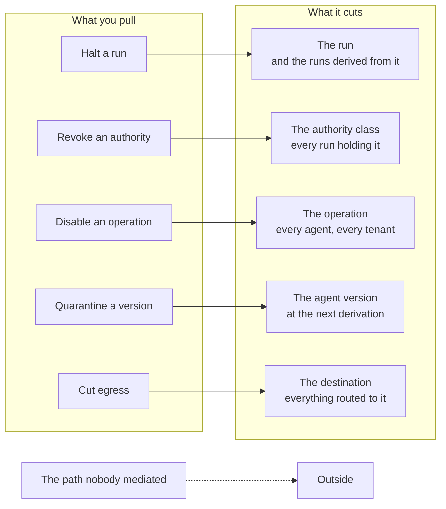

# Stopping it

Somebody asks for the kill switch in the second design review. Usually it is the person who will have to explain the incident rather than the person who will have to build the stop. The request is right. The noun is wrong.

There are five switches. Halting one run, revoking a class of authority, disabling one operation everywhere, quarantining an agent version, and cutting egress are five mechanisms with five reach profiles and five intervals. The one you want at 03:00 depends on what you have just learned. Build one of them, call it the kill switch, and the incident acquires a step nobody rehearsed. Somebody reaches for a reach that is either too small to help or so large that it takes the claims business off the network at the same moment it takes the adversary off it. The instinct behind the singular is the correct instinct – one action, no deliberation, no committee. The design answer is to preserve that property five times rather than to preserve it once.

One statement in the invariant set belongs here. It is the third leg of the claim in chapter 1: revocation takes effect within a stated interval, without the agent's cooperation (I6). That claim is falsified in this chapter or nowhere. There is no other place in the document where it can turn out to be false. Read the interval numbers below with more suspicion than the rest of the document invites.

Before any of it, the provenance. The document's credibility rests on the difference between what it inherited and what it invented. Incident response has a settled vocabulary for the shape of this work – contain first, eradicate second, recover third – and the containment half transfers cleanly enough to be worth borrowing [@nist80061r2]. It is borrowed for vocabulary and not for authority. That literature is about hosts, accounts and network segments. None of those decides at runtime what to do next. On the specific question a reader is entitled to ask – is there published practice on agent-specific kill mechanisms, with reported intervals, that this chapter is following – the honest answer is that there is not. These five are derived: from the run model in chapter 3, the enforcement points in chapters 7 and 13, and the manifest in chapter 12. They have been exercised in our drills and nowhere that anyone has published. Weigh them accordingly.

## Nothing here asks the agent to stop

None of the five is a message the agent is asked to honour. That single constraint eliminates most of the designs a competent team would reach for first.

A cancellation token the orchestration loop checks between steps. A `stop` tool the agent is instructed to call when told to. A system message injected into the next turn saying that the run has been withdrawn. Each is a request addressed to a component that chapter 1 placed outside the trusted computing base. Each of them works exactly as long as the run is behaving. The circumstance in which you are pulling a switch is the circumstance in which it is not. If Kai has talked the run into something, the component you would be politely asking is the component he is talking through.

So every one of the five is somebody else refusing, never the agent complying. The gateway refuses the next call. The derivation path declines to produce an envelope. The egress gateway has no route. The agent finds out what happened the way it finds out about any other refusal, from a structured error. What it does with that information is not load-bearing anywhere in this design.

Two consequences follow that are worth stating plainly. A reader who discovers them during an incident will conclude the mechanism is broken. The first is that a stop is a stop on *effects*, not on execution. After a run is halted, the process is often still running. The model is often still producing tokens. The run is spending money on inference it will not be permitted to use. Termination of the workload follows, and it follows on a slower path, because reclaiming a pod is a housekeeping problem and refusing a call is a security one. The second is that the interval is bounded by propagation to the enforcement points and not by anything about the agent. That is what makes it a number you can measure. It is also the reason chapter 13 gives revocation state the tightest staleness budget of any input in the bundle.

## The five, and what each one reaches

Five is not a taxonomy anyone handed us. Earn it pair by pair. Ask of each pair a reader might reasonably merge: what would be lost by merging them. The distinctions that survive are reach and interval. Implementation is not one of them. Two switches sharing a mechanism are still two switches if they reach different sets. Two that reach the same set are one switch with two buttons on it. They are numbered one to five below in ascending order of reach. That is a convenience for the runbooks and for the interface, not an escalation sequence. Nobody works up the list. There is no incident in which pulling all five is the plan.

**Halting a run against revoking an authority.** A halt names a run and takes it away. A revocation names an authority and catches every run holding it, including runs that have not started yet. Merge them and you lose the case that decides most incidents. At 09:19 on the bad morning you are halting runs by identifier while the batch scheduler starts new ones, and you are losing, because enumeration is slower than a scheduler. Merge them the other way and you cannot stop one misbehaving run without withdrawing an authority class that 400 legitimate runs are holding at the time.

**Revoking an authority against disabling an operation.** These differ on the axis of *who* against *what*. Revocation is scoped to a principal, a mandate or an agent, and it stops those actors doing anything. Disabling an operation is scoped to `tool:claims-core/post-adjustment` and stops everyone doing that one thing, including the 11 other agents you have not thought about yet and the ones another team deployed last week. When the failure is in the tool rather than the caller – a vendor advisory, a bad release behind the seam, a tool server whose manifest turns out to have been signed by a key nobody can now account for – enumerating every authority that contains the operation is an exercise that ends after the incident.

**Disabling an operation against quarantining an agent version.** An operation is a thing that can be done. An agent version is a deployable that can be diffed. Chapter 12 made it a signed artefact precisely so that this switch has something to name. The case that separates them is the one you will meet: `claims-triage` at version 2.3.1 has a binding prompt hash that no longer matches what was reviewed, and every operation in its declared need is fine, and is in use by three other agents. Quarantine the manifest digest and 2.3.1 stops being derivable. Disable its operations instead and you have stopped four agents to deal with one.

**Quarantining a version against halting runs.** These compose. Neither substitutes for the other, because they act at different moments. Quarantine takes effect at the next derivation and never at the current run. That is a property of the promotion path in chapter 12 rather than a defect in the switch: the manifest digest is bound when the envelope is derived, and a run in flight is already holding one. Halt without quarantine and the scheduler brings it back. Quarantine without halt and you have made a correct decision that takes up to the maximum run duration to become visible, which at Borealis is 30 min for tier two work.

**Cutting egress against all four of them.** Egress is the only one of the five that does not reason about authority at all. It is there for the case where the authority was legitimate. A permitted operation, called by a permitted principal, inside a valid envelope, carrying a payload Kai chose: nothing in the first four is looking at the destination, and the whole apparatus above is indifferent to what is inside an argument it was authorised to pass. Cutting the destination is the only move that reaches that. It is also the only one of the five whose full-scope version is more expensive than most incidents.

*Figure 15.1 – When you pull one of these, what stops and what keeps running? Each switch cuts one layer and leaves the other four standing, the quarantine acts at the next derivation rather than on the run in front of you, and the dashed path is the one that no switch in this chapter reaches.*

| Switch | What it stops | What it does not stop | Mechanism | Measured interval, p99, from pull to enforcement | Who pulls it at 03:00 alone |
|---|---|---|---|---|---|
| **1. Halt a run** | One run and the runs derived from it; state becomes `halted` | Other runs of the same agent; effects already committed; the next scheduled run | Run identifier enters the revocation set consulted at every gateway on every call | 3 s | Platform on-call, and the run's own principal from the agent interface |
| **2. Revoke an authority** | Every run holding that mandate, envelope class or delegation, now and at the next derivation | Runs under a different authority that reaches the same tools | Revocation state distributed to enforcement points on the tightest staleness budget in the bundle | 28 s | Platform on-call |
| **3. Disable an operation** | One typed operation for every agent and every tenant | Everything else the same agents can do; the same effect reached through an unmediated path | Entry on the fast deny list, separately signed, with a mandatory 24 h expiry | 95 s | Platform on-call, holding the deny-list signing key |
| **4. Quarantine a version** | Any new run deriving against that manifest digest | The run in front of you, up to the maximum run duration | Manifest digest marked unpromotable; derivation refuses | 20 s to the next derivation; 31 min to the last run in flight | Platform on-call |
| **5. Cut egress** | Outbound payloads to one destination, or to all of them | Anything already sent; internal effects; the paths outside the coverage number | Destination withdrawn at the egress gateway, with network enforcement behind it | Not measured in production; 6 min in staging, which does not count | Destination-scoped, platform on-call. All destinations, nobody: the duty incident manager is woken |

*Table 15.1 – The five switches. Intervals are our own drill figures at Borealis rather than published benchmarks, and the last row is what an unmeasured interval looks like when it is written down honestly.*

## The interval is a measured quantity

An interval is what a drill measured. It is not what the runbook claims, not what the mechanism is theoretically capable of, and not what the architecture document says. This is a definition rather than a piece of advice: until a switch has been pulled against a run that was doing real work, the number beside it is an intention. Intentions have one characteristic omission, which is every step involving a person. The credential that expired. The group that was split in a reorganisation. The engineer who is allowed to pull it and is asleep, and the one who is awake and is not allowed.

On 2026-03-02 the overnight reconciliation report showed an adjustment posting against a claim `claims-triage` had never been asked to touch. At 09:14 the platform lead decided to stop the agent. The stop had three homes by then: a section in the architecture document, control `OPS-4` in the register, and a paragraph in a filing submitted to the supervisor the previous autumn describing the organisation's ability to halt automated processing. None of the three had ever been executed against a production run. The runbook named a script. The script authenticated with a credential the on-call engineer's group had lost read access to in a January reorganisation. At 09:19, with 34 runs active, the engineer scaled the runtime deployment to zero, which stopped the pods and not the work: the batch scheduler had six new runs derived by 09:21, each against a mandate nobody had touched. The last run stopped at 09:25, when a second engineer, woken up, revoked the mandate. That is 11 min, most of it spent discovering that the fast thing available was the wrong thing to do.

The first drill ran on 2026-06-11 and found four defects. The interesting one was that nobody had counted the scheduler as part of the stop [A-7.1]. Level one now exists as a control in the agent's own interface, next to the run it stops, available to the run's principal and to the on-call engineer. Across four drills the median from decision to first refusal is 41 s, and the mechanism's own interval, from the pull to enforcement at every gateway, is 3 s at p99. The human number is the larger one and the one that improved, which is the usual finding.

The other direction was exercised on 2026-07-06 at 22:40, when a storm claim needed an emergency payment and no envelope in force permitted one at that hour. There is no emergency run, no widened envelope and no break-glass derivation, which chapter 14 settled rather than this one. Marta signed into Guidewire and posted the adjustment herself. The platform's contribution was that the movement did not surface as an unexplained effect: the manual path writes into the same evidence chain, marked as a human action on the system of record with no run behind it, and the reconciliation job matched it without anyone being asked to explain it [A-4.7]. The agent was not widened, that night or afterwards [ADR-33].

## What counts as having a switch

A switch that has not been executed against a live run in the last quarter does not exist [ADR-27]. Not degraded. Not probably fine. Not *documented*. It does not exist. The register carries it as absent. The interval column beside it is blank rather than optimistic. The calendar that makes this survivable, and the argument that generalises it from stop mechanisms to every control in this document, belong to chapter 16, which owns them.

The rule is severe on purpose, and it is severe in one specific direction. It costs nothing to write a stop procedure and it costs a morning to run one. An organisation with a procedure and no execution has bought the appearance of the capability for an afternoon of writing and has declined the drill morning four times a year that the capability itself costs. That is not a moral failing. It is an accurate response to the incentives. The only correction that works is to make the absence visible in the same place the capability would have been.

## Why the intervals differ

The five intervals differ by two orders of magnitude. The differences are structural rather than fixable. Engineering effort compresses each of them a little. Nothing reorders them.

Halting a run is fast because it is a direct action against a component the platform owns. The gateway is already on the path of every call, already consulting state, and adding one identifier to a set it reads is the cheapest enforcement in the system. Revoking an authority is slower because it is a distribution problem. Enforcement is local by design, decided in chapter 13 for latency reasons that are not negotiable. The price of local evaluation is that a change of mind travels at the speed of the staleness budget. Disabling an operation is slower again because it rides the fast deny list, which is a signed artefact with its own signing authority. Signing is a step that exists to prevent exactly the attack that a fast path to changing policy would otherwise create.

Quarantining a version is not a propagation number at all. Reading it as one is the mistake this row exists to prevent. Its interval to the next derivation is short. Its interval to the last affected run is the maximum run duration, because the manifest digest is bound at derivation and a run in flight is holding a decision that was correct when it was made. Chapter 6 declined to make envelopes mutable, for reasons that hold. This is one of the prices of that decision arriving where it can be seen.

Cutting egress is the slowest and the least under the platform's control. The last enforcement point is somebody else's: a network policy, a proxy, a firewall change with its own change process and its own on-call. Our figure is a staging figure, which is why the table says so.

## What no switch undoes

Every mechanism in this chapter stops the next thing. None of them touches the last one.

The mail that arrived is read. The payment that cleared has cleared. The data that left is gone, and it is gone in the specific sense that matters: you cannot know what a counterparty did with it in the four minutes before egress was cut. This is not a limitation of the design. It is a property of effects. Any document that leaves the reader with the impression that a fast enough stop makes an irreversible action reversible has traded credibility for comfort.

Compensating action is a business capability and not a platform one. Reversing a payment is a treasury process. Retracting a communication is a customer-relations process. Notifying a supervisor is a legal one. None of them lives in the gateway. None of them is improved by being modelled there. What the platform contributes is knowing precisely what to compensate, which is chapter 11's contribution arriving at the moment it matters. On 2026-03-02, Borealis reversed four postings, and knew there were four, and knew which claims they touched and in what order, from 63 chained events with their envelopes and approvals attached. The alternative shape of that morning is the one where the question *what did it touch* is answered by re-examining a quarter of adjustments, and the answer arrives in weeks and is still an estimate.

There is a second thing no switch undoes, and it is quieter. A stop leaves the organisation in a state where the agent is not running. That is a state somebody has to decide to leave. The exit authority is a named person and the entry authority is not the same person, which is chapter 14's machinery reused rather than rebuilt [A-1.6].

## What five of them cost

Five mechanisms is five things to build, own, document, and drill. The temptation to build one is a resourcing argument dressed as a design argument. Naming it correctly is most of the answer: an organisation that cannot fund five stop mechanisms has a budget position, which is respectable and arguable, and not an architecture in which one switch is sufficient. The honest form of that position is to build the two with the widest coverage per unit of effort – halting a run and revoking an authority – write the interval column for the other three as absent, and let the residual be visible to whoever signs the risk acceptance [ADR-26].

Priced properly, what you are buying is five runbooks and four drills a year each, which is 20 executions a year. At Borealis they run as one drill morning a quarter, two engineers, roughly half a day including the write-up, so about 8 engineer-days a year plus the initial cost of five runbooks nobody enjoys writing. The runs consumed are real runs and the drill is executed in production, because a drill against a staging run measures a staging system, which is the whole content of the last row of Table 15.1. There is no measurable latency cost: the revocation-state check is already inside chapter 13's 20–40 ms at p99, and this chapter adds a tighter staleness budget on one input rather than a new call on the path [A-6.6].

The item most likely to be underestimated is not engineering at all. Five switches means five named owners. Each is a person who is still at the company next year, has the credential, has pulled the thing at least once, and can be reached at 03:00. At an annual turnover of 15%, the probability that all five are still in post twelve months from now is about 44%. The more likely state of the world is that at least one switch has no owner. The second most likely is that nobody has noticed. This is an attrition problem wearing an architecture problem's clothes. The only mechanism that addresses it is the one thing an architecture document can do about staffing: make each owner a named row rather than a team, put the date of their last execution beside their name, and let the blank date be the alarm.

## The five rows, read out

Take the five, and for each one answer two questions in front of whoever owns the platform: the date it was last executed against a live production run, and the interval that was measured. Borealis reads the rows at the quarterly review. On 2026-07-31 they read like this.

Halting a run: 2026-07-21, in earnest rather than in a drill, 3 s at p99 to enforcement and 38 s from the decision. Revoking an authority: 2026-06-11, in a drill, 28 s at p99. Disabling an operation: 2026-05-02, in earnest, against `tool:claims-core/post-adjustment` during a vendor advisory that turned out to be nothing, 95 s at p99. Quarantining a version: 2026-06-11, in a drill, 20 s to the next derivation and 31 min to the last run in flight, which was the whole point of measuring it.

Cutting egress: blank. It has been blank since the platform shipped. The destination-scoped version was exercised in staging, where the egress path is not the production path. The all-destinations version has never been pulled by anyone, because nobody wants to be the person who took the claims business off the network on a Tuesday afternoon to find out how long it takes. Which means Borealis has four stop mechanisms and one paragraph, and the paragraph is in a filing.
