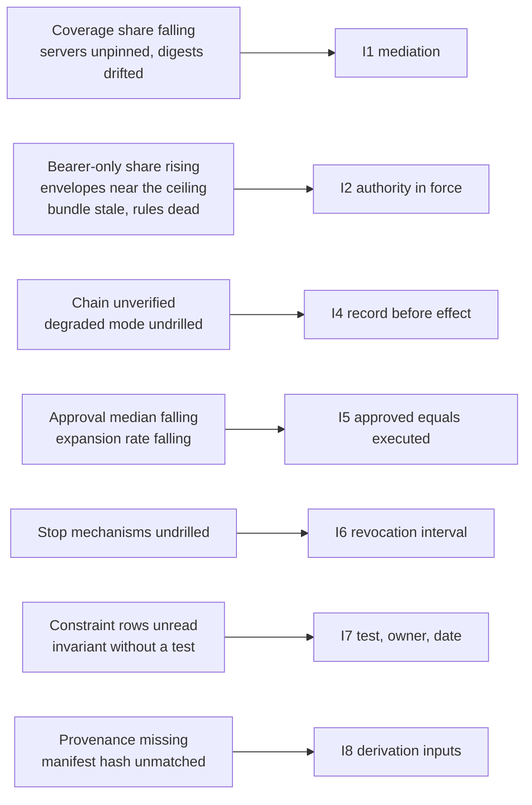

# Decay

Fourteen months in, the quarterly pack is green. Coverage is up two points. Every control on the page has an owner listed against it. The one red cell closed on Tuesday.

Every control in this document degrades. None of them degrades loudly. Each degradation has an indicator you could query this afternoon. The envelope widens one reasonable exception at a time. Coverage falls when a team ships a service that talks directly to a system of record. An approval gate becomes a formality. A policy bundle goes stale. A tool description drifts from the version somebody reviewed. A stop mechanism sits in the runbook for a year without being executed. None of that produces an alert, an error, or a failed request, because none of it is a fault. It is the platform working exactly as configured, with a configuration that has moved.

Which is why the invariant this chapter keeps true looks least like a security property of the eight: every control has a test, an owner, and a date on which it was last exercised. Two of those three are cheap. The date is the expensive one. It is the only one of the three that cannot be produced retrospectively by a competent person with an afternoon and a template. What follows is a maintenance schedule. It does not apologise for being one.

## Why decay is the default

Decay is not what happens when the discipline slips. It is what a competent organisation produces while working normally. That is why the response is a calendar rather than a memo.

Look at how each widening actually arrives. A partner integration cannot present a client certificate, so a bearer-only credential is granted under a named exception with a three-week expiry, by someone who documents it properly. A claims service ships talking straight to Guidewire because onboarding through the gateway takes three weeks and the release is on Thursday. The engineer who made that call raised it in stand-up and was told to ship. A need declaration acquires its fifth operation because a run stopped at 16:40 on something Marta genuinely needed, and the sixth two months later for the same reason. A reviewer learns, correctly, from nine hundred consecutive proposals, that the proposals are fine. A policy bundle gets pinned during a migration so the migration is not fighting two moving parts. Unpinning it lands in a backlog behind work that has a date on it.

Each of those is a reasonable decision made by a competent person under delivery pressure. The sum of reasonable decisions is the original problem restored.

Nothing in an availability dashboard can see any of it. That instrument was built to answer whether the platform is doing its job. During decay the answer is yes and improving: the queue drains faster, refusals fall, onboarding complaints stop, and the coverage percentage rises because the denominator has not been recalculated since March. Every signal an operations team already watches moves in the comfortable direction while the properties in Part II are being taken apart. The second dashboard is not redundancy. It is the only instrument pointed at the thing that is changing.

Two mature regulated fields have the evidence this argument would like to borrow, and borrowing it is stronger than citing nothing. Aviation maintenance and clinical audit both run on recurring audit cycles. Both are old enough to have longitudinal data. Both are in the business of measuring what happens to procedural compliance between one exercise and the next. What is needed here is the rate rather than the anecdote `[citation needed: longitudinal measurement of control drift or compliance decay between audit cycles in aviation maintenance or clinical audit, giving the rate of decline and the recovery observed after an exercise]`.

## The catalogue and how to read it

Every control in this document contributes one row. The row carries an indicator, the unit it is expressed in, the movement that means trouble, and the invariant that stops being true if the movement continues.

| Control | Indicator | Unit | Direction that means trouble | Invariant |
|---|---|---|---|---|
| Constraint inventory · ch. 2 | Months since each row was reviewed with its named owner | months | rising | I7 |
| Run-scoped authority · ch. 3 | Production agents whose authority is not scoped to a run, and rows nobody could answer without reading code | count | rising | I2 |
| Invariant tests · ch. 4 | Invariants with no test that passed this quarter | count of 8 | above zero | I7 |
| Sender-constrained credentials · ch. 5 | Bearer-only share of run credentials issued, and exceptions past their stated expiry | % of issuance; count | rising | I2 |
| Envelope intersection · ch. 6 | Derived envelopes whose operation count sits within 10% of the tier ceiling | % of envelopes | rising | I2 |
| Mediation coverage · ch. 7 | Discovered paths that are mediated, read against the size of the denominator | % of paths; count | falling, or denominator flat | I1 |
| Registry pinning · ch. 8 | Tool servers reachable with no pinned entry, and description digests changed since onboarding | count | rising | I1 |
| Approval gates · ch. 9 | Median time to decision per gate, read with the detail-view expansion rate | s; % | both falling | I5 |
| Memory provenance · ch. 10 | Items in memory carrying no provenance | % of store | rising | I8 |
| Evidence chain · ch. 11 | Days since the whole retention window was verified end to end, and whether a person read the result | days | rising | I4 |
| Agent manifest · ch. 12 | Production runs on a manifest hash that does not match the promoted artefact | count per month | above zero | I8 |
| Policy propagation · ch. 13 | Measured p99 bundle propagation, and the date it was last measured rather than assumed | s; date | rising, or date receding | I2 |
| Policy rules · ch. 13 | Rules that have not fired in 90 d, and rules that fire on every evaluation | count | rising | I2 |
| Policy tests · ch. 13 | Rules carrying a test in the build-time suite | % of rules | falling | I2 |
| Fail postures · ch. 14 | Days since degraded mode was entered deliberately, and whether the capability set matched the declaration | days | rising | I4 |
| Stop mechanisms · ch. 15 | For each of the five, days since it was last executed against a live run, and the interval measured | days; s | rising | I6 |

*Table 16.1 – The decay catalogue: one row per control, the indicator that reveals its decay, the unit the indicator is expressed in, the movement that means trouble, and the invariant that stops holding if the movement continues.*

Three properties of the table matter more than any individual row. Direction beats level everywhere: 87% coverage falling is a worse position than 71% coverage rising, and a table read as a set of thresholds produces arguments about thresholds. Half the rows have a denominator that can be quietly narrowed, and a narrowed denominator improves the number without improving anything else, which is the most common way one of these programmes dies. And each indicator is a query rather than an opinion, so a review's disagreement about it is a disagreement about the query, which can be settled in the room.

*Figure 16.1 – If one of these numbers moves, which invariant stops being true? Each group on the left is the observable form of exactly one invariant on the right ceasing to hold, which is what makes a line on a dashboard a claim about the architecture rather than a claim about the platform's health.*

Three numbers land at Borealis on the same Monday, on one screen. Only one of them is an emergency.

The first is that derived envelopes for `claims-triage` now sit within 8% of the tier two ceiling on average. Chapter 6 asked for the fraction inside 10%, and this is the average, which is the worse reading. It means the typical run is being handed very nearly everything its tier permits. The intersection of declared need, principal reach, and ceiling has stopped subtracting anything worth the arithmetic. Nobody widened an envelope. The declaration acquired operations one at a time, each time a run stopped on something that was genuinely needed that afternoon. The bound that four chapters of Part II construct is now, on average, 8% narrower than the ceiling it exists to improve on.

The second is that a deny rule on cross-tenant claim reads has not fired in 90 d. This is the number that cannot be read at all. Either no run has attempted a cross-tenant read in a quarter, which is plausible and is good news, or the rule stopped matching when the claim schema changed in April and has been evaluating to nothing ever since. The firing telemetry cannot separate those two. Neither can the person looking at it. Both of them will be asked about it in the same meeting.

The third is that the recertification query asks which operations `claims-triage` actually exercised last quarter and returns three of the six in its declared need. Two of the three unused ones never entered a derived envelope at all. That is not decay. That is the machinery working as designed. What it has produced is a list of three declarations to delete before the next review.

So the order of attention is the reverse of the order of alarm. The third number is a result. The first is the loss of the bound the whole document is built to provide. The second is not a number at all until somebody makes the rule fire on purpose.

## A canary that starts passing

A canary is the only mechanism in this document that detects the absence of a control rather than the presence of its activity. The distinction is worth being precise about, because it is the part of this chapter that transfers to systems nothing like this one.

Every other indicator in Table 16.1 measures something a control did. Credentials were issued. Calls were refused. Digests were compared. Decisions were timed. A control that has stopped running produces no activity. No activity is indistinguishable from a quiet quarter. The deny rule above is exactly that ambiguity. No amount of additional telemetry resolves it, because the telemetry and the control fail together.

A canary is a case whose only correct outcome is a refusal, executed continuously against production, on the path a real run takes. It carries the same credential shape. It crosses the same gateway. It meets the same policy bundle and the same registry. It passes when it is refused. A canary that succeeds is an incident and is paged as one. There is only one thing a succeeding canary can mean: a control that was there is not there now.

Two design constraints follow, and both are load-bearing. A canary succeeding is a control absent, so every case is constructed to be harmless when it is not refused: a synthetic claim, a synthetic subject, an amount below every threshold, and a target that is a fixture rather than a record anyone relies on. And canaries appear in evidence and in operational metrics like any other run, so they carry a label applied by the platform at run start and derivable from nothing in the payload. That second constraint exists because of Kai rather than because of tidiness. A person who could mark a real run as a canary would not have found a bypass. They would have found a way to make the estate's own measurements lie, which is a considerably better outcome for them.

At Borealis the suite is roughly 40 cases, one for every refusal the platform claims to be able to produce, running at least daily, and hourly for the operations above the reversibility line [A-7.2]. The maintenance is real and it is the item most often underestimated. A schema change breaks canaries. A broken canary errors rather than passing, so the suite has to distinguish a refusal from an error from a success in three states rather than two. A suite that collapses error into pass has rebuilt the problem it was written to solve, one release at a time. It will do so silently.

## Documented is not exercised

A capability exists only if it was exercised last quarter. A documented procedure with no execution date against it is a plan. The gap between a plan and a capability is discovered at the least convenient moment available.

The objection to that is strong and comes from experienced people, so take it at full strength. Documentation plus competent staff is how every other operational capability in the enterprise is evidenced. Nobody executes the disaster-recovery plan quarterly to prove it exists. Nobody rehearses the certificate renewal. An organisation that made quarterly execution the price of counting a capability would spend more on exercises than on the operations they protect. Regulated organisations already generate more evidence than anyone reads. One more standing obligation is a real cost argued by people who have watched several such obligations decay into a signature on a form.

The answer is not that the objection is wrong. It is that the mechanisms in this document sit in a category the objection does not reach, because they have no organic exercise. A database failover is drilled by the world whether or not anybody schedules it: hardware dies, a patch reboots a node, an availability zone goes away on a Sunday. By month fourteen the procedure has run several times, the runbook has been corrected under pressure by somebody who found it wrong, and the people who would execute it have watched it happen. Nobody halts an agent run by accident. No maintenance window revokes a run credential mid-flight. No patch fires the third stop mechanism. No ordinary Tuesday produces a cross-tenant retrieval attempt that would tell you the deny rule still matches. An undrilled switch has not run rarely. It has never run at all, in any circumstance. Its first execution will be during the incident it was built for, performed by somebody doing it for the first time, on the night when the interval it takes becomes the number in the report [ADR-27].

That distinction also bounds the cost rather than waving it away, which is the honest half of the argument. The obligation attaches to the mechanisms with no organic exercise. That set is enumerable rather than open-ended: the five stop mechanisms, deliberate entry into degraded mode, end-to-end verification of the evidence chain, the manual path on the system of record that exists because there is no agent break-glass, and the refusal paths the canary suite covers. Everything the estate exercises on its own keeps the ordinary evidence it already has. Nothing here asks for a drill of the payroll run.

## What recertification can and cannot ask

Recertification produces two reports with two owners. The question an access review is built to ask has no answer in this architecture. The question that does have an answer is one only the platform can answer.

The data owner recertifies the tier ceiling and the declared need. Both are static artefacts. Both fit on a page. Both ask a question a data owner is competent to judge: is this the work, and is this the reach the work needs. The platform reports the exercised set from last quarter – the list of operations actually called, against which systems, under whose authority. That report is only possible because chapter 11 wrote every effect down before it happened. The two views answer different questions and disagree usefully. The ceiling says what was permitted. The exercised set says what was used. The gap between them is the over-declaration list that keeps the intersection from becoming a constant [ADR-32].

What the identity governance platform can be told is worth stating plainly, because somebody will have to type it into one. It can be told that the agent identity exists, that a named person owns it, that it carries a tier, a declared need, and a ceiling. It can hold those as the static entitlement of record. What it cannot be told is what the identity can reach, because between runs the honest answer is nothing: authority does not exist until a run derives it. A governance tool handed *nothing* records an orphan, or refuses the import, or invents a zero that a reviewer reads as an error. This is a deliberate architectural property colliding with a mandatory, audited process. The collision is far cheaper to prepare for than to discover during an access-review cycle three weeks before an examination. The preparation is one page in the recertification pack: the ceiling as the static figure the tool holds, the exercised set attached as evidence that the static figure overstates reality, and a named person who will say both sentences out loud to an auditor.

The cost is two processes on two calendars. That roughly doubles the load and puts part of it on a team that has never carried a recertification obligation before. It buys what a conventional entitlement review cannot buy at any price: an answer grounded in what happened rather than in what was granted.

## What the calendar looks like

The calendar fits on one page. The full version with its owners and its runbook references is in Appendix G [A-7.1].

Three indicators are plotted weekly, because they move continuously and their direction is the signal: the envelope-to-ceiling fraction, the coverage share, and the approval median with its expansion rate beside it. The counts are monthly, because they move in steps rather than continuously: unpinned servers, drifted digests, bearer-only issuance, unprovenanced memory items, and manifest hashes that do not match the promoted artefact. The quarter carries everything with a date rather than a trend: recertification in both views, the five stop drills, one deliberate entry into degraded mode, end-to-end verification of the retention window, the never-fired and always-fired rule review, and one pass of coverage discovery. The constraint inventory is reviewed with its row owners twice a year. The fail-posture matrix is re-signed annually, or on the day a dependency changes, whichever arrives first. Canaries run continuously and are not on the calendar at all, which is the point of them.

One property of that calendar is worth defending: it is one calendar with one owner, rather than a risk-function calendar and a platform calendar covering overlapping controls. Two calendars drift within a year. They drift in the direction where each assumes the other covers the item both find tedious. What a supervisor eventually asks for is the calendar plus the execution dates against it. A schedule that exists in two versions has the evidentiary weight of neither.

## What the day is spent on

Chapter 1's most quotable number is roughly one engineer-day a week, permanently. It is the number most likely to be challenged in a budget meeting, so here it is itemised rather than asserted. A quarter is 13 weeks, so the claim is 13 engineer-days a quarter for an estate with one gateway domain and nine agents in production.

Coverage discovery takes 5 d of that, which is chapter 7's figure of one person for one week per quarter per domain. It buys the denominator without which the coverage percentage is decorative. Drills take 3 d: half a day each for the five stop mechanisms against a live run including the write-up, and half a day for the deliberate degraded-mode entry and the end-to-end chain verification together. Recertification takes 2 d, which is the exercised-set query, the reconciliation behind it, and the meetings in which a data owner disagrees with the result. Canary maintenance takes 1.5 d: new cases after each incident and each manifest change, repairs after schema changes, and triage of the ones that errored. The archaeology of unmediated paths takes the remaining 1.5 d: finding the owner of a route that discovery surfaced, and deciding whether it gets mediated, retired, or accepted with a name against the acceptance. Thirteen days, one quarter, one engineer-day a week.

The arithmetic holds for one domain. The honest version of the number says which way it scales. Four gateway domains spend 20 d on discovery alone and land nearer 28 d a quarter, which is a little over two engineer-days a week. So chapter 1's figure is a floor for the smallest estate that would sensibly build this rather than a budget for any estate. Discovery scales with domains. Recertification scales with agents and with the number of data owners who have opinions. Canary maintenance scales with the rate of change in the estate rather than with its size. Drills scale with the count of mechanisms and not with anything else, which is the one pleasant item on the list, because a stop drill costs the same whether it protects one agent or nine.

Two things the day is not. It is not one person's day, which is why it disappears from planning: four hours in one week, a morning in another, a full day in the week the drills happen, spread across three or four people, none of whom has a sprint card called *decay*. And it does not include the engineering to fix what the indicators find, which is project work and gets budgeted as project work. The standing day buys the measurement and the exercise. What the measurement finds is a separate conversation with a separate cost. Keeping the two apart is the only way the obligation survives a bad quarter with its number intact.

## Who owns the number

The dashboard is the easy part. A metric with no owner is a screensaver.

The characteristic failure is not an absent dashboard, and it is not a wrong one. It is a correct dashboard. The panels are right. The queries are right. The refresh is hourly. The link is in the runbook. The coverage line has been descending gently for two quarters while nobody's objectives contain it. From inside that situation nothing looks like a control failure. Every review the pack appears in ends with the observation that the numbers are being tracked, which is entirely true. That is a different statement from anyone being accountable for the direction they are moving in.

So ownership is written in the same form as everything else here. A named person per indicator rather than a team, accountable for the trend rather than the level, and obliged to explain any direction the indicator has held for two consecutive quarters. The pack goes to somebody who controls a budget, because an indicator that cannot cause money to move is a measurement rather than a control. The ownership rows are recertified on the same quarterly cycle as the rest, because the fastest decay mode in this chapter is the one where the named person changed roles in March and the row still carries their name.

Two organisations build the same architecture out of this document. Fourteen months later one of them still has the properties in Part II while the other has a diagram of them. The difference is not architecture. Everyone in the room already knows that, which is why it is worth saying once and not building a section around it.

Which leaves one question, and it is the question this chapter has asked about every other control, turned around and pointed at the instrument that measures them. Who owns the decay dashboard, and when did they last look at it?
