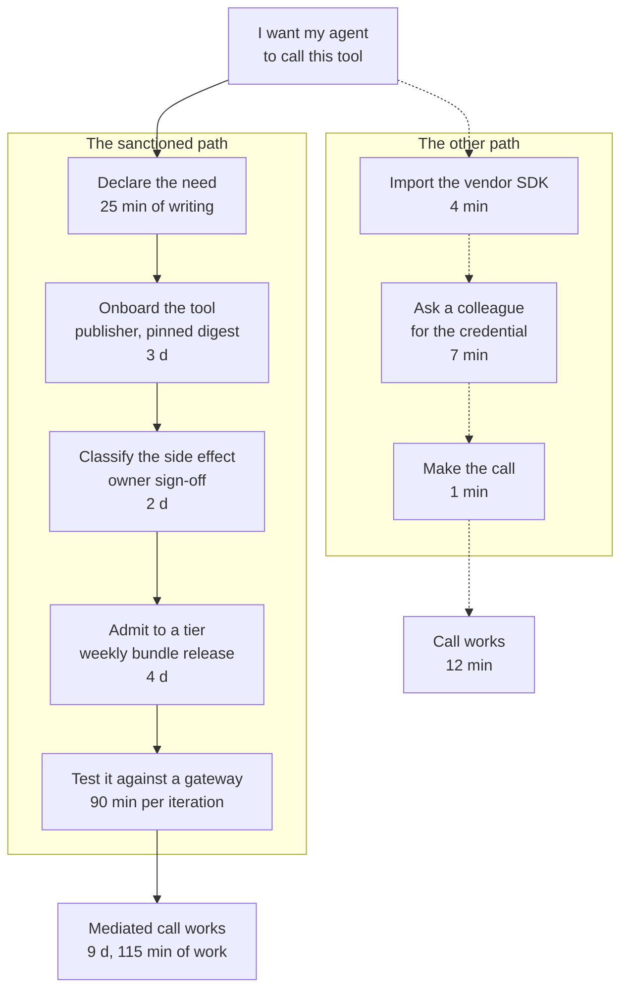

# The paved road

At 16:00 on a Thursday an engineer needs an agent to read a document out of the claims store. There are two ways to do it. One of them takes nine days. The other takes 12 min, because a colleague already holds a credential that works and the vendor SDK is four lines.

The 12-minute path is the one that ships. The decision behind it was correct at the altitude it was taken. There is nothing to persuade that engineer of. They have a delivery date. The shorter path produces a working system. No signal available to them at 16:00 says otherwise. Their comparison decides whether the apparatus in the rest of this document is a control or a diagram.

So the number this chapter is about is a duration. Time-to-first-mediated-call is the elapsed time from *I want my agent to call this tool* to that call succeeding through the gateway, measured at the median and at the ninetieth percentile, given a target, and reported beside the coverage figure. It is a security metric rather than a proxy for one. Filing it under developer-experience housekeeping that the architecture merely benefits from is the mistake this chapter exists to prevent.

It is a security metric because a control that is bypassed is worse than one that does not exist. The bypassed control produces a coverage number, a slide, and a belief. An organisation with no gateway knows it has no bound on what a compromised run can reach. An organisation with a gateway that half the estate routes around believes it has one. The belief is load-bearing: it is what the risk register records and what the incident plan assumes when somebody asks at 03:00 what the agent could have touched. The second organisation holds the same estate as the first, in a worse position, having spent two quarters and six engineers to get there.

That argument runs easily into an excuse for building nothing, so it is worth pinning down where the negative value sits. It sits in the gap between what is claimed and what is routed. A gap closes from either end. Close it by removing the gateway and you have an unbounded estate you can describe accurately, which is honest and worthless. Close it by making the sanctioned path the fast one and you have a bound. The gap is the defect. The gateway is not.

Chapter 7's coverage ratio is where the gap becomes visible, and it becomes visible late. An unmediated path is created on the Thursday somebody chose the shorter route. It appears in a coverage measurement one or two quarters afterwards, if discovery finds it at all. By then the person who created it has changed team and the path has three dependents. Minutes are the leading indicator of the same phenomenon, available on the day the friction is introduced rather than two audits later.

## Two paths and a clock

Price both paths in the unit the engineer uses and the result is not close. That is why the figure below is uncomfortable rather than informative.

The sanctioned route at Borealis, on the day it was first measured, ran to nine days elapsed and 115 min of the requesting engineer's own hands. The other route ran to 12 min. Neither number is a scandal on its own. The nine days are made of steps this document argued for, each of which exists because something specific went wrong without it. The 12 min are made of an import statement and a colleague being helpful.



*Figure 17.1 – Which path would you take at 16:00 on a Thursday? The sanctioned route is nine days and 115 min of your own hands, the other is 12 min, and the dashed steps are the ones the platform never sees.*

One correction to the figure, because it flatters the sanctioned path by being legible. The engineer does not know it is nine days. What they know at 16:00 is that one path opens with a form and the other opens with an import. Their estimate of the first is whatever the last person who tried it said in a channel. Elapsed days are what the metric captures. The choice is made on the first visible step. A path beginning with a field called *declared side-effect class* has already lost to a path beginning with autocomplete.

Borealis set the target at 1 d at the median and 3 d at the ninetieth percentile, published it beside the coverage figure once that measurement existed, and missed it for two quarters. A target missed in public does more work than a target met in private, because the miss is what funds the next piece of the road. There is no published benchmark to set it against: the platform-engineering literature on friction and adoption of a sanctioned path is young, largely vendor-authored, and drawn from surveys of self-selected respondents. A clean, non-vendor measurement of path friction against adoption of a sanctioned internal platform is not something we can cite; the direction of the relationship is not in serious doubt. Our judgement is that the direction of the relationship is not in doubt and the size of it is unknown, which justifies measuring your own and not quoting anybody else's.

## Where the minutes go

The minutes go into five steps. Four of them are waiting. One of them recurs forever.

**Need declaration** is 25 min of writing and is the cheapest step, because the manifest field is small and the person filling it in knows the answer. It is also the step most often blamed, being the one with a form on it. Chapter 6 makes that field static and human-reviewed for a reason that does not compress into a tooltip. The tax here is not the form but the explanation the developer never received.

**Tool onboarding** is three days, almost all of it waiting for a publisher signature and a registry promotion. This is the step with the most engineering headroom, because nothing in the three days is a human judgement. A conformance check that runs on push, a promotion that runs on a green check, and a publisher identity the platform can resolve without an email turn three days into an afternoon [A-5.1].

**Side-effect classification** is two days and cannot be automated, because the question is whether the operation is reversible in this organisation and the person who knows is the system owner. Chapter 8 makes it a declared field precisely because inferring reversibility from an operation name is how a payment gets retried. The lever is the queue rather than the judgement: the request arrives by email and nobody is measured on the response time.

**Tier admission** is four days because the signed policy bundle releases weekly and the request arrived on a Tuesday. The queue is empty. The decision takes a minute. The wait is a release train. An off-cycle path for additive changes, with the same signing authority, removes it at the cost of a second release process to keep honest.

**Local development** is 90 min per iteration and is the item that does not end. There is no gateway on a laptop, so every change to the agent's tool use is tested by deploying to a shared environment behind somebody else's deployment. Ninety minutes multiplied by the iteration count is the real figure. This is the only line where the sanctioned path is not merely slower to start but permanently slower to work in. It is where developers stop asking for improvements and start asking for exceptions.

## The gateway that is not on the laptop

What developers ask for is a local control plane. The right answer is a development tier reached over the network instead.

The ask is reasonable and it is what everyone reaches for first: a gateway on the laptop, a policy bundle in an editable file, a registry they can add to. The objection is not cost. A local control plane is a second implementation of the component whose correctness every claim in this document depends on. Two implementations of a decision path do not stay identical. When they diverge, the one that diverges is the one on the laptop, because it is the one nobody drills, nobody rotates keys in, and nobody upgrades on the Tuesday the bundle format changes. A developer testing against a local gateway three policy versions behind has tested nothing and believes they have tested something. That is this chapter's own thesis pointed back at the platform team.

The development tier is one synthetic tenant on the real control plane, with the real gateway, the real policy engine and the real evidence path behind it. Nothing is emulated. What differs is what sits on the far side of the tools – a set of stand-ins for the systems of record – and what the tenant's ceiling permits, which is nothing above the reversibility line and no operation carrying a monetary constraint. The ceiling belongs to the tenant rather than to the agent and has no exception path. That is what makes the arrangement safe to leave running.

Borealis shipped its development tier on 2026-05-18, 25 days before the first coverage audit closed. The tenant is `borealis-dev-1`, with stand-ins for the four systems of record seeded with 12,000 synthetic claims, its own signed bundle, and a budget of 12 tool calls per run. In the first month the tier carried 2,900 runs, and 340 of them ended by exhausting that budget. The platform team read the 340 as a defect report about their own ceiling and spent a week arguing about whether to raise it to 25. Then somebody looked at the distribution rather than the total. The 340 came from 11 of the 14 agent teams. The three teams with no budget exhaustions had no runs at all, and not fewer runs: none. Those three were still building against production credentials on their own machines, exactly as they had been in March. Two of them owned routes on the list of 17 unmediated paths the June audit had left open. The 340 exhausted runs turned out to be the most useful adoption signal the platform team got that quarter, and they got it by accident, because a failure is a thing that gets logged and an absence is not. The budget was never raised. What changed was the report: a weekly count of development-tier runs per agent team with the teams at zero named, which costs nothing to produce and which no coverage measurement would have surfaced for another two quarters.

Two of the tier's costs are permanent. The stand-ins are real software that has to keep resembling production. A claims-system stand-in two schema versions behind is a quieter lie than the one local emulation tells and slower to find. And every development call crosses the network to the real control plane, which puts a few hundred milliseconds at p99 on an inner loop a local process would have served from memory. Developers notice inner loops.

## A refusal is an interface

A refusal that names which of the three derivation inputs excluded the operation, and what to change, converts an adversary of the platform into a user of it. It is the cheapest high-value item in this document by a wide margin. It is almost always skipped, because it is error-message work and error-message work belongs to nobody.

Consider what an unexplained refusal causes. The developer sees `403` and a decision identifier. They do not open a ticket, because a ticket has a response time measured in days and they have a review at 17:00. They ask in a channel. The fastest answer in a channel is somebody's credential. A refusal that carries no remedy is a recruiting event for the shortcut. The platform generates them at volume in exactly the first weeks when the declared-need artefacts are still wrong in both directions.

```json
{
  "decision": "refused",
  "run_id": "run_01J8F3K2QW7XN4ZB9V6HRTMD5C",
  "envelope_id": "env_01J8F3K2R0YB6D8QW1XN4ZB9V6",
  "operation": "tool:payments-core/change-payee",
  "reason_code": "operation_not_in_envelope",
  "excluded_by": "declared_need",
  "detail": "Absent from manifest claims-triage@2.3.1. Within principal reach. Within the T2 tier ceiling.",
  "remedy": {
    "artefact": "manifest claims-triage",
    "owner": "team:claims-platform",
    "route": "internal:/paved/need/claims-triage",
    "typical_elapsed": "2 d"
  },
  "evidence_ref": "evt_01J8F3K2S4TN7QW1XN4ZB9V6HR"
}
```

*Read `excluded_by` against `detail`: the refusal names which one of the three derivation inputs removed the operation and confirms that the other two would have permitted it, which is the difference between a developer who knows what to request and a developer who guesses [A-4.5].*

A hostile reviewer objects here, and half the objection lands. A refusal itemising the three inputs is an oracle: Kai, having reached the run, can trace the boundary of the envelope by probing it. That half fails, because the run already holds its envelope, chapter 6 injects it into every mediated call, and each probe costs a tool call against a budget and writes an evidence record. The other half holds. The `remedy` block names an internal team, an internal route and an organisational lead time. Returning that into the model's context hands an adversary a map of who approves what. So the object splits at the gateway: the decision, the reason code and the excluded input go back into the run, while the remedy block reaches the developer's console and the evidence path without entering the context the model reads. That split is our judgement rather than a specification's. It is what gets lost in an implementation where one struct serves two audiences.

Chapter 8 listed a standard refusal shape among the six properties the seam protocol does not carry, so this object is the platform's to define and it travels nowhere outside one estate. The cost is a refusal catalogue that somebody maintains, in prose, with the care an API reference gets.

## Funded as a product

The paved road is funded as a product with a named owner and a standing team, in the same quarter as the gateway rather than the one after it, and not as security-owned tooling delivered by a project.

The rejected option deserves its strongest form, because it is how almost every organisation does this and the reasons are not bad ones. A project has a budget, a deadline and an executive sponsor. That combination is what gets a platform built at all. A product with a roadmap and no date gets built in year three, by which time the estate has grown its own answer. Security ownership puts the tooling next to the people who hold the threat model, which is where the judgement lives about which steps can be shortened and which cannot. The gateway at Borealis exists because somebody wrote a charter with a date on it. No product proposal would have survived the same funding round.

What the project form cannot do is outlive itself. A project ends. The team disperses into the next charter. The road stops being paved on the day the last ticket closes, while the estate it was paved for keeps changing weekly. The second failure is worse. A project is measured on scope delivered and a security-owned project on control coverage. Neither of those is a duration. Nobody in the funding structure is accountable for the number that decides whether the control is used. The number is therefore not collected. A road with no owner degrades in the direction of whoever files the most tickets rather than whoever quietly left. A product has an owner whose objective is adoption, a backlog fed by the engineers on the road, and a headline metric measured in days [ADR-28].

## What it costs to keep paved

Three to five people, permanently. That is the largest single line item in this document.

Name them, because the shape of the team is the argument. A product owner measured on time-to-first-mediated-call rather than on features shipped. Two or three engineers who own the templates, the development tier, the conformance check and the onboarding automation. And somebody who writes: the getting-started path, the refusal catalogue, the explanation of why declared need is static. That last role is usually given to whichever engineer objects least, which is how a platform ends up with correct documentation nobody finishes reading. Set the standing cost against chapter 1's build estimate of four to six engineers for two to three quarters. By the end of the second year the road has cost more than the thing it leads to. It has no completion date, no demo, and no incident that would justify it. That is the whole explanation of why it is the line item that gets cut.

When it is cut, the road does not fail. The minutes rise where nobody is watching. A registry promotion that took a day takes four because the person who ran it changed team. The getting-started page describes a console replaced in March. The development tier's stand-ins drift a schema version behind production, and the first developer who loses an afternoon to that tells the next four. Nothing in the sequence produces an alert. None of it reaches the coverage number for one or two quarters.

Then coverage falls. Here is the part worth writing down in advance, because it is the part that gets predicted wrongly in the room: the fall is attributed to culture. The remediation proposed will be a training programme and an architecture-board rule requiring the gateway, both defensible in a governance forum and both costing real money. Neither changes what happens at 16:00 on a Thursday, because neither of them touches a step in Figure 17.1. Coverage is a lagging indicator of friction. That is a causal claim rather than an observed correlation: friction produces bypass, bypass produces unmediated paths, and those paths surface in a measurement taken long after the week that created them. The operational form of the claim is short enough to hang on a wall. If coverage falls, measure minutes before writing a policy [A-6.3].

## When the minutes start rising

Ask for the duration at both ends of the distribution. Expect the median to be offered first.

What is the time from a declared intent to a working mediated call, at the median and at the ninetieth percentile, over the requests that completed this quarter? A median of 2 d with a ninetieth percentile of 23 d is not a road that is mostly paved. It is a road paved for the cases somebody chose to pave and gravel for everything else. The p90 cases are the ones that produce shortcuts, because a developer who waited three weeks once will not wait three weeks twice. A median reported alone has thrown away the half of the answer that predicts next year's coverage number.

Then ask whether it is rising, and over how many quarters. A p90 that has risen for two consecutive quarters while the median held is the signature of a product team that was cut, or reassigned, or given a second product. It is the earliest reliable signal the platform gets that the estate has started building its own path again. It arrives roughly two quarters before anything shows up in a coverage audit.

And ask who is measured on the number rather than who reports it. The requests that never entered the queue are the ones the metric cannot see, which is why the count of development-tier runs per team, with the zeroes named, sits beside it. A duration that nobody owns is a duration that rises. The engineer at 16:00 is not reading either report. They are comparing two numbers they already know, and exactly one of the two is yours to change.
