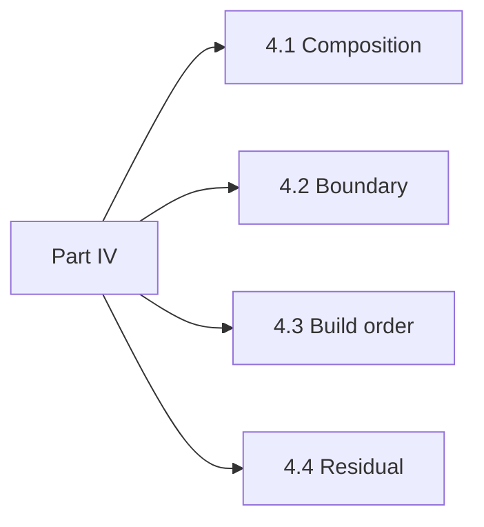

# Part IV. The edges

Complete for nobody, honestly. This part is where the field has no settled answer, and it says so.

Composition – an agent calling an agent – breaks one central assumption of this document in a specific way. Cross-organisational interaction removes the shared policy domain the rest of the apparatus assumes. The build order says when to stop. The residual names what an adversary can still do after everything here is built, operating, drilled and measured.

A reader who wants a finished answer will find the gaps uncomfortable. That is the point. Naming what cannot be built, and what remains possible anyway, is more useful than a design that pretends the gaps are not there.

*Figure P4 – Part IV spine: where the field has no settled answer.*
