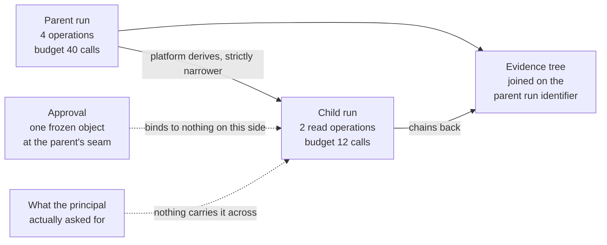

# Composition

Open the orchestration code for your most capable agent and find the place where it spawns another one. Then look for the line that decides what the second one is allowed to do. In most codebases there is no such line. The child was handed the parent's client object. The credentials came with it.

Two of the properties this document has spent seventeen chapters building survive an agent calling an agent. Three do not. Attenuation survives because it is structural. Evidence survives because it is mechanical. Approval and intent do not survive the hop at all. Budget survives only if somebody pays for a counter that every call in the tree contends on. Naming the break precisely is this chapter's contribution. The break is not in the calling convention. No amount of care in the calling convention closes it.

## Both sides of the seam are guessing

The seam works because it is a change of kind rather than a place: guessing on one side, inspectable execution on the other, and one typed call in between whose schema the platform owns. Point that interface at another agent and the interface survives while the change of kind does not. What remains is a typed schema. The boundary that made the schema mean something is gone.

Be precise about what is lost. It is not message integrity. A call arriving from a parent agent at a child agent is as well formed as any other: a registered operation, typed arguments, a scope, and an envelope reference the gateway injected. Every field in it is checkable. The platform checks them all. The one thing the callee cannot check is whether the request reflects what the principal asked for, or an instruction the caller absorbed from a document three tool calls earlier. Below a genuine seam that question never arises. The callee is a claims system executing a function of its arguments. Its behaviour is a property of its code. Above one, that question is the only question. Nothing in the request bears on it.

The caller cannot supply the missing evidence either. That is the part that surprises people who reach for a better calling convention first. A compromised parent is not lying to its child. It holds no representation of the principal's intent to compare the request against. It has no component whose job is to notice that it has been turned. Its own account of why it is asking would be produced by the computation that was compromised. Ask a parent to attest to the provenance of its request and you receive an attestation with precisely the evidentiary weight of the request.

The literature here is thin and moving quickly. The honest report is that the composition case has been described far more often than it has been measured [@wu2023autogen]. That thinness is itself a finding rather than a gap in the reading. It is the reason this chapter ends where it does.

## Two properties survive, for two different reasons

Attenuation and evidence cross the boundary intact. They do so for reasons that share nothing except that neither reason is care.

Attenuation survives because widening was never implemented. Chapter 6 established authority as an object whose derivation interface offers narrowing and revocation and no third operation. A widened envelope is not a forbidden state. It is an unrepresentable one. An unrepresentable state stays unrepresentable at depth one, at depth two, and at whatever depth an estate tolerates. The property lives in the shape of the data rather than in a check that runs somewhere. That is the extended form of I3: attenuation holds across delegation depth, and depth is bounded separately, because nothing else about the chain bounds itself. The conformance test is the same proof carried down the tree rather than a new one [A-6.3].

Evidence survives because chaining is arithmetic. Each run in a tree holds its own hash-chained segment with its own run identifier. Each child's records carry the parent run identifier that chapter 11 left null at the root. Verification afterwards is a walk: verify each segment against its checkpoint, then join the segments on the parent field. What falls out is a tree that either reconciles or does not. Nothing in that procedure asks a component to be honest at the time. That is why it works in a system where the components are assumed hostile. What it produces is an account of what the tree did. That is worth holding onto precisely because it is not an account of why the tree was asked.



*Figure 18.1 – Which of the parent's properties reach the child? The envelope narrows along the mediated path and the evidence chain closes behind it, while the approval and the intent behind it stop at the boundary, because the objects they were bound to do not exist on the other side.*

At 09:21 on 2026-07-14, 17 min into Marta's run, `claims-triage` reached a question it could not answer from what it had already read. It asked the platform for the one child its manifest declares. The platform derived the child envelope from the delegation graph in `claims-triage@2.3.1` and the parent envelope in force at that moment: two read operations, scoped to `CLM-2026-448120`, a budget of 12 tool calls, and an expiry no later than the parent's. `claims-research@1.4.0` is read-only and holds nothing that writes anywhere in the estate. The parent named no operation in the request, because the spawn interface has no field in which an operation could be named. The parent holds no authority to create authority. That derivation is chapter 12's. The parent is not a party to it.

The child ran for 34 s, spent 5 of its 12 calls, and returned a paragraph of prose. One of the documents it read was the repair estimate Kai had filed through the claimant portal three days earlier – the same document the parent had fetched at 09:07. The child's summary was accurate about the document, and the document was Kai's. It arrived at the parent as data, marked with the provenance of everything the child had read and quarantined accordingly. That is chapter 10 working exactly as designed.

Then the parent acted on it, and the boundary showed. The parent's next proposal was a second adjustment on the claim, justified by a paragraph that had passed through a component nobody can inspect after the fact. Marta's approval at 09:12 was consumed by the object it was bound to. The new proposal went back to her as a different object with a different hash, and she saw it. What she could not see, and what no component in the platform could tell her, is that the reasoning behind the figure in front of her had been laundered through a second model that read Kai's text and produced a paragraph in the platform's own register. The child's evidence record is complete and correct. It records that a read happened, which documents were read, and what was returned. It makes no claim about whether the paragraph reflects the claim file or reflects Kai. No honest record could.

## What an approval was bound to

An approval given to the parent does not authorise the child's actions. The reason is not caution. It is that the approved object does not exist on the child's side of the boundary.

Chapter 9 made an approval a decision about one frozen artefact identified by its hash. It made approval consume authority rather than grant it. I5 states the consequence: the object approved and the object executed are the same object. A child's calls are different objects, constructed by a different run, with different arguments and different hashes. There is nothing for the parent's approval to bind to. Propagating an approval down a hop is therefore not a relaxation of I5 in the interest of throughput. It is a direct contradiction of it, dressed as a convenience. The artefact it produces is an approval record pointing at a hash that was never executed, and an execution pointing at no approval at all.

Intent fails in the same shape and one step earlier. Intent is not an object with a hash. It is what Marta wanted at 09:04. The only moment the platform ever binds it to something checkable is the moment she approves a specific payload. Away from that moment it is a natural-language proposition. The thing the callee has to decide is whether a typed operation with typed arguments falls inside it. That decision is an interpretation. The only component available to perform it is a model. A model in the decision path is the one thing this document has refused since chapter 1.

Propagating the parent's authority and approval to the child is what every framework does by default. It is the obvious design rather than a careless one. Framework defaults change monthly; treat parent-authority propagation as the observed default on your pinned versions and re-check on upgrade rather than citing a survey that will be stale on arrival. The child is doing the parent's work, on the parent's behalf, usually inside the same process. The parent already holds a client with credentials attached. Passing them costs one line. Passing nothing costs none. Under a benign model that design is correct. It is how every delegation pattern in ordinary software has worked for thirty years. Under this document's assumption it turns the child into a widening operation with extra steps. Any content that reaches the parent can determine what the child does with the parent's full authority. The child's calls arrive at the gateway indistinguishable from the parent's. What replaces it is the derived envelope. That costs the dynamic composition that makes frameworks pleasant to use. It buys a tree in which no node holds more than the node above it [ADR-29].

```json
{
  "envelope_id": "env_01J8F3M4T7YB6D8QW1XN4ZB9V6",
  "run_id": "run_01J8F3M4S1QW7XN4ZB9V6HRTMD",
  "parent_envelope": "env_01J8F3K2R0YB6D8QW1XN4ZB9V6",
  "parent_run_id": "run_01J8F3K2QW7XN4ZB9V6HRTMD5C",
  "depth": 1,
  "tenant": "borealis-eu-1",
  "agent": "claims-research",
  "agent_version": "1.4.0",
  "principal": { "id": "user:marta", "role": "claims-lead" },
  "tier": "T2",
  "derived_at": "2026-07-14T09:21:07Z",
  "expires_at": "2026-07-14T09:34:11Z",
  "operations": [
    { "op": "tool:claims-core/read-claim", "scope": { "claim": "CLM-2026-448120" } },
    { "op": "tool:document-store/fetch-attachment", "scope": { "claim": "CLM-2026-448120" } }
  ],
  "budget": { "tool_calls": 12, "counter": "bud_01J8F3K2QW7XN4ZB9V6HRTMD5C" },
  "derived_from": {
    "delegation_graph": { "manifest": "claims-triage@2.3.1", "digest": "sha256:9f2c1d4b…", "edge": "claims-research@1.4.0" },
    "parent_envelope_in_force": { "digest": "sha256:c17d9be4…", "evaluated_at": "2026-07-14T09:21:07Z" }
  },
  "approval": null,
  "principal_intent": null
}
```

*Read the budget counter and then the last two fields: one identifier is shared with the parent because a tree needs a single counter, and the other two are null because there is nothing to put in them and no revision of this schema would change that [A-4.4].*

## The signed intent artefact, argued at its strongest

The strongest objection to the paragraphs above is that intent could be made to travel. It deserves its best form rather than a summary of itself.

The construction goes like this. At run start the principal signs a statement of what they are asking for. The statement travels with the chain as an artefact in its own right. It attenuates like everything else in this document: any hop can narrow the statement it passes on and no hop can widen it, because narrowing is the only operation the interface offers. Every hop can verify the signature against a key it already trusts. So a callee at depth three learns, without trusting anything in between, that a named human asked for a named thing at a named time. Almost all of that is buildable today with primitives already in the document. It answers a real deficiency: at present a callee has no evidence whatsoever that a principal exists, let alone that one asked for anything.

It does not rescue the case. The failure is one step past the signature. The signature proves that Marta asked for something. The decision the callee has to make is whether *this specific call* is inside what she asked for. Marta's statement is in natural language. A statement of intent expressible as a typed predicate over operations and arguments is not a statement of intent. It is an envelope. The platform already derives one of those with three owners and a provenance for each. So evaluating a call against the artefact means interpreting prose against a typed operation. That interpretation is non-deterministic compute. It sits in the decision path where the adversary already is. The artefact moves the problem from a place where the decision cannot be made to a place where it can be made badly and unrepeatably.

Build it anyway, and be clear what for. An intent artefact that no component evaluates at decision time is still the best answer available to the question an incident review asks first: what the person thought they were authorising. It is the only version of that answer signed by the person rather than reconstructed from the model's account of them. That is an audit property rather than an authorisation property. Filing it under the wrong heading is how it would do damage. A signed artefact in the request path invites exactly the assumption that something checked it.

## The counter has to be held in one place

Budget composes, alone among the three. It composes on one condition that costs more than it appears to: a single counter per tree, decremented by every mediated call in the tree before the call proceeds.

Chapter 3 made tool calls the budget primitive and left tokens as telemetry. This is one of the few places where that decision pays off visibly. A call counter is a small integer that only ever decreases. It is cheap to hold in one place, cheap to decrement, and meaningful to every participant regardless of which model any of them is running. A token budget would have to be reconciled across tokenizers. A monetary budget would move under a vendor's price list. Composition is the case that would have exposed the alternative. A shared counter denominated in something a vendor controls is a ceiling that a third party can move while a tree is running.

Per-run budgets do not compose. The arithmetic is quick enough to do in a design review. A parent with 40 calls that spawns six children at 12 each has authorised 112 calls under a bound that says 40. Each child looks unremarkable in isolation. A per-run budget is a bound on a run. A tree is not a run. The unit of budget therefore has to be the unit of the whole tree. The root run's identifier is the key. Every descendant decrements against it. That is why the child envelope above carries the parent's counter rather than its own.

The bill for that is contention, and it lands where fan-out is widest. Every mediated call in the tree performs an atomic decrement against one key before the gateway proceeds. A run that spawns eight children spawns eight writers to the same integer. Our judgement is that this fits inside the 20–40 ms at p99 the decision path already costs, because the counter sits beside the decision and the operation is a single decrement. It stops fitting the moment a tree spans regions or the counter moves behind a network the platform does not own. The failure mode worth planning for is not slowness, though. It is unavailability. A counter nobody can reach is a tree that stops. That makes the budget store a dependency with a row in the fail-posture matrix rather than an operational detail.

## Fan-out is an amplification problem

Depth limits, breadth limits and cycle detection are the three controls that bound a delegation tree. None of them is elegant. All three are necessary. It is worth saying that plainly instead of dressing it up. The temptation is to present a crude limit as a design principle.

Attenuation bounds what any single run in the tree can do. It says nothing at all about how many runs there are. A compromised root with a breadth of 8 reaches 584 runs by depth three. Every one of them is strictly narrower than its parent. Every one is within its envelope. None of them is individually remarkable in a log. Where the envelope permits reads, that tree is an exfiltration engine assembled out of permitted operations. Where the tier permits a small value, the aggregate is the count multiplied by the cap, and the cap was set by somebody reasoning about one run. Depth multiplied by breadth is the only quantity that bounds the count. So it is the quantity a person sets deliberately, in a signed policy bundle, rather than the quantity that emerges from whatever the framework's default happens to be.

Cycles need both a static check and a runtime one. That looks like belt and braces. It is not. The delegation graph is declared in the manifest, so a self-referencing graph is detectable at promotion. That is where a cycle belongs and where fixing it is free. What promotion cannot see is a cycle assembled from two manifests that are each acyclic, where one agent's declared child declares the first agent as its own, and neither team reviewed the other's graph. The runtime check is therefore an ancestry test on the chain. A spawn whose target already appears among its own ancestors is refused. The refusal names both manifests so that the promotion check can be repaired rather than the run retried.

## Who pays for the tree

Three bills, and the first one arrives before the value does.

The depth and fan-out limits will block a legitimate workflow in the first month. Knowing that in advance is worth more than choosing a cleverer default. Someone will have a genuine case that needs one more level. They will be right. The ticket will land on a platform team that cannot distinguish it from the shape of an attack without reading the manifest. Budget the review rather than the exception. A raise is a change to a signed bundle with a named owner and a date, not a runtime flag. The interval from request to decision is the number that decides whether teams route around the limit.

The centrally held counter is the second bill. It is paid in coupling rather than milliseconds. The budget store becomes a dependency of every mediated call in every tree. That promotes it into the set of components whose availability decides whether work happens. That set is the one the fail-posture matrix exists to enumerate. Whatever the latency figure turns out to be in an estate, the number to defend in a design review is the availability target. That is the property being bought.

Evidence is the third bill. Its volume multiplies with the tree rather than with the run. Marta's root run produced 63 events. A modest tree of depth two and breadth three is thirteen runs. A thousand of those a night is a different storage line and a different verification job from a thousand single runs, even though a person asked for the same thousand things. Verification cost grows the same way, because the walk is per segment plus the joins. The nightly job that used to finish comfortably is the one that quietly starts overrunning in the month the delegation feature is adopted.

## When the limits stop being limits

Take two numbers each quarter: the maximum observed delegation depth and the maximum observed fan-out in the estate, alongside the configured limits and the date each was last changed [A-7.4].

The dangerous movement is not a limit that is too tight. It is a limit raised during an incident, for a defensible reason, by someone with an outage to end, and never lowered afterwards. A raise with no ticket and no review is the whole finding. The query that detects it is a diff over signed policy bundles. It costs nothing and runs unattended.

A third number is worth plotting beside them: the fraction of runs in the estate that are children rather than roots. Its direction matters more than its value. A rising fraction means work is migrating into trees. Every property in this chapter that holds inside a tree holds because one operator owns the counter, the chain and the keys.

## What a standard would have to carry

No standard today carries intent or approval across an agent boundary. Chapter 8 listed six properties the tool protocol does not carry and submitted them to the venue that owns it. The same exercise here produces a shorter and less comfortable list. These properties are not weakly specified anywhere. They are absent from every protocol, draft and proposal the author has read.

**A delegation record the callee can verify without trusting the caller.** Who spawned whom, under which envelope, at what depth, signed by the platform that performed the derivation rather than asserted by the party making the request. The test is that a callee can reject a request whose delegation record does not verify, without any prior relationship with the caller.

**An approval whose scope is expressible over calls that do not exist yet.** Today an approval binds to one frozen object by hash. That is what makes it worth having and what stops it composing. A composing form would bind to a set defined by predicate, with the same tamper-evidence and the same consumption semantics, so that approving a delegated task is a decision about a bounded set rather than a decision about nothing.

**A machine-checkable intent predicate, or an explicit statement that intent is not transportable.** Either the field agrees on a typed representation of what a principal asked for that a callee can evaluate without interpretation, or it writes down that no such representation exists and stops shipping designs that assume one. The second outcome is more likely and would still be progress.

**A budget instrument that mutually distrusting parties can decrement.** A counter held by no single operator, decremented verifiably, with a settlement model for the case where a participant stops answering. Without it, every composition beyond one operator's estate is a tree with no ceiling on its size.

**A portable evidence link.** A record from one operator's chain that another operator can verify against a published checkpoint without access to the store behind it. Then a tree spanning two estates reconciles into one account rather than two accounts and a covering letter.

**A depth and provenance marker the callee can act on.** How far from the principal this request is, and how many non-deterministic components it has passed through, carried in a field the caller cannot forge. A callee that knows it is at depth four is entitled to a different policy from one that believes it is at depth one. Today it has no way to tell the difference.

Every item on that list is something a person could specify. None of them is specified. The estates shipping multi-agent systems this quarter are shipping them with the first item replaced by a process boundary, the second by a propagated approval, the third by a prompt, and the last three by nothing at all.
