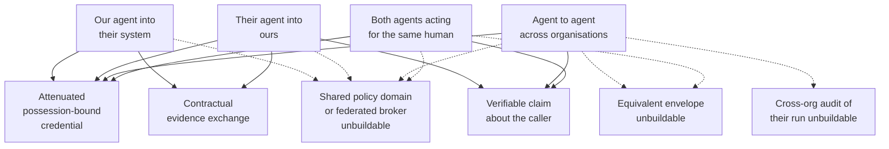

# Across the boundary

The partner's portal accepted a bearer token from `claims-triage` on a Friday afternoon. The ticket that followed said the call worked. That was true and beside the point. What neither organisation could say afterwards was whether the caller was still the run that Marta authorised, whether the counterparty's agent had been operating under anything resembling an equivalent envelope, or what either side would show a supervisor who asked for proof of the other estate's decisions.

Across organisations, three instruments survive mutual distrust: attenuated credentials bound to a possessor, verifiable claims about the caller that a recipient can check without trusting the sender, and evidence obligations that are contractual rather than technical. Most of what people want here – knowing that the counterparty's agent ran under an equivalent envelope, auditing their run, sharing a policy domain, or trusting a federated broker to mediate both sides – cannot currently be built. Saying so precisely, and saying what would have to exist for each item, is more useful than a design that assumes the missing trust away.

Chapter 18 established composition inside one boundary, where the platform still owns the derivation, the counter and the evidence store. This chapter crosses the organisational line, where none of that holds. The adversary is still Kai: a person who can shape documents on either side of the call, wait for the weaker estate, and never needs to compromise a model to make the call look ordinary.

## Three instruments, four situations

The four situations people collapse into one sentence have different answers. Treating them as one problem is how a design for the easiest case gets shipped against the hardest.

**Our agent into their system.** Borealis presents something their gateway will accept, scoped to what Marta authorised for this run, and bound so that a token lifted off the wire is useless to anyone else. What they do with that presentation is theirs. What we can prove afterwards is what we sent and what we recorded of the reply, not what their policy decided. The TCB that made the credential true is ours. The TCB that accepted it is theirs. Neither side enlarges to include the other.

**Their agent into ours.** We accept something we can verify against keys we already trust, check claims about who is calling and under what ceiling, and mediate the call exactly as we would for any other principal arriving from outside. Their internal envelope is invisible to us. Pretending otherwise is the failure mode this chapter exists to refuse. A foreign agent arriving with a well-formed credential is still an untrusted proposer on our side of the seam. Chapter 8's treatment of tool descriptions as untrusted data applies to every byte they send with the call.

**Agent to agent across organisations.** Two non-deterministic components talk through a typed interface neither fully owns. Credentials and claims can still travel. Intent, approval, and any assurance that the peer was operating under an equivalent bound cannot. The reasons are the same structural ones chapter 18 gave inside one estate, compounded by the absence of a shared derivation path.

**Both agents acting for the same human.** Marta has a relationship with Borealis and a relationship with a counterparty. Both agents claim to act for her. Possession-bound credentials and verifiable claims about the principal can make that claim checkable. Coordinating two envelopes across two TCBs into one coherent bound cannot be built today without a third party both estates already trust with derivation. That is exactly the trust the situation lacks.

*Figure 19.1 – Which of the four cross-organisational situations do we actually have an answer for? Credentials, claims and contractual evidence attach where mutual distrust still permits a check; the dashed cells are absent constructions, not empty cells waiting for a vendor.*

The dashed edges are the ones the field keeps drawing as solid. A shared policy domain assumes both estates evaluate the same rules against the same inputs. A federated broker assumes a third party both sides trust with mediation. Equivalent-envelope assurance assumes a portable representation of another organisation's derivation that this side can verify without becoming their auditor. None of those assumptions survive contact with two regulated enterprises that do not share an identity estate, an evidence store, or a reason to open either.

## Credentials that cross because they never needed trust

Attenuated, possession-bound credentials work across organisational boundaries for the same reason they work inside them: the recipient verifies a cryptographic fact about the presenter, not a story about the sender's estate.

Chapter 5 joined two identity chains at run start and made the run credential sender constrained, so that possession of the bytes is not possession of the authority. Across a boundary that construction travels almost unchanged. The counterparty's gateway checks the audience, the expiry, the confirmation that the presenter holds the key bound into the credential, and the attenuated scope the issuing side put on the wire. What it cannot check – and what no revision of the credential format supplies – is whether the issuing side's envelope was derived correctly, whether Marta was still authorised at that moment, or whether Kai shaped the document that caused this particular call to be proposed. Those are facts about another TCB. Another TCB is outside this one by definition. The trusted computing base on this side remains what chapter 1 named: the gateway, the decision path, the evidence path, and the key material underneath them. Nothing in the credential enlarges that set to include theirs.

The cost is bilateral rather than architectural. Each counterparty needs an onboarding in which audiences, key material, accepted claim types and maximum lifetimes are agreed in writing, then encoded as configuration somebody owns. That is slower than pointing both sides at a shared broker. It is the price of not inventing a party both sides trust with the keys. Latency sits where it already sat: a verification on the order of the decision path's existing 20–40 ms at p99 when keys are local, and higher when the recipient has to fetch material it has not cached. The capability foregone is dynamic discovery of counterparties. Every new estate is a commercial conversation before it is a technical one. The queue of conversations is a standing operational load rather than a one-off project.

Decay shows up as an audience that still accepts a credential whose issuing keys were rotated, or as an integration that still posts after the bilateral agreement's expiry date. Both are detectable with a register and a calendar. Neither is detectable from the call logs alone. The query that catches them is the same shape as chapter 15's recertification questions: list the counterparties whose schedules have lapsed, then list the audiences that still accept their credentials [A-7.5].

## Claims the recipient can check without trusting the sender

A verifiable claim about the caller is a statement a recipient can verify against an issuer it already trusts, without accepting the caller's account of itself.

What can usefully be asserted is narrow and worth keeping narrow. That this call is bound to a named run. That the principal behind the run is a named natural person or a named standing mandate. That the issuing organisation attests a tier ceiling and an expiry. That the credential presented is the one bound to this presenter. W3C verifiable credentials and related work supply formats for packing such statements so that a recipient can check signatures and status without a live call back to the issuer [@w3c2025vc]. What those formats do not supply is a semantics for another organisation's envelope. Grafting one on would recreate the shared policy domain by another name. Status lists and revocation endpoints are part of what makes a claim useful after it leaves the building. Without them the recipient holds a signed assertion it cannot cheaply retire when the issuing side withdraws it [@w3c2025statuslist].

The gap between assertion and check is the whole subject. Borealis can assert that `claims-triage@2.3.1` is running under a tier-two ceiling for Marta on tenant `borealis-eu-1`. A counterparty can verify that Borealis signed that statement and that the statement has not been revoked. The counterparty cannot verify that the statement was true at derivation time, that the gateway mediating the call is the one in Borealis's TCB, or that the model proposing the call is the one named in the manifest. Those checks would require either a shared control plane or an audit right into Borealis's evidence store. Both are commercial facts rather than protocol features. A claim that the recipient cannot act on at decision time is still useful later, in the same way chapter 18 treated a signed intent artefact: as an audit property filed under the right heading, never as authorisation dressed up as a check.

Agent interoperability proposals that appear in drafts and preprints often treat a richer claim set as the path to cross-organisational safety: portable envelopes, shared risk scores, mutual attestation of mediation coverage [@google2025a2a]. Our judgement is that a richer claim set without a richer verification path is a more convincing story about the caller, told to a recipient that still cannot check the story's load-bearing parts. Write the claim set to what can be checked. Everything else belongs in the contract, or in the list of things that are unbuildable. This section will age faster than most of the document. That is visible on purpose. A retrieval date on every citation here is the mechanism that keeps the ageing honest rather than silent.

## What the exchange looked like when residency moved

At 14:08 on 2026-07-22, run `run_01J8F3K2QW7XN4ZB9V6HRTMD5C` on `claims-triage@2.3.1` reached a repair estimate Borealis does not hold locally. The estimate lives at Helix Repair Network, whose portal accepts audience-bound credentials under a bilateral schedule expiring 2026-12-31. The platform derived a one-shot credential attenuated to `tool:helix/fetch-estimate` scoped to `CLM-2026-448120`, possession-bound to the gateway's presenter key, lifetime 90 s. Helix verified audience, confirmation key and scope, returned the estimate, and recorded a Borealis presentation. Neither side saw the other's envelope. That is the working case, and the entire working case.

Kai's contribution was earlier. His claimant-portal note named a preferred repair path whose public documentation advertises inference in a region Borealis's residency constraint does not permit for this class of personal data. At 14:09 the model vendor's routing layer, recovering from a regional blip, moved the next completion for this run onto a capacity pool outside the allowed set. The Helix call still verified: credential, scope and logs all clean. What no longer matched was the residency claim Borealis makes about inference for `borealis-eu-1`. Residency is not a property of the credential. It is a vendor path beneath the TCB, intersecting a constraint chapter 2 records and this chapter cannot enforce on somebody else's stack.

Marta saw the estimate at 14:11 with Helix provenance. She did not see the routing move. Borealis's evidence shows the mediated fetch, credential identifier, audience and reply hash – not where the model that decided to fetch was running. Helix holds an attestation that Borealis called. Borealis holds one that Helix answered. Neither says whether the inference that caused the call respected the residency row counsel think they bought. No surviving instrument makes that sayable without the vendor exposing routing as a checkable claim, which as of 2026-07 it does not [@openai2025residency]. The credential exchange did its job. The residency intersection failed underneath, on a path neither gateway mediates.

## Evidence you cannot audit, only require

You cannot audit their run. You can require an attestation and hold a record of what you were told. That is a weaker property and a real one.

Chapter 11 made evidence a write-before-effect chain inside one estate, hash-linked and keyed so that erasure is destruction of key material rather than redaction of bytes. Across organisations that construction does not compose. The chain lives behind keys the other side does not hold and a store the other side does not open. What composes is a contractual obligation to produce a defined attestation within a defined interval after a defined class of call: who called, under which credential, against which audience, with which reply hash, signed by the counterparty's evidence path or by a component they nominate in the schedule. You verify the signature. You retain the attestation. You do not verify their chain. The schema for that attestation is bilateral and dated. Appendix D holds the Borealis-side event shape that records receipt of a foreign attestation without pretending the foreign chain is local [A-4.5].

That is less than the claim in chapter 1 promises inside the boundary. It is the honest commercial substitute. The burden it creates is operational: an attestation register with expiry dates, a chase process when an attestation fails to arrive, and a decision – made before the incident – about what happens to the integration when the counterparty stops producing them. Fail-closed on missing attestations above a stated tier. Fail-recorded below it. Never fail-silent, because silence is how an expired schedule keeps clearing calls for six months.

The engineering cost is modest once the bilateral schema exists – on the order of one additional evidence event per cross-organisational call, written on the local chain with a pointer to the foreign attestation. The commercial cost is the negotiation, the legal review, and the standing obligation to watch expiry. That is the bill most teams underestimate because it does not appear in the architecture diagram.

## What is unbuildable today

The following are absent, not emerging. Each names what would have to exist before a competent team spends design time on it.

**Assurance that the counterparty's agent operated under an equivalent envelope.** Would require a portable, recipient-verifiable representation of another organisation's derivation – declared need, principal reach, tier ceiling and the intersection – signed by a party the recipient already trusts for that purpose. No such representation is standardised. Any bilateral encoding is an audit right dressed as a token.

**Audit of their run from our evidence store.** Would require either shared storage under shared keys, or a portable evidence link that verifies against a published checkpoint without access to their store. Chapter 18 listed the second as a property a composition standard would have to carry inside one field. Across organisations the same property is still absent. The incentives against opening an evidence store to a counterparty are structural rather than temporary.

**A shared policy domain.** Would require both estates to evaluate the same rules against the same named inputs with the same fail postures. Regulated enterprises do not share those inputs. A lowest-common-denominator rule set that both would accept is not a policy domain worth having.

**A federated broker that mediates both sides.** Would require a third party both organisations trust with credentials, mediation and evidence for cross-boundary calls. Brokers of that shape are proposed regularly. What they assume is the trust the boundary exists to withhold. Building one inside a single vendor's estate is ordinary platform work. Building one between mutually distrusting regulated parties is a market that does not yet clear.

**Mutual knowledge of mediation coverage.** Would require each side to publish a coverage number the other can act on, with a discovery method both accept. Coverage as chapter 7 defines it is an internal measurement against paths you can see. Paths in their estate are not visible from yours.

**Portable approval or intent across organisational agent hops.** Chapter 18 already refused this inside one boundary for structural reasons. Across two boundaries the same refusal holds a fortiori: there is no frozen object shared by both sides for an approval to bind to, and no typed intent predicate a foreign gateway can evaluate without interpretation.

Saltzer and Schroeder's economy of mechanism still applies when the mechanism would have to span two counsel's offices [@saltzer1975protection]. The confused deputy does not become less confused because the deputy and the instruction crossed a corporate logo [@hardy1988confused]. What changes is only which instruments you still own.

## Liability without a law degree

The burden of proof lands on whoever cannot demonstrate what happened when something irreversible crossed the boundary. A contractual attestation schedule shifts that burden only to the extent the attestation arrives, verifies and covers the fact in dispute. Everything this chapter left unbuildable stays with the party whose counsel thought a logo on a slide was a control.

That is a commercial motive for chapter 11's discipline rather than a compliance one. The estate that can produce a tamper-evident account of its own side settles faster than the estate that offers a reconstructed narrative. The difference is visible to people who never read an evidence schema.

## Against the shared domain and the federated broker

The recurring proposal is to dissolve the boundary: put both organisations in one policy domain, or put a broker between them that both treat as an extension of their own TCB. Either proposal is attractive because it would let the instruments of Parts II and III apply unchanged. Both fail for the same reason they are attractive. A shared policy domain presupposes shared inputs, shared fail postures and a shared appetite for the other's incidents. A federated broker presupposes a third computing base both sides will treat as trusted for mediation and evidence. That concentrates the richest secrets of two estates in one place and replaces bilateral distrust with a single compromise story neither side controls. The construction that survives is the narrower one: credentials the recipient can verify, claims the recipient can check, and attestations the contract can demand – with the unbuildable list kept visible so that nobody fills the gaps with hope [A-2.30] [ADR-30].

What this costs, in total, is not primarily engineering. It is bilateral agreements, per-counterparty onboarding, and an attestation register with expiry dates that a named owner watches. Teams that price only the credential format discover the legal and commercial half about two quarters late, usually when the first schedule expires and the integration is still live.

Which counterparty attestations have expired, and are the corresponding integrations still live?
