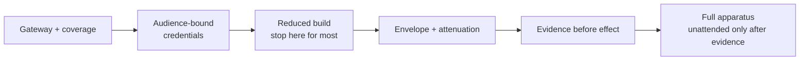
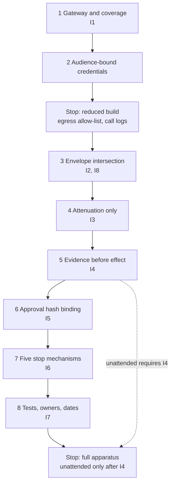

# Build order, and who should not build this

Build the gateway first, the evidence path second, and unattended operation last. For most organisations reading this, stop after four things and one quarter. The order is not a preference among interesting components. It is the only sequence in which every interrupted roadmap still leaves something you can defend.

*Figure 20.0 – What do you build first? Mediation and credentials that survive an interruption; unattended operation hangs off evidence, not ambition.*

## The rule that generates the order

Every step has to leave the system defensible on its own. Every roadmap gets interrupted. The interruption arrives at a random point.

That rule is the whole generator. A step that only becomes valuable once three later steps exist is a bet that the funding, the headcount and the political weather all survive until the end of the sequence. That is a bet no programme of this size wins. A step that is valuable the day it ships survives a hiring freeze, a reorganisation, and the quarter in which the model vendor changes its interface. Test any candidate order against the rule by cutting the programme at that step and asking what you can still say to a supervisor. If the honest answer is *we were halfway through*, the step was in the wrong place.

The same rule produces the reduced build as a first-class stopping point rather than as unfinished work. Four controls that answer a narrower question are a complete answer to that question. An apparatus that needs two more quarters to become true is not a better answer to a question you did not have.

## The order

Eight steps, each making one invariant true, with two places you are allowed to stop.

1. **Mediate every effect through one gateway, and publish the coverage number.** Makes I1 true as a measured claim rather than as a design sentence: no effect leaves the platform except through a mediated call, and the honesty of that sentence is a ratio with a date on it.
2. **Issue audience-bound run credentials; stop treating possession as authority.** Does not own an invariant of its own, and without it none of the later ones can be enforced at the call: a bearer token stolen between two tool calls is still sufficient, and Kai does not need anything cleverer than that.
3. **Derive the envelope as the intersection of declared need, principal reach and tier ceiling; keep that derivation free of anything the agent can write.** Makes I2 and I8 true together: no call carries authority beyond the envelope in force, and the inputs that produced the envelope are not writable by the run that spends it.
4. **Make widening unrepresentable.** Makes I3 true: no delegation widens authority, because the derivation interface offers narrowing and revocation and no third operation.
5. **Write a durable, tamper-evident record before the effect happens.** Makes I4 true: no side effect occurs without the record written first, which is the only ordering that survives an evidence-store outage without producing actions nobody can later account for.
6. **Bind the object approved to the object executed.** Makes I5 true: the thing Marta signed and the thing the gateway sent are the same object, compared by digest rather than by a summary somebody rendered.
7. **Install five distinct stop mechanisms, each with a stated interval that does not require the agent's cooperation.** Makes I6 true: revocation takes effect inside the interval you claimed, which is a number a drill either confirms or falsifies.
8. **Give every control a test, a named owner, and a date on which it was last exercised.** Makes I7 true: a capability that has not been exercised this quarter is a capability you do not have, and the calendar is how you find that out before Kai does.

Two stopping points sit on that sequence. The first is after steps 1 and 2 plus an egress allow-list and ordinary call logs – the reduced build, complete for any estate that fails the introduction's intersection test. The second is after step 8, when the three conditions all hold and the full apparatus has earned its cost. Everything between those two points is ordered so that cutting the programme mid-sequence still leaves I1, then I2 and I8, then I3, then I4, each independently answerable.

*Figure 20.1 – Where can we stop and still be defensible? After audience-bound credentials and the reduced controls, or after the full invariant set; unattended operation hangs off evidence, not off ambition.*

## What each step buys, and what it costs

Step 1 buys the only number that decides whether anything else here is real. Without a gateway and a published coverage ratio, every later control governs an unmeasured subset. Kai's path is whichever arrow was never drawn. The build is weeks of joining telemetry you mostly already have. The standing cost is the attention that keeps the denominator honest, inside the one engineer-day a week the platform already owes. What you can defend is a dated ratio, not a design sentence.

Step 2 buys the property that a stolen credential is not a stolen authority. The broker costs single-digit milliseconds at p99 when co-located, and 40–120 ms at p99 across a region boundary, paid once per run. The larger bill is key material per workload, which arrives on a hiring schedule. Without it, no later envelope can be enforced at the call.

Steps 3 and 4 buy the bound. Envelope derivation costs tens of milliseconds at run start when entitlements are local, and permanently costs the agent team the labour of keeping declared need true. Attenuation costs the refusal to implement a widen operation. What you can defend is a set enumerated before the run, narrower than any role the agent held, that no child of that set can exceed.

Step 5 buys the proof: 5–15 ms at p99 for a quorum-durable append in one availability domain, 40–80 ms at p99 across regions, on effect-bearing calls only. Storage grows with runs. Keys grow with data subjects. What you can defend is a bounded answer to what the run touched. That is the conversation the introduction's third condition is asking you to be ready for.

Step 6 buys the difference between an approval and a ceremony, at the price of human latency in minutes and a throughput ceiling in humans. Steps 7 and 8 buy the claim that any of this still exists next quarter: five stop mechanisms with quarterly drills, and the decay calendar that itemises the standing day. What you can defend is a stop inside a stated interval, and a dated answer to whether each control was last exercised rather than last documented.

Unattended operation is not a step. It is a graduation that hangs off step 5. A standing mandate without write-before-effect evidence is a signed permission to produce effects nobody can later list. Gateway before evidence before unattended is the dependency the rule generates when you ask what remains defensible if the programme stops the week after the nightly batch is switched on.

## The reduced build

Most organisations reading this should build a gateway, audience-bound credentials, an egress allow-list, and call logs – one quarter of work for a small team of about four engineers – and then stop.

That is a recommendation, not a concession and not a starter pack. The introduction's intersection test asks three questions. The expensive apparatus earns its cost only when all three hold at once: unattended operation, irreversible or externally visible effects, and a burden of proof owed to a third party. Fail any one of them and the reduced build is the complete answer to the question you actually have. Attended review of every effect makes most of Part II solve a problem you do not have. Reversible internal effects make the undo path the control. *We would quite like to know what happened* is not an obligation to demonstrate it to a supervisor on their schedule.

What the four pieces buy is specific. The gateway puts a turnstile on the paths you know about. Audience-bound credentials close the theft-to-use window bearer tokens leave open. An egress allow-list bounds where a compromised run can talk. Call logs give a forensic starting point weaker than hash-chained evidence and stronger than reconstructing a Tuesday from logs nobody retained. Latency stays inside ordinary platform noise. The standing obligation survives a bad quarter. The developer-experience tax is real and smaller than the full paved road's, which is part of why this build is adoptable.

Stopping is the hard part. The temptation after a successful quarter is to continue because the team is warm. Warmth is not an intersection test. If the three conditions still do not hold, further steps buy sophistication you cannot cash. State the stop in the same charter that funded the quarter, or the programme will invent a reason to continue.

## When all three conditions hold

When the agent acts unattended, the effects cannot be undone in ten minutes or are visible outside the building, and somebody else is entitled to ask what happened on their schedule, the arithmetic inverts and the full sequence is the cheaper path.

The alternative was never *no apparatus*. It is buying the same apparatus later, one incident at a time, at retail, in front of the person you owed the proof to. Chapter 1 priced the first version at four to six engineers for two to three quarters, roughly 20–40 ms at p99 on every mediated tool call, and something like one engineer-day a week thereafter. Those figures are judgements. They are the same figures this chapter will not revise. They are what a funding conversation gets to argue with. The decision path is most of the per-call latency. Evidence adds 5–15 ms at p99 on effect-bearing calls in one availability domain. The paved road is three to five people permanently and usually exceeds the platform's cost by year two.

The tier that requires all of this is the set of agents for which the three conditions are true, not a maturity badge. An estate can run the reduced build for attended assistants and the full sequence for one unattended payment path. What is not ordinary is running unattended irreversible work on the reduced build because the full sequence looked expensive in the second quarter.

## If you already have half of it

Most readers are not starting from zero. They are starting from a gateway somebody built last year, an identity estate that almost fits, a logging stack that was never asked to be proof, and a policy engine that is already more expressive than the coverage number can justify.

Do not restart. Inventory against the eight steps. Mark each invariant true or not with evidence you would hand a supervisor. Resume at the first false one. A gateway without a published coverage number is step 1 begun: next work is discovery and the denominator, not a richer policy language on an unmeasured estate. Audience-bound credentials in front of a growing bearer-exception list are step 2 decaying. Shrink the exception share before designing envelopes those exceptions will bypass. Editable call logs are not I4. Until write-before-effect ships, the honest claim is forensic usefulness rather than proof.

Partial apparatus is a mandate to finish the next invariant, not the diagram. If you already have mediation and identity and fail the intersection test, stop and operate what you have. If you pass the test, build evidence next – not approval theatre, not a multi-agent mesh, not unattended graduation. The order does not change because some boxes are already ticked.

## Policy before coverage

The characteristic sequencing failure is building policy sophistication before coverage. It produces a system that looks finished in a design review and is open in production.

A rich policy language over sixty per cent coverage is a rich policy language over sixty per cent coverage. The forty per cent Kai can reach does not evaluate the elegant rules, write the evidence record, or consume the budget counter. Every week spent refining obligation expressions and exception DSLs while the denominator is unmeasured is a week in which interesting work displaced load-bearing work.

The tell is organisational. Policy work has demos and a sense of completion. Coverage work has an embarrassing first number and owners who have moved teams. Under delivery pressure the schedule slides towards what photographs well, and coverage becomes a design assertion again – *all tool access is mediated by the gateway* – the sentence chapter 7 exists to retire. Refuse to schedule policy features against a coverage number that has not moved. Give discovery to somebody who does not own the headline ratio. Before the ratio is high enough that the rules govern the paths that matter, the rich language is decoration with a compiler.

## Borealis, quarter one

Borealis Mutual did not start from the diagram. It started from `claims-triage` already posting adjustments through a service account, a Tuesday pull request that had added two more tools, and a supervisory conversation in which *we would reconstruct from the claims system of record* stopped being an acceptable sentence.

The platform team of five took the intersection test literally. Unattended nightly triage was already running. Payment adjustments were irreversible and customer-visible. The burden of proof was not hypothetical. So they did not build the reduced build, and they also did not attempt the full sequence in one quarter. Quarter one had three deliverables and an explicit non-deliverable. The gateway mediated calls into the claims system of record and the document store, with coverage first measured at 71% of discovered paths and published internally to the smallest audience that included a budget holder. Audience-bound run credentials replaced the shared service account for attended runs under Marta. The nightly batch kept its old identity for one more quarter on a named exception with an expiry. Egress from the agent runtime was allow-listed to the gateway and the model endpoint. Call logs were retained, searchable, and known to be editable by the platform team – which is to say they were not yet evidence.

What quarter one refused was the thing the agent team asked for in week six: graduating the 03:00 batch to the new credentials and calling it done. The refusal was not theatrical. Without write-before-effect evidence, an unattended night under new identity would have produced a cleaner audit trail of effects nobody could prove had been authorised. That is a narrower failure rather than a smaller one. Marta signed the exception extension through 2026-09-30 in a fifteen-minute meeting, the same form she would later use for `mandate:claims-nightly`. The batch kept running under the old account while step 5 was built in quarter two. Kai did not need the batch. In week eleven a supporting document reached a claim through a laptop connector that coverage had already listed and nobody had closed. Marta's attended run read it the next morning. The gateway mediated what the run did next. It had nothing to say about the write that shaped the instruction, because that write had never been a mediated call. Quarter one did not prevent that. It made the gap numerable, owned, and ahead of the unattended graduation rather than underneath it.

## Assembled cost

The figures below are assembled from the mechanism chapters rather than re-estimated here. Where a chapter stated a range, the range is kept. Where a chapter stated a judgement, it is marked as one. Units are in the column headers.

| Line | Build effort | Latency | Standing obligation | Notes |
|---|---|---|---|---|
| Full first version | 4–6 engineers, 2–3 quarters | 20–40 ms at p99 per mediated call | ~1 engineer-day / week | Same figures as chapter 1; judgement |
| Reduced build | ~4 engineers, 1 quarter, then stop | Ordinary platform noise | Light; no paved-road team | Recommendation when the intersection test fails |
| Gateway and coverage | Weeks of assembly, not invention | Federated hop adds tens of ms at p99 before decision | ~1 person-week / quarter / domain, inside the standing day | I1; discovery owned separately from coverage |
| Audience-bound credentials and broker | Key-material competence; often a hiring lag | Broker: single-digit ms at p99 co-located; 40–120 ms at p99 cross-region, once per run | ~0.25 FTE ongoing for issuance and rotation | Paid on run start, not per call |
| Envelope derivation | Agent-team declaration labour, permanent | Tens of ms at p99 at run start when entitlements are local | Refusal-rate attention in the first two months | I2, I8; under-declaration is loud, over-declaration is dangerous |
| Attenuation-only delegation | Small build; large refusal to implement widen | Negligible | Recert of exercised versus declared sets | I3 |
| Evidence, write-before-effect | Key management per data subject; backup regimes that can destroy keys | 5–15 ms at p99 same availability domain; 40–80 ms at p99 cross-region; effect-bearing calls only | Verification owner ≠ store operator; reconciliation of declared-without-settled | I4; largest latency item after the decision path |
| Decision path / signed bundles | Bundle pipeline as a supply chain | Most of the 20–40 ms at p99 | Permanent tension with user-facing latency owners | Staleness budgets are security parameters |
| Approval, hash-bound | Approval UI treated as a security component | Minutes of human latency; throughput in humans | Gate measurement; remove unread gates | I5 |
| Five stop mechanisms | Five runbooks | Stop interval as claimed (e.g. 5 s at p99 for revocation push) | Four drills / year / mechanism | I6 |
| Decay calendar | n/a | n/a | ~13 engineer-days / quarter for one domain (~1 day / week); rises with domains | I7; floor, not a budget for a large estate |
| Paved road | Funded in the same quarter as the gateway | n/a | 3–5 people permanently | Often exceeds platform cost by year two |
| Developer-experience tax | n/a | n/a | Coverage falls when the sanctioned path is slower than the shortcut | Measure minutes before writing policy |

*Table 20.1 – Assembled bill for a funding conversation. Ranges are preserved from the chapters that earned them; the full-version row is not a different estimate from chapter 1.*

## What remains after you build it

Build the sequence, operate the calendar, and Kai can still do a specific and enumerable set of things. That set is the subject of the next chapter rather than a soft landing for this one. It is the last useful contribution the document makes: a residual with an expiry schedule, not a promise that the bound was a boundary.

Three questions decide whether the build was worth the quarters it consumed. Can you name what a compromised run may still attempt inside a correct envelope? Can you point at the decision records that would reopen if the protocol, the identity provider, or the supervisory reading of erasure changed? Can you tell a sponsor, without hedging, which of the seven residual paths you declined to close and why the closing cost was refused? If the answer to any of those is no, the build produced components rather than a position. Components age into inventory. A position ages into an expiry schedule you can argue from.

The reduced build from earlier in this chapter still leaves a residual; it is simply a larger one, with fewer invariants holding. Skipping evidence that gates execution does not remove residual risk. It removes the ability to prove what happened when the residual is exercised. Skipping the paved road does not save the residual chapter from being written. It guarantees the coverage number that chapter 7 publishes will be a story about shortcuts rather than a story about mediation. Read the next chapter as the bill the build order could not pay, not as optional epilogue.
