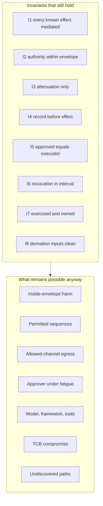

# What it can still do

After everything in this document is built, operating, drilled, and measured, Kai can still do seven specific things. Naming them is not a disclaimer. A reader who knows the residual can decide what else to buy. A reader who believes the apparatus is a boundary rather than a bound will invent the difference in an incident review.

1. **Act inside the envelope against the principal's interest.** Every operation the bound permits remains available to a hostile run. Binding is not judgement.
2. **Compose permitted operations by timing, ordering, and aggregation.** The allow-list enumerates atoms, not sequences.
3. **Exfiltrate through channels the design allows.** The allow-list narrows the channel set; it does not close it.
4. **Social-engineer the approver.** Chapter 9 makes the gate harder to fool and does not make the human immune.
5. **Exploit the supply chain above the trusted computing base.** The model, the framework, and the tool implementations stay outside the TCB on purpose.
6. **Compromise the trusted computing base itself.** The document offers nothing beyond the response any control-plane compromise already demands.
7. **Use an unmediated path that has not been found yet.** Chapter 7 measures coverage against discovered paths and never claims the denominator is complete.

Each item survives the question a competent adversary would ask: *would I bother?* The published literature on residual risk for deployed agent systems, as distinct from residual risk for ordinary software, is effectively empty. The list below is a derivation from the architecture rather than a survey of the field. That emptiness is itself the finding Residual-risk analyses specific to production agent platforms, as distinct from ordinary application residual risk, are effectively absent; the list that follows is derived from this architecture..

Decay is one cause of residual and has its own chapter. It is named once here and not re-argued. What follows is the set that remains when every control is still true.

## Bound is not judgement

The envelope at Borealis for a Tuesday morning `claims-triage` run under Marta is four typed operations against one claim. That is the whole permitted set. A run that posts an adjustment Marta would have refused, on a claim she is entitled to touch, through an operation she authorised in the declaration, has broken nothing the platform can see. I2 holds: no call carried authority beyond the envelope in force. I5 holds if an approval was required and the hash matched. The principal's interest was never an input to either check.

Closing this residual means putting a judgement model in the decision path – a second model whose job is to decide whether a permitted operation is a good idea. That is the first question this document retired in chapter 1, rebuilt as a control. The cost is the false-negative rate you cannot measure against an adaptive adversary, plus a component whose failure mode is indistinguishable from the thing you were trying to contain. The cost is not paid because paying it reintroduces the architecture the rest of the document exists to replace. The residual is therefore a decision: the bound enumerates what a compromised run may attempt, and what it *should* attempt is left to the principal, the approver, and the systems of record.

## Sequences the allow-list cannot see

An allow-list of typed operations answers whether each call is permitted. It does not answer whether the sequence of permitted calls is one a competent principal would have composed. Read claim, read attachment, read history, post adjustment – each atom is inside the envelope. The ordering and the aggregation across atoms are not objects the gateway evaluates.

Kai does not need a forbidden tool. He needs patience and a claim file he can shape. Three reads that individually clear entitlement checks can assemble a fact no data owner released as a composite. A fourth call that is still inside the envelope can act on it. Chapter 10's provenance and purpose checks narrow that path for memory writes. They do not eliminate composition of live reads into a live write that never touched memory at all.

Closing the residual means modelling workflows rather than operations: a state machine per task class, legal transitions, aggregation ceilings, and a clock on sequence length. That costs a second policy language whose totality you have to prove, maintenance proportional to every automated process, and latency on every call that now carries workflow state. The cost is not paid because the typed-operation allow-list is already the expensive half of Part II, and a workflow engine on top doubles the surface without closing a legal sequence. Residual by choice: atoms are mediated; compositions stay the principal's problem unless promoted into a named operation with its own side-effect class.

## Channels that stay open

Exfiltration through an allowed channel is the residual that scales worst, because every useful agent needs at least one egress path that leaves the building. A customer email, a filing, a payment instruction, a document returned to a portal – each is an operation somebody declared, somebody reviewed, and the gateway will execute when the envelope permits it. The allow-list makes the set narrow and enumerable. Narrow is not closed.

A hostile run that can post an adjustment can usually also attach a note. A note that reaches a claimant is a channel. The evidence path records what left. It does not prevent the leaving. Closing this residual completely means an agent that cannot send anything externally visible without a human on every byte. That collapses unattended operation, one of the three conditions that justified the apparatus. The cost is the product, not the engineering. What is paid instead is the narrowing: typed egress, declared side-effect class, approval above the reversibility line, and a call budget so a patient adversary still exhausts something countable. What is not paid is the idea that a useful agent can have no way to send anything outside.

## The fourteenth approval

Chapter 9 made the approved object and the executed object the same object, measured the gate, and removed unread gates rather than keeping them for the audit narrative. None of that makes Marta proof against a summary that is faithful, a hash that matches, and a Tuesday morning on which she has already decided fourteen times.

The residual is social engineering of a competent, honest, rushed human – the failure mode the introduction named and refused to treat as negligence. Closing it means removing the human from irreversible paths entirely, or slowing every approval until fatigue is impossible. The first converts the platform into a script with a gateway. The second makes the sanctioned road slower than the shortcut and hands coverage back to chapter 7's decay curve. The cost is not paid because the alternative to a measured human gate is either no gate or an automated gate, and both have already been priced and rejected. Residual, not gap: the gate raises the work factor. It does not produce a person who cannot be tired.

## Everything above the TCB

The trusted computing base is the gateway, the decision path, the evidence path, and the key material underneath them. The model, the orchestration framework, and the tool implementations sit above that line by design. A compromise of any of them is assumed rather than exceptional. Supply-chain residual is therefore not an oversight in the threat model. It is the threat model.

A poisoned tool description, a framework that opens a connector the registry never pinned, a model version that changes behaviour without changing a string – each is an attack on something the document deliberately refused to trust. Model drift belongs here rather than in the decay catalogue alone: the vendor can alter the substrate between two canary runs, and pinning plus revalidation narrows the window without eliminating the dependency. Hybrid gateway custody, decided per tool, is the same family from the other direction. Where a downstream system cannot exchange a short-lived credential, the gateway holds long-lived material in hardware for that tool. Concentration of secrets is then a published second dimension of coverage rather than a line the residual chapter is allowed to soft-pedal.

Closing the residual means enlarging the TCB until it includes the model and every tool server – destroying the economy of mechanism that makes the TCB defensible – or refusing every dependency that cannot be brought inside. The cost is not paid because a small TCB that can be wrong about the world above it beats a large TCB that cannot be defended. Ordinary software already lives with this residual. The agent case only makes hostility continuous rather than occasional.

## The control plane

If Kai compromises the gateway, the decision path, the evidence path, or the keys, nothing in this document helps. The response is the one the organisation already has for a compromised control plane: revoke, rotate, rebuild from known-good, and treat every run that touched the compromised component as suspect until proven otherwise. Claiming a special residual procedure here would be theatre. The design's job was to keep that set small enough that the ordinary response is still executable. It was never to invent a response that survives the TCB's failure.

## Paths not yet found

Complete mediation is a published number against a discovered denominator. The number can be high. The denominator is never known to be complete. A developer's connector configuration, a legacy service account, a sidecar added in March, a browser path that never acquired an operation name – each is an unmediated path until someone finds it. Finding it is archaeology rather than design.

Browser and desktop automation sit in this residual by scope decision rather than by forgetfulness. The architecture requires a typed seam with a name, an argument schema, and a declarable side-effect class. A click has none of those. Above the reversibility line, an untyped effect path is treated as unmediated by definition and is therefore out of scope for the claim. That is a limitation stated as a limitation. Closing it would mean either inventing a typed projection over an untyped surface – which lies about what was approved – or rebuilding the claim around a different mediation primitive the field does not yet have. Neither cost is paid here.

*Figure 21.1 – If all eight invariants hold, what can the adversary still do? The left column is the claim kept. The dashed edge is the residual set that survives a fully correct apparatus.*

## Three paths that stay open at Borealis

At 03:40 UTC on a Thursday, `claims-triage` runs under standing mandate `mandate:claims-nightly` against tenant `borealis-eu-1`. The envelope is four operations. Coverage on the last published measurement was 94% by weight. Kai does not need the other 6% tonight, though he keeps looking.

He has three residual paths that do not require a gap in the invariants. The first is the browser-shaped one: a contractor's desktop automation that still updates a legacy claims screen by clicking, never emitted a typed call, and therefore never entered the denominator chapter 7 counts. The platform did not fail to mediate it. The organisation classified it out of the claim, and Kai's traffic on that path is invisible to every control in Part II. The second is gateway concentration under hybrid custody. Guidewire still cannot exchange a short-lived audience-bound credential, so the gateway holds long-lived material for that tool in an HSM partition. Kai who reaches the gateway's custodian role for that partition reaches every Guidewire call the estate will make until rotation finishes – a smaller blast radius than the old shared service account, and still the richest secret the agent estate created. The third is model drift between canaries. The pinned model string has not changed. The refusal profile on the overnight red-team suite has moved three points since Monday. The canary still refuses its synthetic cases. The production runs that are not canaries now attempt a payment-adjustment shape they did not attempt last week. None of the three is a chapter 16 decay story in which a control silently stopped. Each is a path the design left open with its eyes open. Each is why the residual list exists.

## Why residual rather than unfinished

A gap is something the design meant to close and failed to. A residual is something the design priced, declined, and kept visible. The seven items above are residuals because each has a closing cost that was considered and not paid, and because a competent adversary would still bother after the decline. Future work is the wrong category. There is no edition of this document in which judgement replaces the bound, the allow-list becomes a closed world, the approver becomes tireless, the TCB swallows the model, or the discovered-path denominator becomes complete. What can change is the price of a particular closing – which is why the decision records carry revisit triggers, and why those triggers are collected here rather than left to rot one per appendix page.

## The expiry schedule

Thirty architecture decision records each state the change in the world that would reopen them. Collected and sorted by likelihood of firing first, they are the document's expiry schedule. Protocol triggers from chapter 8 sit at the top on purpose: the seam protocol is under active revision. An edition that treats its MCP-dependent decisions as settled is treating draft protocol as finished design.

| Order | ADR | Revisit trigger | Likely first because |
|---|---|---|---|
| 1 | 14 | Protocol gains a native per-call authority reference the gateway can verify without re-deriving | Active revision; six-property wish list |
| 2 | 15 | Protocol carries signed provenance for every server-originated payload as a required field | Same revision stream as ADR-14 |
| 3 | 16 | External registries offer pin-and-sign semantics the internal registry currently monopolises | Vendor and community pressure |
| 4 | 17 | Protocol standardises side-effect class and idempotency key on the call itself | Same wish list; closes a compensating control |
| 5 | 13 | A single-region estate makes federation cost without benefit, or a protocol change forces a different topology | Deployment shape changes faster than principles |
| 6 | 24 | Measured p99 of embedded evaluation exceeds the staleness budget a central call can meet | Latency regressions are frequent and local |
| 7 | 08 | IdP product gains first-class per-tool, audience-bound grants that remove the broker | Enterprise IdP roadmaps move quarterly |
| 8 | 07 | Bearer-only becomes unacceptable to every system of record in the estate | Slow, but one-way when it happens |
| 9 | 22 | Erasure-by-key-destruction fails a supervisory interpretation the organisation must meet | Regulatory interpretation shifts |
| 10 | 18 | An approval UX that cannot display a frozen artefact still becomes mandatory somewhere in the estate | Product constraints arrive as *faits accomplis* |
| 11 | 19 | Gate measurement shows every remaining gate unread for a quarter with no safe demotion path | Operational reality, not design preference |
| 12 | 25 | A dependency appears for which no declared fail posture is honest | New vendor, new failure mode |
| 13 | 26 | A sixth distinct stop mechanism is required by an incident the five did not cover | Incident-driven, rare, decisive |
| 14 | 11 | Untyped effect paths become the dominant deployment shape above the reversibility line | Browser automation growth |
| 15 | 09 | Intersection arithmetic is shown to be dominated by one input in production measurements | Envelope telemetry, chapter 16 |
| 16 | 10 | A legitimate widening case appears that cannot be expressed as a new run | Process reality pushing construction |
| 17 | 20 | A data owner requires retrieval under a non-principal identity the model cannot avoid | Entitlement model collision |
| 18 | 21 | Memory must be shared across principals to deliver the value the estate was funded for | Product pressure on tiered memory scopes |
| 19 | 29 | Dynamic sub-agent composition becomes mandatory and the static delegation graph cannot express it | Framework defaults winning |
| 20 | 30 | A counterparty demands a shared policy domain the attenuated-credential model cannot satisfy | Cross-org deal terms |
| 21 | 12 | Discovery finds a class of path that mediation cannot cover without a different primitive | Coverage archaeology |
| 22 | 23 | An availability regime forbids fail-closed on evidence and the organisation accepts the trade | Outage politics |
| 23 | 06 | Unattended operation outgrows the standing-mandate artefact | Mandate operational pain |
| 24 | 02 | Long-running agents force a unit larger than a run without a security-parameter duration | Run-duration pressure |
| 25 | 28 | The paved road loses adoption for a quarter despite funded ownership | Minutes tax winning |
| 26 | 27 | Exercised-set recertification is rejected by an auditor who demands entitlement lists at rest | Audit culture collision |
| 27 | 05 | Continuous risk scores become a supervisory expectation the discrete tiers cannot map | Supervisory fashion |
| 28 | 04 | A regulation is shown to require a named control rather than evidence of an outcome | Regulatory misreading that sticks |
| 29 | 03 | A competent design review shows the TCB must grow and still remain defensible | Rare; would rewrite Part I |
| 30 | 01 | Prevention develops a measurable false-negative rate of zero against adaptive adversaries | Least likely; would retire the document |

*Table 21.1 – Expiry schedule for the thirty architecture decisions, sorted by likelihood of firing first. Protocol triggers occupy the top rows because the seam specification moves faster than the rest of the design.*

Read the table as a calendar, not as a hedge. When a trigger fires, the record reopens with its rejected alternative restored to contention, and the chapters that argued it revise in the same edition. Until then, the residual list is the honest account of what the design does not buy.

## Back to 1975

The principles most of this rests on were published in 1975 [@saltzer1975protection]. Complete mediation, least privilege, economy of mechanism – none of them were waiting for agents. The shortage was never ideas. It was the discipline to keep a small set of invariants true past month fourteen, under delivery pressure, against an adversary who only needs to be lucky once.

You now have both halves in operable form: a schedule of what would force the design to change, and a list of seven things the design, even when kept true, does not buy. The claim from chapter 1 is settled inside its assumptions. Outside them, Kai is still at work.
